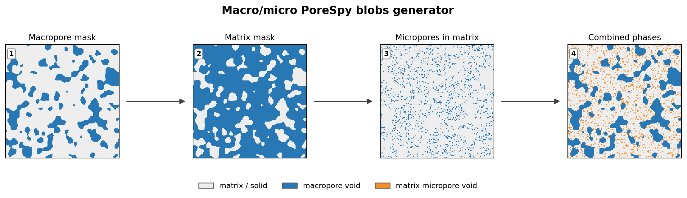
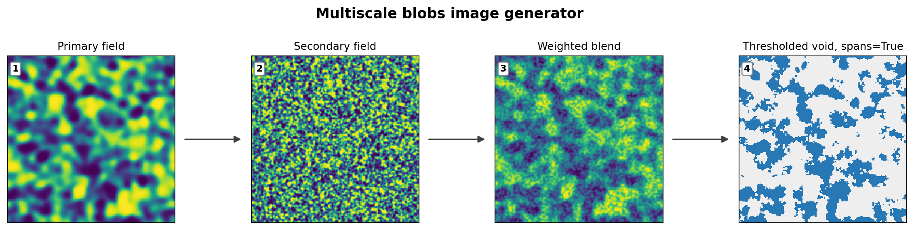
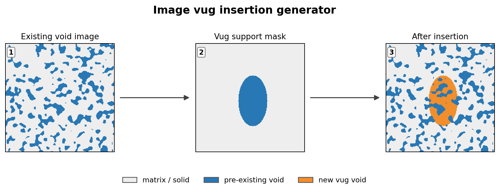
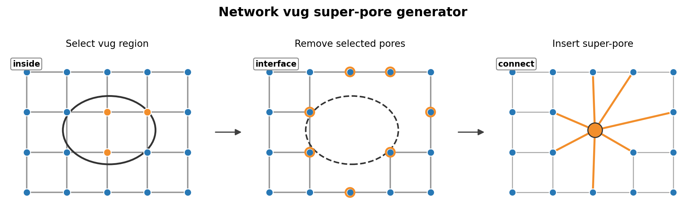

# Generators

The `voids.generators` sub-package provides functions to create synthetic and
mesh-based pore networks for controlled experiments and validation.

For a workflow-level description of macro/micro PoreSpy `blobs` images, see
[Synthetic Image Cases](../synthetic_cases.md). For voxel-volume import/export
and STL/OBJ surface-mesh export, see [I/O](io.md).

---

## Generator Workflow Schematics

The figures below show the main generator operations used by the public API.
They are schematic 2-D views of operations that may also be applied to 3-D
volumes or networks. The binary image convention is `True = void` and
`False = solid/matrix`.

### Macro/Micro Pore Images

The macro/micro generator constructs a two-scale binary image by first building
a macropore mask, then selecting a prescribed fraction of the remaining matrix
as small pores:

\[
\Omega_{\mathrm{void}}
=
\Omega_{\mathrm{macro}}
\cup
\Omega_{\mathrm{micro}},
\qquad
\Omega_{\mathrm{micro}}
\subset
\Omega_{\mathrm{matrix}}.
\]

The `matrix_microporosity` parameter is measured only over
\(\Omega_{\mathrm{matrix}}\), not over the full image support. The total porosity
is therefore

\[
\phi_{\mathrm{total}}
=
\phi_{\mathrm{macro}}
+
(1-\phi_{\mathrm{macro}})
\phi_{\mathrm{micro|matrix}}.
\]

### Multiscale Blobs

The multiscale generator forms two correlated PoreSpy `blobs` score fields,
combines them as

\[
S = w S_1 + (1-w)S_2,
\]

then thresholds the blended score at the requested porosity quantile:

\[
\Omega_{\mathrm{void}} = \{\,x : S(x) \le q_{\phi}(S)\,\}.
\]

For the spanning variants, `voids` then accepts the realization only if the void
phase contains a connected path through the requested image axis. This is a
topological acceptance criterion; it does not guarantee a target permeability.

### Image Vug Insertion

Image-based vug insertion is a Boolean union between an existing void mask and a
geometric support mask:

\[
\Omega_{\mathrm{out}}
=
\Omega_{\mathrm{in}}
\cup
\Omega_{\mathrm{vug}}.
\]

The circular, elliptical, spherical, and ellipsoidal helpers differ only in the
support mask geometry. Existing void voxels remain void.

### Network Vug Super-Pores

Network vug insertion is a topological network transformation. Pores inside the
elliptical or ellipsoidal vug region are removed, one super-pore is inserted at
the vug center, and connector throats are added to the interface neighbors of
the removed region. The connector geometry is a heuristic closure intended for
controlled sensitivity studies; it should not be interpreted as a unique
first-principles reconstruction of an imaged vug throat geometry.

---

## Network Generators

::: voids.generators.network

---

## Porous Image Generators

::: voids.generators.porous_image

---

## Vug Templates

::: voids.generators.vug_templates
