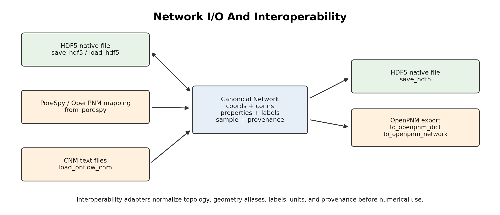
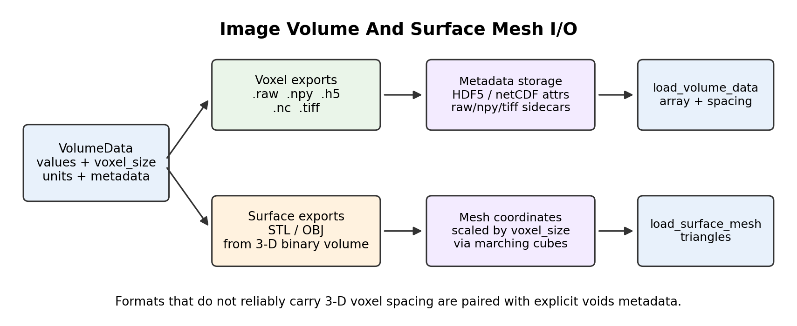

# I/O

The `voids.io` sub-package handles serialization and import/export for canonical
networks, PoreSpy interoperability, OpenPNM interoperability, and image-volume
cases.

---

## Network I/O And Interoperability

`voids` supports network import/export through the canonical `Network` data
model. The native disk format is an HDF5 schema written by `save_hdf5` and read
by `load_hdf5`. External network interoperability is handled by adapters that
normalize topology, geometry aliases, labels, sample metadata, and provenance
before numerical use.



### Supported Network Paths

| Path | Direction | Primary API | Notes |
|---|---|---|---|
| Canonical HDF5 | read/write | `save_hdf5`, `load_hdf5` | Native `voids` round trip for `Network`, `SampleGeometry`, `Provenance`, labels, properties, and JSON-compatible `extra` metadata |
| PoreSpy/OpenPNM-style dictionary | import | `from_porespy` | Imports flat mappings with keys such as `pore.coords` and `throat.conns`; common geometry aliases are normalized |
| PoreSpy voxel-unit geometry | preprocessing | `scale_porespy_geometry` | Converts common length, area, volume, and perimeter fields from voxel units to physical units for isotropic voxels |
| Cartesian boundary labels | preprocessing | `ensure_cartesian_boundary_labels` | Infers labels such as `pore.inlet_xmin` and `pore.outlet_xmax` from pore coordinates |
| OpenPNM-style dictionary | export | `to_openpnm_dict` | Exports a `Network` to a flat dictionary suitable for OpenPNM/PoreSpy-style workflows |
| OpenPNM network object | export | `to_openpnm_network` | Requires optional `openpnm`; constructor handling is version tolerant |
| Imperial CNM text files | import | `load_pnflow_cnm` | Imports `*_node1.dat`, `*_node2.dat`, `*_link1.dat`, and `*_link2.dat` files into a canonical `Network` |

### Canonical HDF5 Round Trip

Use HDF5 when the goal is a native round trip for later `voids`
calculations:

```python
from voids.io import load_hdf5, save_hdf5

save_hdf5(net, "network.h5")
reloaded = load_hdf5("network.h5")
```

The HDF5 layout stores the schema version, sample geometry, provenance, pore and
throat arrays, boolean labels, and JSON-compatible `net.extra` metadata.

### Importing PoreSpy/OpenPNM-Style Networks

PoreSpy and OpenPNM commonly represent networks as flat mappings. The minimal
required topology keys are `pore.coords` and `throat.conns`:

```python
from voids.io import (
    ensure_cartesian_boundary_labels,
    from_porespy,
    scale_porespy_geometry,
)

scaled = scale_porespy_geometry(network_dict, voxel_size=2.5e-6)
labeled = ensure_cartesian_boundary_labels(scaled, axes=("x",))
net = from_porespy(labeled, sample=sample, provenance=provenance)
```

The importer maps common aliases such as `throat.cross_sectional_area`,
`throat.total_length`, `pore.inscribed_diameter`, and
`throat.conduit_lengths.*` to canonical `voids` fields. Two-dimensional
coordinate arrays are embedded in 3-D as `(x, y, 0)`.

### Exporting To OpenPNM-Style Objects

Use `to_openpnm_dict` when a flat mapping is enough:

```python
from voids.io import to_openpnm_dict

op_dict = to_openpnm_dict(net)
```

Use `to_openpnm_network` when an actual OpenPNM object is needed:

```python
from voids.io import to_openpnm_network

op_net = to_openpnm_network(net)
```

`to_openpnm_network` depends on the optional `openpnm` package. If OpenPNM is
not installed, use the dictionary export or install the optional stack required
for the target workflow.

### Importing CNM Text Networks

`load_pnflow_cnm` imports the four-file CNM text layout used by
`pnextract`/`pnflow` workflows:

```python
from voids.io import load_pnflow_cnm

imported = load_pnflow_cnm("case_dir/case_name")
net = imported.net
```

The `prefix` should omit the `_node1.dat`, `_node2.dat`, `_link1.dat`, and
`_link2.dat` suffixes. The importer attaches sample lengths, pore/throat
geometry, boundary labels, and import metadata. It currently supports the
x-directed boundary convention used by the committed CNM benchmark files.

`voids` does not currently provide a general CNM exporter. For external network
export, use either canonical HDF5 or the OpenPNM-style dictionary/object
adapters, depending on the downstream solver.

### Network API Reference

#### HDF5

::: voids.io.hdf5

---

#### PoreSpy Import

::: voids.io.porespy

---

#### OpenPNM Export

::: voids.io.openpnm

---

#### CNM Import

::: voids.io.pnflow_cnm

---

## Image Volume And Surface Mesh I/O

`voids.io.volume` provides the image-volume import/export surface used by the
synthetic image workflows. The central object is `VolumeData`, which couples a
2-D or 3-D image array to its physical voxel spacing, length units, and
provenance metadata.



Use `VolumeData` when the image is intended to leave Python or feed a
continuum/FEM workflow:

```python
from voids.io import VolumeData, save_volume_bundle

case_data = VolumeData(
    values=void_image,
    voxel_size=(40.0e-6, 40.0e-6, 40.0e-6),
    units={"length": "m"},
    metadata={"case": "macro_micro_vug"},
)

written = save_volume_bundle(
    case_data,
    "outputs/synthetic_case",
    stem="macro_micro_vug",
    formats=("raw", "npy", "h5", "nc", "tiff", "stl", "obj"),
)
```

### Supported Formats

| Format | Kind | Metadata handling |
|---|---|---|
| `.raw` | voxel field | Written with a `.raw.json` sidecar containing shape, dtype, voxel size, units, and provenance metadata |
| `.npy` | voxel field | NumPy-native array plus `.npy.json` sidecar for voxel size, units, and provenance metadata |
| `.h5` | voxel field | HDF5 dataset `/volume` plus JSON metadata attributes |
| `.nc` | voxel field | Basic netCDF variable `volume` plus metadata attributes |
| `.tif`, `.tiff` | voxel field | TIFF stack plus `.tif.json` or `.tiff.json` sidecar for voxel size, units, and provenance metadata |
| `.stl` | surface mesh | 3-D binary interface extracted by marching cubes using `voxel_size` as physical spacing |
| `.obj` | surface mesh | 3-D binary interface extracted by marching cubes using `voxel_size` as physical spacing |

STL and OBJ exports require a 3-D binary volume containing both void and solid
voxels. The binary volume must be a boolean array or a numeric array whose
values are limited to 0 and 1. These exports represent the void/solid interface
as a triangular surface, not the full voxel field.

### Loading Voxel Volumes

Use `load_volume` when only the array is needed:

```python
from voids.io import load_volume

volume = load_volume("outputs/synthetic_case/macro_micro_vug.h5")
```

Use `load_volume_data` when physical resolution matters for porosity maps,
permeability maps, surface exports, or external FEM/continuum solvers:

```python
from voids.io import load_volume_data

volume_data = load_volume_data("outputs/synthetic_case/macro_micro_vug.tiff")
```

TIFF files may contain some resolution tags in particular software workflows,
but they should not be treated as a reliable source of 3-D voxel spacing. If the
TIFF was not written by `voids` with its JSON sidecar, pass the voxel size
explicitly:

```python
external_scan = load_volume_data(
    "micro_ct_stack.tiff",
    voxel_size=(40.0e-6, 40.0e-6, 40.0e-6),
    units={"length": "m"},
)
```

Raw binary files have no self-describing shape, dtype, or voxel resolution. If
the `voids` sidecar is absent, provide shape, dtype, and voxel size explicitly
when those quantities matter:

```python
volume_data = load_volume_data(
    "macro_micro_vug.raw",
    shape=(160, 160, 160),
    dtype="uint8",
    voxel_size=(40.0e-6, 40.0e-6, 40.0e-6),
    units={"length": "m"},
)
```

### Loading Surface Meshes

Surface meshes can be read back with:

```python
from voids.io import load_surface_mesh

mesh = load_surface_mesh("outputs/synthetic_case/macro_micro_vug.obj")
```

Surface files are geometric interchange files. They do not replace the voxel
field when voxel-wise phase information is needed.

::: voids.io.volume
