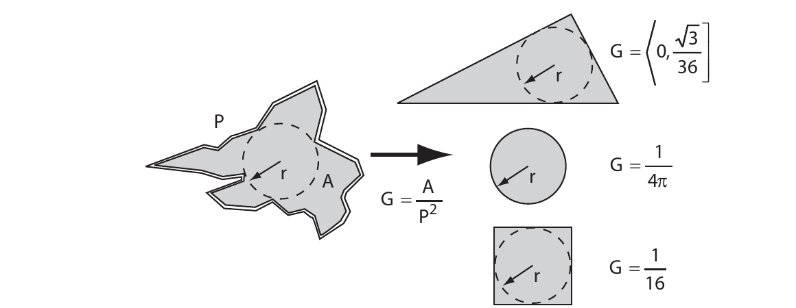
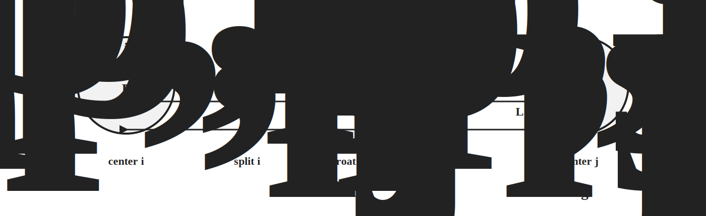

# Theoretical Background

This page summarizes the physical and numerical models implemented in `voids`.
The emphasis is on the equations, assumptions, units, and boundary conventions
that define the package's digital porous media workflows.

The main scientific boundary is simple:

- `voids` is a scientific Python package for digital porous media research
- pore-network modeling is the main graph-based modeling approach
- map-based FVM/FEM and direct-image LBM backends provide complementary
  single-phase upscaling and comparison methods
- pore-network hydraulic conductance can be constant-viscosity or pressure-dependent
- conductance can be selected explicitly or through the data-adaptive `auto` model
- pore-network geometry can be circular, size-factor based, shape-aware throat-only, or
  shape-aware pore-throat-pore
- thermodynamic viscosity is available through tabulated `thermo` and `CoolProp` backends

If a study needs corner films, capillary entry, wettability hysteresis, or dynamic
multiphase occupancy, those physics are still outside the present scope.

---

## Pore-Network Representation

A pore network is represented as a graph

\[
\mathcal{G} = (V, E),
\]

where pores are vertices \(V\) and throats are edges \(E\). For a throat \(t\) that
connects pores \(i\) and \(j\), `voids` stores:

- the pore coordinates \(\mathbf{x}_i\), \(\mathbf{x}_j\)
- the connectivity pair \((i, j)\)
- pore-wise and throat-wise geometric arrays
- boundary labels used to define the macroscopic experiment
- sample-scale geometry needed for Darcy-scale reporting

This matters scientifically because topology, conduit geometry, and sample geometry
play different roles:

- topology controls connectivity and admissible flow paths
- local geometry controls conductance
- sample geometry controls the conversion from total flow rate to apparent permeability

`voids` therefore keeps those records explicit in `Network`, `SampleGeometry`, and
`Provenance` instead of collapsing them into one opaque container.

---

## Single-Phase Hydraulic Conductance

### Throat Flux Law

The local constitutive law used throughout `voids` is

\[
q_t = g_t \, (p_i - p_j),
\]

where \(q_t\) is the volumetric flow rate through throat \(t\), \(g_t\) is the
hydraulic conductance assigned to that throat or conduit, and \(p_i - p_j\) is the
pressure drop between its end pores.

The scientific question is therefore how \(g_t\) is modeled from geometry and
viscosity.

### Generic Poiseuille Model

The fallback model is the circular Poiseuille conductance

\[
g_t = \frac{\pi r_t^4}{8 \mu L_t}
    = \frac{\pi d_t^4}{128 \mu L_t},
\]

where \(r_t\) and \(d_t\) are throat radius and diameter, \(L_t\) is throat length,
and \(\mu\) is the dynamic viscosity.

This is exposed in `voids` as `generic_poiseuille`.

It is the correct law for creeping flow in a circular tube, but it is only an
equivalent-duct approximation for image-extracted throats with irregular shape.
That simplification is often acceptable for controlled baselines and regression tests,
but it is not a faithful geometric closure for angular or highly non-circular ducts.

### Hagen-Poiseuille Conduit Model

The Hagen-Poiseuille conduit model applies the circular segment law to a
pore-throat-pore conduit when conduit sub-lengths are available:

\[
\frac{1}{g_{ij}} =
\frac{1}{g_{p,1}} + \frac{1}{g_t} + \frac{1}{g_{p,2}},
\qquad
g_s = \frac{A_s^2}{8 \pi \mu_s L_s}.
\]

Here \(A_s\), \(L_s\), and \(\mu_s\) are the area, length, and dynamic viscosity
for each segment \(s\). For a circular segment, \(A_s=\pi r_s^2\), so this
reduces to the usual \(\pi r_s^4/(8\mu_s L_s)\).

This is exposed in `voids` as `hagen_poiseuille`. If conduit lengths are absent,
the model falls back to the one-throat `generic_poiseuille` calculation because
that is the same segment law without pore-end resistances.

For PoreSpy-style imports, `voids` preserves explicit OpenPNM conduit lengths
when present. If they are absent but pore diameters, throat diameters, and a
center-to-center throat length are available, the importer derives a
sphere-cylinder pore1-core-pore2 split and records the derivation summary in
`net.extra["conduit_lengths"]`. This keeps the extraction path usable with
PoreSpy/PREGO region networks that expose `throat.direct_length` but not
`throat.conduit_lengths.*` directly.

### Hydraulic Size-Factor Model

OpenPNM-style networks may already contain hydraulic size factors, and `voids`
can also generate them for PoreSpy/PREGO image-extracted networks through
`transport_geometry="pyramids_and_cuboids"`. In that representation, the
geometry-dependent part of the conductance is reduced to size factors \(S\), and
viscosity is applied afterward:

\[
g_t = \frac{S_t}{\mu_t}
\]

for a throat-only size factor, or

\[
\frac{1}{g_{ij}} =
\frac{\mu_{p,i}}{S_{p,1}} +
\frac{\mu_t}{S_t} +
\frac{\mu_{p,j}}{S_{p,2}}
\]

for a three-segment pore-throat-pore conduit. This is the same algebra as
combining the three segment conductances \(S/\mu\) in series.

`voids` preserves imported `throat.hydraulic_size_factors` in
`net.extra["throat.hydraulic_size_factors"]` and stores generated
pyramids-and-cuboids factors in `net.throat["hydraulic_size_factors"]` so they
round-trip through HDF5 with the rest of the network arrays. The `auto`
conductance model uses either location before applying any local geometry
fallback, because size factors are already a completed geometric conductance
reduction.

For the generated pyramids-and-cuboids transport geometry, pores are represented
as truncated pyramids and throats as cuboids. The stored factors follow the
OpenPNM convention

\[
S_s = \frac{1}{16\pi^2 I_s F_s},
\]

where \(F_s\) is the segment integral of \(1/A(x)^2\) and \(I_s=1/6\) for the
square cross-section used by the pyramids-and-cuboids model. This is a transport
post-processing model on top of the extracted network geometry; it is not a
change to the segmentation.

### Shape Factor and Equivalent Ducts

For shape-aware closures, `voids` uses the dimensionless shape factor

\[
G = \frac{A}{P^2},
\]

where \(A\) is cross-sectional area and \(P\) is wetted perimeter. For the circle,
square, and equilateral triangle:

\[
G_{\mathrm{circle}} = \frac{1}{4 \pi}, \qquad
G_{\mathrm{square}} = \frac{1}{16}, \qquad
G_{\mathrm{triangle}} = \frac{\sqrt{3}}{36}.
\]

In the equivalent-duct construction used in this modeling family, the
cross-section is represented by an admissible duct family with the same inscribed
radius \(r\) and shape factor \(G\). For that family,

\[
A = \frac{r^2}{4G}.
\]

This relation is exact for the canonical circle, square, and triangle classes used by
the Valvatne-Blunt style model.

Two cautions are important:

1. The pair \((r, G)\) is a reduced constitutive representation, not a full
   reconstruction of the original cross-section.
2. The square/circle transition used in `voids` follows a historical
   implementation convention. It is a pragmatic modeling rule, not a universal theorem.

### Valvatne-Blunt Throat-Only Model

The throat-only shape-aware model classifies the throat from its shape factor and uses

\[
g_t = \frac{k(G_t)\, G_t\, A_t^2}{\mu_t L_t},
\]

with the single-phase coefficients

\[
k =
\begin{cases}
3/5      & \text{triangular ducts}, \\
0.5623   & \text{square-like ducts}, \\
1/2      & \text{circular ducts}.
\end{cases}
\]

In `voids` this closure is exposed as `valvatne_blunt_throat`.

The circular limit is internally consistent. If \(G = 1/(4\pi)\), then

\[
\frac{1}{2}\frac{GA^2}{\mu L}
= \frac{1}{2}\frac{1}{4\pi}\frac{(\pi r^2)^2}{\mu L}
= \frac{\pi r^4}{8 \mu L},
\]

which recovers the usual Poiseuille conductance.

### Valvatne-Blunt Conduit Model

When conduit sub-lengths are available, `voids` uses a pore-throat-pore series model.
Each connection is decomposed into three segments:

- pore-1 segment of length \(L_{p,1}\)
- throat-core segment of length \(L_t\)
- pore-2 segment of length \(L_{p,2}\)

For a segment \(s\), the resistance is

\[
R_s = \frac{\mu_s L_s}{k_s G_s A_s^2},
\]

and the conduit resistance is

\[
R_{ij} = R_{p,1} + R_t + R_{p,2}.
\]

Therefore the equivalent conductance is

\[
g_{ij} = \frac{1}{R_{ij}}.
\]

Equivalently, if each segment conductance is computed first,

\[
\frac{1}{g_{ij}} = \frac{1}{g_{p,1}} + \frac{1}{g_t} + \frac{1}{g_{p,2}},
\]

which is the harmonic series combination implemented in `voids`.

This closure is exposed as `valvatne_blunt`. The older name
`valvatne_blunt_baseline` remains as a backward-compatible alias, not as a separate
physical model.

### Auto Conductance Hierarchy

The default conductance model in `voids` is the conservative
`generic_poiseuille` baseline. The `auto` model is available when the goal is to
use the richest conductance information present in a network. Its selection logic is:

1. If `throat.hydraulic_conductance` is already present, trust it directly; no
   viscosity is required because the constitutive reduction has already been
   performed.
2. Else, if `throat.hydraulic_size_factors` are available, use the
   OpenPNM-style size-factor model.
3. Else, if conduit lengths and explicit pore/throat shape data are available, use
   `valvatne_blunt`.
4. Else, if conduit lengths and pore/throat areas are available, use
   `hagen_poiseuille`.
5. Else, if explicit throat-only shape data are available, use
   `valvatne_blunt_throat`.
6. Else, fall back to `generic_poiseuille`.

That hierarchy is scientifically deliberate. It preserves richer geometric
information when available, while keeping the solver usable on incomplete networks.
The word "explicit" matters here: `auto` does not classify an area-plus-diameter
network as shape-aware unless a shape factor or perimeter was actually provided.
That avoids silently treating circular-equivalent metadata as a resolved angular
duct model.

Richer does not always mean closer to an experimental permeability target. Image
extractors may report geometric areas, shape factors, or conduit sub-lengths that
are useful descriptors but are not independently calibrated hydraulic conductance
factors. For literature-reference or regression comparisons, select the intended
model explicitly rather than relying on `auto`.

Precomputed `throat.hydraulic_conductance` is a final hydraulic conductance, not
a geometric size factor. It is therefore viscosity-inclusive and pressure
independent inside `voids`: pressure-dependent viscosity models will report local
viscosity fields, but they will not rescale those precomputed conductances. Use
`throat.hydraulic_size_factors` or a geometric model when the conductance should
remain coupled to local viscosity. For constant-viscosity permeability reporting,
the fluid viscosity passed to the solve should match the reference viscosity
implicit in the precomputed conductance.

---

## Pressure-Dependent Viscosity

### Constant-Viscosity Mode

The simplest fluid model is

\[
\mu(\mathbf{x}) = \mu_0,
\]

with one constant dynamic viscosity applied everywhere. This remains the right choice
for:

- dimensionless toy problems
- permeability comparisons where viscosity variation is negligible
- geometry-focused benchmarks where constitutive complexity would only add noise

### Thermodynamic Backend Mode

`voids` also supports pressure-dependent water viscosity through tabulated backend
calls at fixed temperature:

\[
\mu = \mu(P, T).
\]

Two backend families are currently supported:

- `thermo`, through the `thermo.Chemical(...).ViscosityLiquid` interface
- `CoolProp`, through `CoolProp.CoolProp.PropsSI`

At the code level, the constitutive query is not solved directly at every pore during
every iteration. Instead, for a given boundary-pressure interval
\([P_{\min}, P_{\max}]\) and temperature \(T\), `voids` first tabulates the backend
response on a pressure grid:

\[
\{(P_n, \mu_n)\}_{n=1}^{N}, \qquad
\mu_n = \mu_{\mathrm{backend}}(P_n, T).
\]

The tabulated law is then replaced by a clipped piecewise-cubic Hermite interpolant
(PCHIP):

\[
\hat{\mu}(P; T) = \mathcal{I}_{\mathrm{PCHIP}}
\left(
\operatorname{clip}(P, P_{\min}, P_{\max})
\right).
\]

This matters for two reasons:

1. it avoids repeated expensive backend calls during the nonlinear solve
2. it provides a differentiable constitutive law with an explicit derivative
   \(d\hat{\mu}/dP\)

Outside the tabulated interval, pressure is clipped to the interval bounds rather than
extrapolated. Consequently, the effective derivative is zero outside the tabulated
range.

### Pore and Throat Viscosity Fields

The current solver evaluates viscosity at:

- pore centers for pore-body segments
- midpoint throat pressures for throat-core segments

For a throat connecting pores \(i\) and \(j\),

\[
P_t = \frac{P_i + P_j}{2}.
\]

Then the local viscosities are

\[
\mu_{p,i} = \hat{\mu}(P_i; T), \qquad
\mu_t = \hat{\mu}(P_t; T).
\]

The same midpoint rule is used for the throat derivative:

\[
\frac{\partial \mu_t}{\partial P_i}
= \frac{\partial \mu_t}{\partial P_j}
= \frac{1}{2}\frac{d\hat{\mu}}{dP}(P_t; T).
\]

This is not the only admissible closure, but it is consistent with the current local
pressure representation used in the conduit model.

### Absolute Pressure Requirement

Thermodynamic backends are queried in absolute pressure units. Therefore, unlike a
constant-viscosity solve, the pair \((P_{\mathrm{in}}, P_{\mathrm{out}})\) is not
only a pressure drop; its absolute level matters because the constitutive law depends
on pressure itself.

In practice, this means

- `pin=1.0, pout=0.0` is fine for dimensionless constant-viscosity tests
- positive absolute pressures in Pa are required for thermodynamic viscosity solves

---

## Nonlinear Single-Phase Solve

### Governing Balance

For each free pore \(i\), steady incompressible mass conservation requires

\[
R_i(\mathbf{p}) =
\sum_{j \in \mathcal{N}(i)} q_{ij}(\mathbf{p})
= 0,
\]

with

\[
q_{ij}(\mathbf{p}) = g_{ij}(\mathbf{p}) (p_i - p_j).
\]

If viscosity is constant, then \(g_{ij}\) is constant and the residual is linear in
\(\mathbf{p}\). The usual weighted graph-Laplacian system follows:

\[
\mathbf{A}\mathbf{p} = \mathbf{b},
\]

where, for free pores,

\[
A_{ii} = \sum_{j \in \mathcal{N}(i)} g_{ij},
\qquad
A_{ij} = -g_{ij}.
\]

If viscosity depends on pressure, then \(g_{ij}\) depends on \(\mathbf{p}\) through
\(\mu(\mathbf{p})\), and the problem becomes nonlinear.

### Picard Iteration

The Picard strategy used in `voids` is:

1. guess a pressure field
2. evaluate pore and throat viscosities from that field
3. rebuild the conductance field
4. solve the resulting linear pressure problem
5. repeat until the pressure update is small

In symbols, with iterate \(k\),

\[
\mathbf{A}(\mathbf{p}^{(k)}) \, \mathbf{p}^{(k+1)} = \mathbf{b}(\mathbf{p}^{(k)}).
\]

Picard is robust and remains available as a fallback, but its convergence rate is
typically linear.

### Newton Linearization

The current Newton path in `voids` differentiates the tabulated constitutive law and
assembles the pore-balance Jacobian explicitly.

For one throat \(t = (i,j)\),

\[
q_t = g_t(p_i, p_j) (p_i - p_j).
\]

The local derivatives are

\[
\frac{\partial q_t}{\partial p_i}
= g_t + (p_i - p_j)\frac{\partial g_t}{\partial p_i},
\qquad
\frac{\partial q_t}{\partial p_j}
= -g_t + (p_i - p_j)\frac{\partial g_t}{\partial p_j}.
\]

The pore-balance Jacobian is then assembled from those throat contributions.
This is close to a full constitutive Newton method for the problem actually being
solved, with one important caveat:

!!! note "Important modeling point"
    The Jacobian is exact for the tabulated/interpolated constitutive law
    \(\hat{\mu}(P;T)\), not for the original backend callable itself.
    That is a deliberate approximation layer introduced for speed and numerical
    smoothness.

The Newton step \(\delta \mathbf{p}\) solves

\[
\mathbf{J}(\mathbf{p}^{(k)}) \, \delta \mathbf{p}
= -\mathbf{R}(\mathbf{p}^{(k)}),
\]

followed by a damped update

\[
\mathbf{p}^{(k+1)} = \mathbf{p}^{(k)} + \alpha \, \delta \mathbf{p},
\qquad 0 < \alpha \le 1,
\]

with backtracking if the residual does not decrease.

### Boundary Conditions and Active Domain

Dirichlet boundary conditions are imposed on labeled pore sets:

\[
p = p_{\mathrm{in}} \text{ on inlet pores}, \qquad
p = p_{\mathrm{out}} \text{ on outlet pores}.
\]

Connected components that do not touch any Dirichlet pore are excluded from the active
solve domain. This avoids singular floating-pressure blocks. Pressures and fluxes on
those excluded components are reported as `nan` in the returned result.

---

## Linear Solver Options

The inner linear systems used by the constant-viscosity solve, Picard updates, and
Newton steps can be solved with:

- a sparse direct solve
- conjugate gradients (`cg`)
- GMRES (`gmres`)

`voids` also supports optional algebraic multigrid preconditioning through `pyamg`.
That is a linear algebra acceleration, not a separate physical model.

The most defensible rule of thumb is:

- use `cg` plus `pyamg` for constant-viscosity pressure solves when the system is
  close to symmetric positive definite
- use `gmres` plus `pyamg` for Newton inner solves when pressure-dependent viscosity
  makes the Jacobian less symmetric

The actual speedup is geometry- and conditioning-dependent, so it should be treated as
an empirical numerical option rather than as a universal guarantee.

---

## Darcy-Scale Permeability

Map-based continuum upscaling in `voids.fvm` and `voids.fem` uses the same
Darcy reporting convention below, but the field solve is no longer a pore-network
pressure solve. The TPFA backend solves a cell-centered finite-volume Darcy problem
on a scalar permeability map. The FEM backends solve mixed Darcy-Darcy or
Darcy-Brinkman forms on porosity/permeability maps, with the local drag coefficient
\(\gamma = \mu / K\) and, for Brinkman models, an effective viscous coefficient
\(\mu / \phi\). These models are useful for direct map upscaling and
micro-continuum comparisons, but their quantitative validity still depends on the
map closure for \(K\), the porosity field, mesh resolution, pressure boundary
conditions, and representative-volume assumptions.
For the full TPFA, FEM, USFEM, and LBM formulations used by the package, see
[Map-Based Single-Phase Solvers](map_based_singlephase_solvers.md).

After solving the pore pressures, `voids` computes throat fluxes and sums the net
inlet flow rate \(Q\). The reported apparent permeability is then obtained from
Darcy's law:

\[
K = \frac{|Q| \, \mu_{\mathrm{ref}} \, L}{A \, |\Delta P|},
\]

where

- \(L\) is the sample length along the chosen axis
- \(A\) is the sample cross-sectional area normal to that axis
- \(\Delta P = P_{\mathrm{in}} - P_{\mathrm{out}}\)
- \(\mu_{\mathrm{ref}}\) is the scalar reporting viscosity

The reporting convention is:

- use `fluid.viscosity` directly if the user supplied a constant reference viscosity
- otherwise, for thermodynamic viscosity, use the midpoint viscosity over the imposed
  pressure interval

This is a reporting choice. It does not change the solved nonlinear flow field, but it
does affect the permeability value reported from that field.

---

## Porosity and Connectivity

### Absolute Porosity

Absolute porosity is

\[
\phi_{\mathrm{abs}} = \frac{V_{\mathrm{void}}}{V_{\mathrm{bulk}}}.
\]

If `pore.region_volume` is available, `voids` treats it as a disjoint partition of the
void domain and uses it directly. Otherwise, it falls back to summing pore and throat
volumes. Those two bookkeeping conventions are not interchangeable and can differ
materially on extracted networks.

### Effective Porosity

Effective porosity is

\[
\phi_{\mathrm{eff}} = \frac{V_{\mathrm{connected}}}{V_{\mathrm{bulk}}},
\]

where the connected volume may be defined either by axis-spanning components or by
boundary-connected components, depending on the selected mode.

### Connectivity Metrics

Connectivity is not only a graph-theoretic descriptor here. It directly controls:

- which pores contribute to effective porosity
- which components are admitted into the active pressure solve
- whether a reported permeability corresponds to a genuinely spanning flow path

---

## Assumptions and Limitations

The main assumptions that should be stated explicitly in any study using `voids` are:

1. Upstream segmentation and extraction quality dominate the scientific credibility of
   the imported network.
2. Shape-factor closures are equivalent-duct models, not reconstructions of the full
   cross-sectional geometry.
3. Pressure-dependent viscosity is currently pressure-only at fixed temperature during
   a given solve; density/compressibility coupling is not modeled.
4. The thermodynamic nonlinear solve is exact only for the tabulated constitutive law,
   not for the raw backend callable.
5. Apparent permeability depends on the correctness of `SampleGeometry.lengths` and
   `SampleGeometry.cross_sections`.
6. Full multiphase polygonal-corner physics from the broader network-modeling
   literature is not implemented yet.

If any of these assumptions are not acceptable for a given study, the workflow needs
to be tightened before the resulting permeability should be interpreted quantitatively.

---

## References

- Mason, G., and N. R. Morrow (1991). Capillary behavior of a perfectly wetting
  liquid in irregular triangular tubes. *Journal of Colloid and Interface Science*,
  141(1), 262-274.
- Patzek, T. W., and D. B. Silin (2001). Shape factor and hydraulic conductance in
  noncircular capillaries I. One-phase creeping flow. *Journal of Colloid and
  Interface Science*, 236(2), 295-304.
- Valvatne, P. H. (2004). *Predictive pore-scale modelling of multiphase flow*.
  PhD thesis.
- Valvatne, P. H., and M. J. Blunt (2004). Predictive pore-scale modeling of
  two-phase flow in mixed wet media. *Water Resources Research*, 40(7).
- Blunt, M. J., et al. (2013). Pore-scale imaging and modelling. *Advances in Water
  Resources*, 51, 197-216.
- Khan, Z. A., and J. T. Gostick (2024). Enhancing pore network extraction
  performance via seed-based pore region growing segmentation. *Advances in Water
  Resources*, 183, 104591. <https://doi.org/10.1016/j.advwatres.2023.104591>
- Brinkman, H. C. (1947/1949). A calculation of the viscous force exerted by a
  flowing fluid on a dense swarm of particles. *Applied Scientific Research*,
  1, 27-34. <https://doi.org/10.1007/BF02120313>
- Soulaine, C., and Tchelepi, H. A. (2016). Micro-continuum approach for pore-scale
  simulation of subsurface processes. *Transport in Porous Media*, 113(3).
  <https://doi.org/10.1007/s11242-016-0701-3>
- Soulaine, C., Gjetvaj, F., Garing, C., et al. (2016). The impact of
  sub-resolution porosity of X-ray microtomography images on the permeability.
  *Transport in Porous Media*, 113(1). <https://doi.org/10.1007/s11242-016-0690-2>
- Franca, L. P., and Valentin, F. (2000). On an improved unusual stabilized
  finite element method for the advective-reactive-diffusive equation.
  *Computer Methods in Applied Mechanics and Engineering*, 190(13-14),
  1785-1800. <https://doi.org/10.1016/S0045-7825(00)00190-0>
- Barrenechea, G. R., and Valentin, F. (2002). An unusual stabilized finite
  element method for a generalized Stokes problem. *Numerische Mathematik*,
  92, 653-677. <https://doi.org/10.1007/s002110100371>
- Pacazuca, J. F., Valentin, F., and Volpatto, D. (2026). A Locally Conservative
  Low-Order Stabilized Mixed Finite Element Method for the Brinkman Problem in
  Highly Heterogeneous Porous Media. InterPore 2026 poster.
  <https://doi.org/10.13140/RG.2.2.23699.23840>
- `thermo` project documentation: <https://thermo.readthedocs.io/>
- CoolProp documentation: <https://coolprop.org/>
