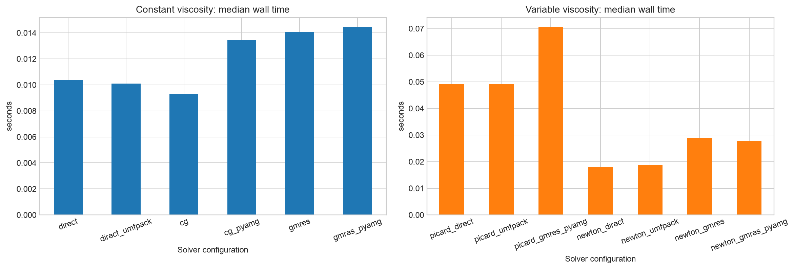
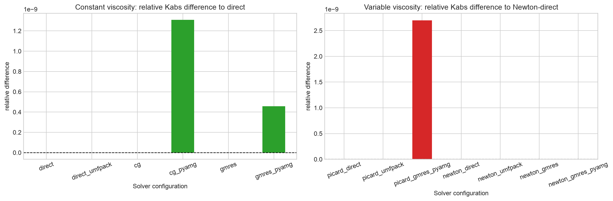
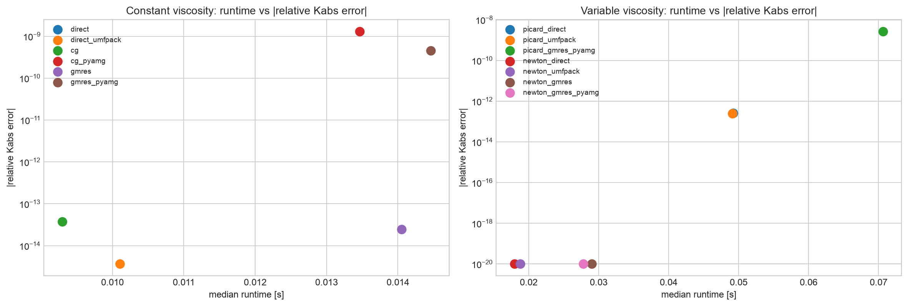
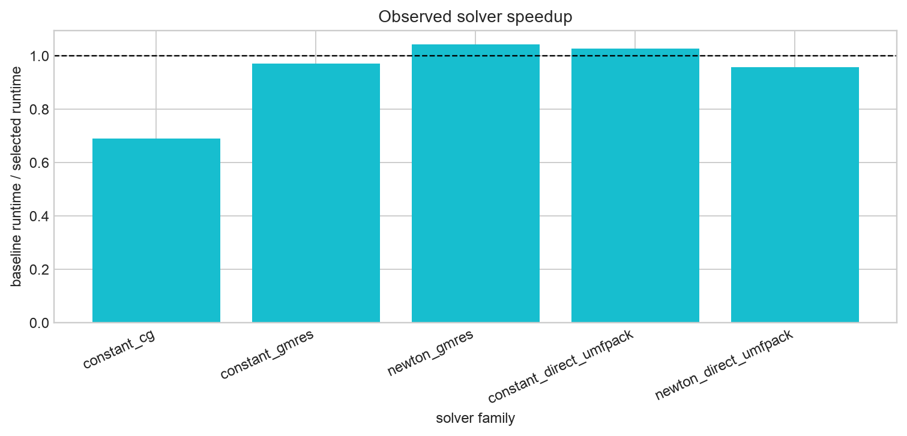
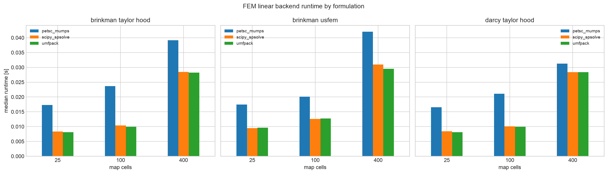
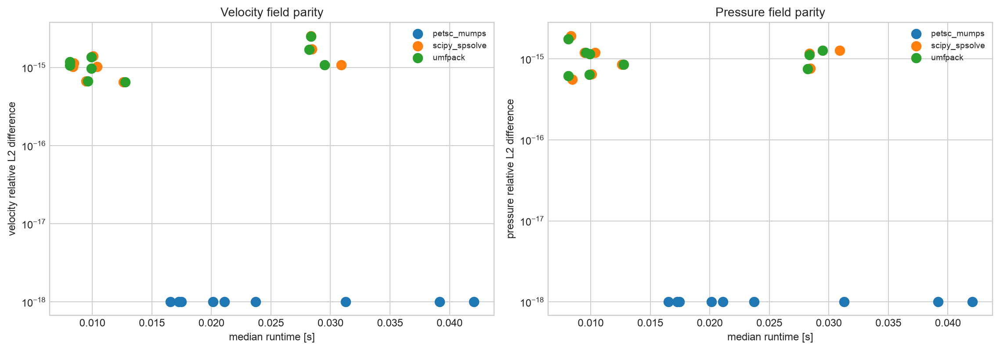

# Solver Backends And Performance

`voids` exposes sparse linear solver choices in two layers:

- PNM and TPFA use the shared `voids.linalg.solve.solve_linear_system`
  interface.
- FEM uses DOLFINx assembly and selects a linear algebra path through
  `FEniCSSolverOptions.linear_backend`.

The solver backend is a numerical linear algebra choice. It should not change
the pore-network equations, the TPFA discretization, the FEM weak form, the
boundary conditions, or the porosity/permeability map closure. If two direct
backends disagree beyond roundoff on the same assembled problem, treat that as a
numerical diagnostic before interpreting the permeability physically.

## Installation

The Pixi `default` and `test` environments include the solver feature:

```bash
pixi run -e test python -c "import voids.linalg.solve; import voids.fem.singlephase"
```

Plain `pip install voids` keeps optional solver stacks separate. Install Python
solver helpers with:

```bash
pip install "voids[solvers]"
```

FEM still requires a compatible DOLFINx/FEniCSx installation. On native Windows,
the conda-forge DOLFINx stack used by `voids` does not provide the PETSc-backed
`dolfinx.fem.petsc` path, so FEM `linear_backend="auto"` falls back to the
serial SciPy sparse direct backend when PETSc is unavailable.

## PNM And TPFA Backends

PNM and TPFA call `solve_linear_system(A, b, method=...)` after assembling their
sparse systems.

| Method | Backend | Typical use | Main caveat |
|---|---|---|---|
| `"direct"` | `scipy.sparse.linalg.spsolve` | default sparse direct solve | SciPy may use UMFPACK internally when configured that way |
| `"umfpack"` | `scikits.umfpack.spsolve` | explicit SuiteSparse/UMFPACK direct solve, including Windows fallback studies | requires `scikit-umfpack` and UMFPACK libraries |
| `"pardiso"` | `pypardiso.spsolve` | Linux MKL/PARDISO direct solve | not a portable Windows fallback |
| `"cg"` | SciPy conjugate gradient | symmetric positive systems | convergence depends on conditioning and tolerances |
| `"gmres"` | SciPy GMRES | nonsymmetric or harder systems | restart and tolerance choices matter |

`cg` and `gmres` accept optional PyAMG preconditioning:

```python
from voids.physics.singlephase import SinglePhaseOptions

options = SinglePhaseOptions(
    solver="gmres",
    solver_parameters={
        "rtol": 1.0e-10,
        "maxiter": 800,
        "restart": 80,
        "preconditioner": "pyamg",
    },
)
```

Explicit UMFPACK for PNM:

```python
from voids.physics.singlephase import SinglePhaseOptions

options = SinglePhaseOptions(solver="umfpack")
```

Explicit UMFPACK for TPFA:

```python
from voids.fvm.singlephase import solve_tpfa

result = solve_tpfa(permeability_map, solver_method="umfpack")
```

## FEM Backends

FEM backends use the same DOLFINx/UFL forms and coefficient maps, then select
the linear solve path:

| `linear_backend` | Linear algebra path | Platform role | Main caveat |
|---|---|---|---|
| `"auto"` | PETSc when available; SciPy direct fallback on native Windows when PETSc is missing | recommended default for portable scripts | resolved backend can differ by platform |
| `"petsc"` | DOLFINx PETSc `LinearProblem` with PETSc options from `FEniCSSolverOptions` | production Linux/macOS path; supports PETSc/MPI workflows | unavailable in native Windows conda-forge DOLFINx stack used by `voids` |
| `"scipy"` | DOLFINx assembly converted to SciPy sparse format and solved with `spsolve` | serial direct fallback and comparison backend | serial-only |
| `"umfpack"` | DOLFINx assembly converted to SciPy sparse format and solved with `scikits.umfpack.spsolve` | explicit serial SuiteSparse/UMFPACK path | requires `scikit-umfpack`; serial-only |

Default portable behavior:

```python
from voids.fem.singlephase import FEniCSSolverOptions, upscale_permeability_fem

result = upscale_permeability_fem(problem, options=FEniCSSolverOptions())
print(result.results["x"].metadata["linear_backend"])
```

Force PETSc, SciPy, or UMFPACK:

```python
from voids.fem.singlephase import FEniCSSolverOptions

petsc_options = FEniCSSolverOptions.direct_lu("mumps")
scipy_options = FEniCSSolverOptions.scipy_direct()
umfpack_options = FEniCSSolverOptions.umfpack_direct()
```

For reproducible reports, store the requested backend, the resolved backend from
result metadata, the formulation name, pressure drop, map shape, permeability
and porosity floors, and the numerical thread environment.

## Benchmark Design

The executable benchmark is
[`17_mwe_solver_options_benchmark`](notebook_reports/17_mwe_solver_options_benchmark.md).
It writes stable plots and CSV tables under `docs/assets/solver_backends/`.

The PNM section compares:

- SciPy direct solve,
- explicit UMFPACK direct solve,
- CG and GMRES,
- CG/GMRES with PyAMG preconditioning,
- Picard and Newton outer iterations for pressure-dependent viscosity.

The FEM section compares PETSc/MUMPS, SciPy direct sparse, and UMFPACK on
homogeneous 2-D maps for:

- Taylor-Hood Darcy-Darcy,
- Taylor-Hood Darcy-Brinkman,
- stabilized USFEM Darcy-Brinkman.

It reports permeability, flow rate, pressure field relative \(L^2\) difference,
velocity field relative \(L^2\) difference, and repeated-run wall time.

## Benchmark Results

The current benchmark data are available as CSV artifacts:

- [PNM constant-viscosity solver table](assets/solver_backends/constant_solver_benchmark.csv)
- [PNM variable-viscosity solver table](assets/solver_backends/variable_solver_benchmark.csv)
- [Solver speedup table](assets/solver_backends/solver_speedup.csv)
- [FEM backend benchmark table](assets/solver_backends/fem_linear_backend_benchmark.csv)
- [FEM backend summary table](assets/solver_backends/fem_linear_backend_summary.csv)

The headline results from the generated tables are:

| Benchmark slice | Best local median runtime | Agreement with reference |
|---|---:|---:|
| PNM constant-viscosity network solve | CG, 0.0093 s | \(K\) relative difference \(3.8 \times 10^{-14}\) |
| PNM constant-viscosity direct solve | UMFPACK, 0.0101 s | \(K\) relative difference \(3.7 \times 10^{-15}\) |
| PNM variable-viscosity Newton solve | SciPy direct, 0.0180 s | reference row |
| FEM backend summary | UMFPACK, 0.0099 s median over 9 cases | max field relative \(L^2\) difference \(2.5 \times 10^{-15}\) |
| FEM backend summary | SciPy direct, 0.0104 s median over 9 cases | max field relative \(L^2\) difference \(2.6 \times 10^{-15}\) |
| FEM backend summary | PETSc/MUMPS, 0.0211 s median over 9 cases | reference row |

These numbers are from the local serial notebook run used to generate the
committed assets. They are performance evidence for this benchmark size and
machine, not a universal backend ranking.













On the homogeneous benchmark systems, the direct sparse backends recover the
same PNM permeability and flow rate to roundoff. The FEM backends recover the
same permeability, flow rate, pressure field, and velocity field to numerical
roundoff when all requested backends are installed. Runtime ranking is local to
the benchmark machine and problem size; for larger heterogeneous 3-D maps,
repeat the notebook at the target resolution before choosing a production
backend.

## Performance Guidance

- Use `"direct"` for the most portable PNM/TPFA baseline.
- Use `"umfpack"` when you want to request SuiteSparse/UMFPACK explicitly,
  especially for Windows-compatible direct-solver studies.
- Use `"pardiso"` only when the Linux MKL/PARDISO stack is available and has
  been checked against the same system.
- Use Krylov methods with PyAMG when direct factorizations become too expensive,
  but record convergence tolerances and residuals.
- Use FEM `"petsc"` for PETSc/MPI or heavily configured production runs.
- Use FEM `"scipy"` or `"umfpack"` for serial Windows-compatible FEM solves when
  DOLFINx core is available but PETSc is not.

## Scientific Caveats

Solver agreement does not prove that the physical closure is correct.
Permeability estimates still depend on pore/throat geometry, map construction,
permeability floors, porosity floors, pressure conventions, side-wall
conditions, and representative-volume assumptions.
