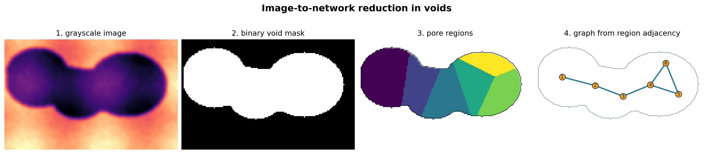
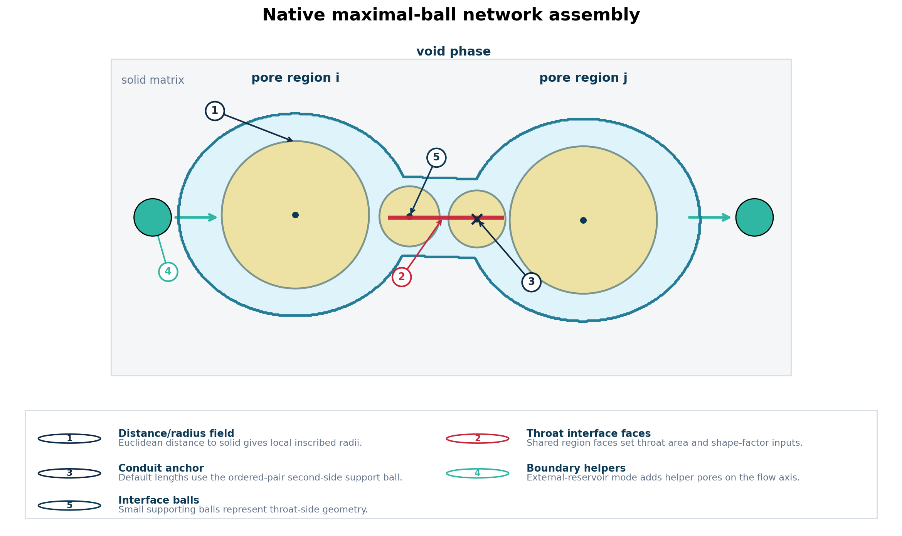

# Image Segmentation And Network Extraction

This page documents the current image-to-network machinery in `voids`. It is
intended to make the scientific assumptions visible: how a grayscale image
becomes a binary void/solid image, how a segmented image becomes a pore network,
which geometric quantities are assigned, and which backend choices are available.

`voids` does not try to hide image processing, extraction, and transport behind a
single opaque button. The recommended workflow is explicit:

1. preprocess and segment the image into phases
2. verify void connectivity and sample geometry
3. extract a full pore network with a chosen backend
4. normalize geometry, labels, and provenance
5. prune to an axis-spanning subnetwork
6. solve flow or run other graph/geometry diagnostics



The figure is schematic: real 3-D networks are more complex, but the reduction
steps are the same. The important point is that each stage changes the scientific
object being represented.

---

## Phase Convention

All image-extraction paths expect a 2-D or 3-D phase image. For the current
single-phase workflows:

| Value | Meaning |
|---:|---|
| `0` or `False` | solid / inactive phase |
| nonzero or `True` | void / active phase |

Mathematically, the binary void indicator is

$$
\chi_v(\mathbf{x}) =
\begin{cases}
1, & \mathbf{x}\in \Omega_v,\\
0, & \mathbf{x}\in \Omega_s,
\end{cases}
$$

where \(\Omega_v\) is the void phase and \(\Omega_s\) is the solid matrix.

This convention is intentionally simple. If the original data are grayscale CT,
SEM, or another intensity image, the threshold and cleanup choices should be
recorded in provenance metadata because they influence porosity, connectivity,
and permeability.

---

## Segmentation Helpers In `voids`

The segmentation module provides basic, reproducible preprocessing helpers for
common research workflows. These are not meant to replace a full image-analysis
study for difficult scans, but they are useful for scripted benchmarks and
controlled datasets.

### Cylindrical-Specimen Crop

For a raw 3-D grayscale volume \(I(k,y,x)\), `crop_nonzero_cylindrical_volume`
builds a slice-wise specimen support mask from a background discriminator:

$$
S_k(y,x) = \operatorname{fill\_holes}\left(I(k,y,x) > I_\mathrm{bg}\right).
$$

It then computes the common support over all slices,

$$
C(y,x) = \bigwedge_k S_k(y,x),
$$

and returns the largest axis-aligned rectangle fully contained in \(C\). This is
useful for cylindrical plugs because it avoids including the air outside the
sample when later computing porosity or permeability.

Relevant functions:

- `largest_true_rectangle(mask2d)`
- `crop_nonzero_cylindrical_volume(raw, background_value=...)`
- `preprocess_grayscale_cylindrical_volume(raw, ...)`

### Threshold Binarization

`binarize_grayscale_volume` converts a cropped grayscale volume into an integer
binary phase image. If no threshold is supplied, the threshold is computed with
one of the supported scikit-image methods.

For dark voids,

$$
\chi_v(\mathbf{x}) = \mathbf{1}\{I(\mathbf{x}) < T\}.
$$

For bright voids,

$$
\chi_v(\mathbf{x}) = \mathbf{1}\{I(\mathbf{x}) > T\}.
$$

Supported automatic threshold methods are:

| Method | Typical use |
|---|---|
| `otsu` | robust first choice for bimodal histograms |
| `li` | entropy/minimum-cross-entropy thresholding |
| `yen` | often useful for high-contrast foregrounds |
| `isodata` | iterative intermeans thresholding |
| `triangle` | skewed histogram thresholding |

Relevant functions:

- `binarize_grayscale_volume(cropped, threshold=None, method="otsu", void_phase="dark")`
- `binarize_2d_with_voids(gray2d, threshold=None, method="otsu", void_phase="dark")`
- `preprocess_grayscale_cylindrical_volume(...)`

### Connectivity Screening

Before extracting a network or solving flow, check whether the void phase spans
the intended flow axis. `voids` uses face-connected components through
`scipy.ndimage.label`.

For a flow axis \(\alpha\), a connected void component \(C_m\) spans if

$$
C_m \cap \Gamma_{\alpha,\min} \neq \emptyset
\quad\text{and}\quad
C_m \cap \Gamma_{\alpha,\max} \neq \emptyset .
$$

Relevant functions:

- `has_spanning_cluster(void_mask, axis_index)`
- `has_spanning_cluster_2d(void_mask, axis_index)`

!!! warning "Segmentation is part of the model"
    A thresholded image is not a neutral input. Threshold method, phase polarity,
    denoising, cropping, and connectivity cleanup can change the extracted
    topology. Record those choices in `Provenance.user_notes`.

---

## Minimal Segmentation Example

```python
import numpy as np

from voids.image.segmentation import (
    has_spanning_cluster,
    preprocess_grayscale_cylindrical_volume,
)

raw = np.load("scan.npy")

seg = preprocess_grayscale_cylindrical_volume(
    raw,
    background_value=0.0,
    threshold_method="otsu",
    void_phase="dark",
)

phases = seg.binary
spans_x = has_spanning_cluster(phases.astype(bool), axis_index=0)

print("threshold =", seg.threshold)
print("crop bounds =", seg.crop.crop_bounds_yx)
print("void fraction =", phases.mean())
print("spans x =", spans_x)
```

For already segmented data, skip this step and pass the binary/integer image
directly to `construct_spanning_network` or `extract_spanning_pore_network`.

---

## Sample Geometry

Network extraction also needs a voxel size. For an image with shape
\((n_x,n_y,n_z)\) and voxel edge length \(\Delta x\), `voids` assigns

$$
L_x = n_x\Delta x,\quad
L_y = n_y\Delta x,\quad
L_z = n_z\Delta x,
$$

and directional cross-sections

$$
A_x = L_yL_z,\quad
A_y = L_xL_z,\quad
A_z = L_xL_y.
$$

In code, this is handled by `infer_sample_axes` and stored in
`SampleGeometry`. The selected flow axis defaults to the longest image axis when
`flow_axis` is omitted.

!!! warning "Scale once"
    PoreSpy-style outputs are typically in voxel units before import. The
    `voids` image workflow scales those outputs by `voxel_size`. Do not manually
    scale the same network twice.

---

## Network Extraction Entry Points

The main high-level function is `construct_spanning_network`. It returns a
`NetworkConstructionResult` with both the full network and the axis-spanning
subnetwork.

```python
from voids.image import construct_spanning_network

result = construct_spanning_network(
    backend="native_maximal_ball",
    phases=phases,
    voxel_size=2.0e-6,
    flow_axis="x",
    extraction_kwargs={
        "distance_map_backend": "scipy",
        "flow_boundary_mode": "external_reservoir",
    },
    provenance_notes={
        "segmentation": "Otsu threshold, dark voids, cylindrical common crop",
    },
)

net_full = result.net_full
net_spanning = result.net
```

Use `extract_spanning_pore_network` when you only need image extraction. Use
`construct_spanning_network` when you want a single interface that can also
construct imported reference networks in the same canonical schema.

---

## Backend Overview

| Public backend | Normalized backend | Dependency | Main purpose |
|---|---|---|---|
| `porespy`, `snow2`, `porespy_snow2` | `porespy_snow2` | PoreSpy | Standard PoreSpy `snow2` extraction |
| `porespy_imperial`, `imperial_snow2`, `snow2_imperial` | `porespy_snow2_imperial` | PoreSpy | `snow2` with benchmark-tuned defaults for a more conservative reduction |
| `prego` | `prego` | `voids` plus PoreSpy region geometry | PREGO-style seed-based pore-region growing |
| `native_maximal_ball`, `maximal_ball`, `maxball` | `native_maximal_ball` | NumPy/SciPy, optional `edt` | Native dependency-light maximal-ball extraction |

### PoreSpy `snow2`

The PoreSpy backend calls `porespy.networks.snow2`, normalizes the result into a
PoreSpy/OpenPNM-style dictionary, scales geometric fields to physical units, and
imports the dictionary into the canonical `voids.Network` schema.

PoreSpy extraction options are forwarded as `extraction_kwargs`:

```python
result = construct_spanning_network(
    backend="porespy",
    phases=phases,
    voxel_size=2.0e-6,
    flow_axis="x",
    extraction_kwargs={"sigma": 0.4, "r_max": 5, "boundary_width": 3},
)
```

### PoreSpy Imperial Approximation

`backend="porespy_imperial"` still uses PoreSpy `snow2`, but starts with
defaults selected during the external-reference benchmark investigation:

| Option | Default |
|---|---:|
| `sigma` | `1.0` |
| `r_max` | `4` |
| `boundary_width` | `1` |

User-supplied `extraction_kwargs` override these values. This backend is a
practical approximation mode, not an exact replica of any external extractor.

### PREGO

`backend="prego"` implements a PREGO-style seeded region-growing segmentation
based on Khan and Gostick's 2024 pore-region growing paper. It uses local
distance-transform maxima to choose seed points, orders those seeds by
descending distance-transform radius, grows pore regions with a configurable
FIFO strategy, and fills the remaining foreground voxels with a face-connected
queue. The resulting region image is passed to PoreSpy's `regions_to_network`,
then imported into the canonical `voids.Network` schema.

The paper leaves some floating-point tie cases and exact queue-level behavior
underspecified, so this backend is a transparent native implementation rather
than a bitwise reproduction of the authors' code. Treat permeability,
coordination-number, and throat-area differences relative to `snow2` as
scientific outputs to validate, not just implementation noise.

```python
result = construct_spanning_network(
    backend="prego",
    phases=phases,
    voxel_size=2.0e-6,
    flow_axis="x",
    extraction_kwargs={
        "settings": {
            "r_max": 4,
            "sigma": 0.4,
            "peak_footprint": "sphere",
            "growth_mode": "level_queue",
        }
    },
)
```

The default `peak_footprint="sphere"` uses PoreSpy's SNOW-style spherical peak
search. Set `peak_footprint="cube"` for a faster cubic local-maximum filter
when runtime is more important than seed-search fidelity.

The default `growth_mode="level_queue"` uses delayed seed activation and
level-by-level FIFO growth. Set `growth_mode="fast"` to use the faster
approximation that stamps non-overlapping seed spheres in descending radius order
before the final FIFO fill. The level-queue mode is the more direct algorithmic
path, but it is not claimed to be a bitwise reproduction of any external
implementation.

The internal PREGO region-label and FIFO queue arrays use the smallest signed
integer type that is safe for the image dimensions and number of seeds; for the
`256^3` blob benchmark this is `int16`, but larger or more heavily seeded images
automatically widen before integer overflow is possible.

PoreSpy's `regions_to_network` output commonly contains pore/throat diameters,
`throat.direct_length`, and `throat.total_length`, but not explicit
`throat.conduit_lengths.*` arrays. During import, `voids` preserves explicit
conduit lengths when present and otherwise derives a sphere-cylinder
pore1-core-pore2 split from the available diameters and direct length. The
derivation metadata is stored in `net.extra["conduit_lengths"]`, so PREGO
networks can use the `hagen_poiseuille` conduit model instead of silently
collapsing to a one-throat model whenever that geometry is available.

### Native Maximal-Ball

The native maximal-ball backend is implemented inside `voids`. It is intended
for transparent, dependency-light extraction and staged verification against the
classical maximal-ball literature.



The current native implementation includes:

- Euclidean void-distance field
- boundary clipping heuristic
- maximal-ball candidate selection and overlap suppression
- parent-child ball hierarchy
- root-region voxel assignment and boundary cleanup
- region adjacency and interface face counting
- pore/throat geometry assembly
- optional external-reservoir helper pores on the flow axis
- shape-factor repair and pore shape-factor reconstruction

It is not yet exact external-reference parity. The remaining benchmark mismatch is
concentrated in throat cross-section, shape-factor, and throat-surface ball
details. See the [External Reference CNM Benchmark](verification/pnflow.md)
for the current evidence.

---

## Native Maximal-Ball Equations

### Distance And Radius Fields

For each void voxel center \(\mathbf{x}\), the Euclidean distance transform is

$$
d(\mathbf{x}) = \min_{\mathbf{y}\in\Omega_s} \|\mathbf{x}-\mathbf{y}\|_2 .
$$

The default maximal-ball radius convention subtracts half a voxel:

$$
r(\mathbf{x}) = \max(d(\mathbf{x}) - 0.5, 0).
$$

This is controlled by `MaximalBallSettings.radius_field_mode`:

| Mode | Meaning |
|---|---|
| `half_voxel` | use \(d - 0.5\), default |
| `edt` | use the plain Euclidean distance map |

The distance transform backend is selected with `distance_map_backend`:

| Backend | Meaning |
|---|---|
| `auto` | prefer optional `edt` for 3-D if installed, otherwise SciPy |
| `scipy` | use `scipy.ndimage.distance_transform_edt` |
| `edt` | require the optional `edt` package |

### Candidate Selection

Candidate balls are selected from the radius field, then sorted by decreasing
radius. The user-facing selector is
`MaximalBallSettings.candidate_selection_mode`:

| Mode | Meaning |
|---|---|
| `threshold_all` | retain all voxels above the resolved radius threshold before suppression |
| `local_maxima` | start from local radius maxima before suppression |

The resolved minimal radius defaults to an Imperial-style rule based on the
average positive distance-map value:

$$
r_\min =
\min(1.25,\;0.25\bar{d}_+) + 0.5,
$$

unless `minimal_pore_radius_voxels` is explicitly supplied.

### Hierarchy And Region Assignment

Retained balls are organized into a hierarchy using distance and radius
criteria. At a high level, a ball \(b_i=(\mathbf{x}_i,r_i)\) can be assigned to
a larger parent \(b_j=(\mathbf{x}_j,r_j)\) when the centers are close enough
relative to the radii and the hierarchy factors. Root balls become pore seeds.

Voxel regions are then grown from those roots. The output is a label image
\(\ell(\mathbf{x})\), where each assigned void voxel belongs to a pore region:

$$
\ell(\mathbf{x}) \in \{0,\ldots,N_p-1\}.
$$

Region adjacency is obtained by scanning neighboring voxel faces. If two
neighboring voxels belong to different pore labels, their shared face contributes
to a throat candidate.

### Throat Area And Shape Factor

The default throat cross-sectional area is based on interface face count:

$$
A_t = N_f\,\Delta x^2 .
$$

With `throat_area_mode="vector_magnitude"`, `voids` instead uses the magnitude
of the oriented face-balance vector:

$$
A_t = \|\mathbf{n}_f\|_2\,\Delta x^2 .
$$

The hydraulic shape factor is the usual dimensionless quantity

$$
G = \frac{A}{P^2}.
$$

When a throat has area and an inscribed radius surrogate, the Imperial-style
export repair uses

$$
G_t = \frac{r_t^2}{4A_t}.
$$

The radius used in that expression is controlled by
`throat_shape_factor_radius_mode`:

| Mode | Meaning |
|---|---|
| `inscribed` | use the exported throat inscribed radius, default |
| `surface_ball` | use the interface-supporting surface-ball radius for the shape-factor calculation |

### Conduit Lengths

For each throat, `voids` computes a pore1-core-pore2 conduit. The current
maximal-ball default anchors the conduit at the ordered pair's second
interface-supporting ball:

$$
\mathbf{x}_a = \mathbf{x}_{\mathrm{support},2}.
$$

The pore-to-anchor distances are

$$
d_1 = \|\mathbf{x}_a-\mathbf{x}_{p1}\|_2,\qquad
d_2 = \|\mathbf{x}_{p2}-\mathbf{x}_a\|_2.
$$

The segment lengths are regularized to avoid zero-resistance artifacts:

$$
\ell_{p1} = \max(0.67d_1,\;0.5\Delta x),
$$

$$
\ell_{p2} = \max(0.67d_2,\;0.5\Delta x),
$$

$$
\ell_t = \max(d_1+d_2-\ell_{p1}-\ell_{p2},\;\Delta x),
$$

with an additional minimum total-length safeguard. The anchor convention is
controlled by `throat_anchor_mode`:

| Mode | Meaning |
|---|---|
| `second_side` | use the ordered pair's second interface-supporting ball, default |
| `largest_support` | use the side with the larger supporting radius |

---

## Boundary Treatment

Boundary labels drive pressure boundary conditions and spanning-subnetwork
selection. The canonical Cartesian labels are:

| Axis | Lower label | Upper label |
|---|---|---|
| `x` | `inlet_xmin` | `outlet_xmax` |
| `y` | `inlet_ymin` | `outlet_ymax` |
| `z` | `inlet_zmin` | `outlet_zmax` |

For PoreSpy-style networks, `ensure_cartesian_boundary_labels` mirrors common
aliases and geometric boundary labels to this convention.

For native maximal-ball, PoreSpy `snow2`, and PREGO extraction,
`flow_boundary_mode` controls how the flow axis is represented:

| Mode | Meaning |
|---|---|
| `direct` | label physical pores that touch the boundary |
| `external_reservoir` | add zero-volume helper pores outside/at the boundary and connect them with boundary throats |

`external_reservoir` is often preferable for permeability benchmarks because it
avoids imposing pressure directly at internal pore centers. For PoreSpy-style
backends this is a post-import network augmentation: `voids` adds zero-volume
helper pores at the selected Cartesian boundary and connects them to the
boundary-touching physical pores. This mode requires geometric conductance
models; it intentionally refuses networks that already contain a precomputed
`throat.hydraulic_conductance`, since a new boundary throat cannot be assigned a
consistent precomputed value without re-solving the reference model.

### Pyramids-And-Cuboids Transport Geometry

PoreSpy-style extraction backends also accept
`transport_geometry="pyramids_and_cuboids"`. This does not alter the
segmentation or the region-growing labels. It attaches OpenPNM-style hydraulic
size factors to the imported `Network` using truncated-pyramid pore segments and
cuboid throat segments.

The generated size factors are stored in `net.throat["hydraulic_size_factors"]`
so they serialize with the rest of the throat geometry. The
`conductance_model="auto"` single-phase solve will use them ahead of local
fallbacks such as `hagen_poiseuille` or `valvatne_blunt`. The option depends on
the imported pore1-core-pore2 conduit lengths and on pore/throat size
surrogates; it is therefore still a reduced hydraulic model, not a direct
voxel-scale Stokes solve.

A PREGO extraction with external-reservoir boundaries and pyramids-and-cuboids
transport geometry looks like:

```python
result = extract_spanning_pore_network(
    phases,
    voxel_size=2.25e-6,
    backend="prego",
    flow_axis="x",
    extraction_kwargs={
        "flow_boundary_mode": "external_reservoir",
        "transport_geometry": "pyramids_and_cuboids",
        "settings": {"r_max": 4, "sigma": 0.4},
        "regions_to_network_kwargs": {"accuracy": "standard"},
    },
)
```

---

## Spanning Subnetwork

After full-network import, `voids` prunes to the components that span the chosen
axis. Given connected-component labels \(c_i\), the retained components satisfy

$$
\{c_i: i\in \Gamma_{\alpha,\min}\}
\cap
\{c_i: i\in \Gamma_{\alpha,\max}\}
\neq \emptyset .
$$

The result object stores both:

| Field | Meaning |
|---|---|
| `net_full` | full extracted/imported network |
| `net` | induced axis-spanning subnetwork |
| `pore_indices` | retained pore indices in `net_full` |
| `throat_mask` | retained throat mask in `net_full` |

This split is important for porosity interpretation: absolute porosity may use
the full network, while effective transport should use the spanning network.

---

## Main Configuration Reference

### `extract_spanning_pore_network`

| Option | Default | Meaning |
|---|---:|---|
| `backend` | `porespy` | image extraction backend |
| `flow_axis` | longest axis | axis used for boundary labels and spanning pruning |
| `length_unit` | `m` | stored length unit metadata |
| `pressure_unit` | `Pa` | stored pressure unit metadata |
| `geometry_repairs` | `imperial_export` | importer geometry repair mode for PoreSpy-style outputs |
| `repair_seed` | `0` | seed for stochastic repair fallback |
| `strict` | `True` | require required topology fields during import |
| `extraction_kwargs` | `None` | backend-specific controls |

### PREGO `extraction_kwargs`

| Key | Default | Meaning |
|---|---:|---|
| `settings` | `None` | `PregoSettings` instance or mapping |
| `prego_settings` | `None` | alias for `settings` |
| `distance_map` | `None` | optional precomputed void-space distance transform |
| `peaks` | `None` | optional precomputed seed markers |
| `regions_to_network_kwargs` | `None` | options forwarded to PoreSpy `regions_to_network` |

### `PregoSettings`

| Field | Default | Meaning |
|---|---:|---|
| `r_max` | `4` | local-maximum filter radius for seed detection |
| `sigma` | `0.4` | Gaussian smoothing applied before seed detection |
| `peak_footprint` | `sphere` | local-maximum filter shape for seed detection; use `cube` for a faster local approximation |
| `growth_mode` | `level_queue` | delayed seed activation with level-by-level FIFO growth; use `fast` for stamped spheres plus FIFO fill |
| `distance_map_backend` | `auto` | distance-transform implementation |
| `edt_parallel_threads` | `None` | optional worker count for the `edt` backend |
| `cleanup_unassigned` | `True` | leave unfilled foreground voxels as background labels |

### Native Maximal-Ball `extraction_kwargs`

| Key | Default | Meaning |
|---|---:|---|
| `distance_map_backend` | `auto` | distance-transform implementation |
| `apply_boundary_clipping` | `True` | apply Imperial-style distance clipping near boundaries |
| `flow_boundary_mode` | `direct` | direct labels or external helper reservoirs |
| `boundary_axis` | `flow_axis` | axis used by external-reservoir helpers |
| `boundary_length_epsilon` | `1.0e-300` | tiny reservoir-side conduit length |
| `boundary_radius_scale` | `1.1` | helper-pore radius multiplier |
| `throat_area_mode` | `face_count` | throat area from face count or oriented vector magnitude |
| `throat_shape_factor_radius_mode` | `inscribed` | radius used for throat shape-factor repair |
| `throat_anchor_mode` | `second_side` | anchor convention for conduit lengths |
| `settings` | `None` | `MaximalBallSettings` instance or mapping |
| `maximal_ball_settings` | `None` | alias for `settings` |

### `MaximalBallSettings`

| Field | Default | Meaning |
|---|---:|---|
| `minimal_pore_radius_voxels` | resolved | smallest candidate pore radius |
| `clip_radius_fraction_streamwise` | `0.05` | boundary clipping along streamwise axis |
| `clip_radius_fraction_transverse` | `0.98` | boundary clipping along transverse axes |
| `medial_surface_mid_radius_fraction` | `0.7` | medial-surface support criterion |
| `medial_surface_noise_voxels` | resolved | noise scale for medial-surface logic |
| `hierarchy_length_factor` | `0.6` | parent-child distance factor |
| `hierarchy_radius_factor` | `1.1` | parent-child radius factor |
| `radius_smoothing_iterations` | `3` | local radius-field smoothing passes |
| `retention_radius_factor` | `0.15` | overlap-suppression radius factor |
| `retention_radius_offset_voxels` | resolved | overlap-suppression radius offset |
| `radius_field_mode` | `half_voxel` | radius convention |
| `candidate_selection_mode` | `threshold_all` | candidate selector |

---

## Recommended Recipes

### Standard PoreSpy Extraction

Use this when you want the established PoreSpy `snow2` path.

```python
result = construct_spanning_network(
    backend="porespy",
    phases=phases,
    voxel_size=2.0e-6,
    flow_axis="x",
    extraction_kwargs={"sigma": 0.4, "r_max": 5},
)
```

### Native Maximal-Ball Benchmark Mode

Use this when you want the current native maximal-ball path with boundary helper
pores suitable for permeability benchmarks.

```python
result = construct_spanning_network(
    backend="native_maximal_ball",
    phases=phases,
    voxel_size=2.0e-6,
    flow_axis="x",
    extraction_kwargs={
        "distance_map_backend": "scipy",
        "flow_boundary_mode": "external_reservoir",
    },
)
```

### Controlled Geometry Experiment

Use this to test throat-area and shape-factor conventions explicitly.

```python
result = construct_spanning_network(
    backend="native_maximal_ball",
    phases=phases,
    voxel_size=2.0e-6,
    flow_axis="x",
    extraction_kwargs={
        "flow_boundary_mode": "external_reservoir",
        "throat_area_mode": "vector_magnitude",
        "throat_shape_factor_radius_mode": "surface_ball",
        "throat_anchor_mode": "second_side",
    },
)
```

Do not treat a lower permeability error from one case as proof of a better
general model. These options change coupled geometric assumptions and should be
validated across cases.

---

## Provenance Checklist

For publishable or benchmark-quality image workflows, record at least:

| Item | Example |
|---|---|
| raw image source | dataset id, scan id, crop id |
| voxel size | `2.0e-6 m` |
| threshold rule | `otsu`, explicit threshold, or external segmentation method |
| phase polarity | `dark voids` or `bright voids` |
| cleanup | opening/closing, connected-component filtering, manual edits |
| extraction backend | `porespy`, `prego`, `native_maximal_ball`, etc. |
| backend options | `sigma`, `r_max`, PREGO or maximal-ball settings |
| boundary treatment | direct labels or external reservoir helpers |
| spanning axis | `x`, `y`, or `z` |
| geometry repairs | `imperial_export` or none |

Use `provenance_notes` for this metadata:

```python
result = construct_spanning_network(
    backend="native_maximal_ball",
    phases=phases,
    voxel_size=2.0e-6,
    flow_axis="x",
    extraction_kwargs={"flow_boundary_mode": "external_reservoir"},
    provenance_notes={
        "segmentation_threshold": "otsu",
        "void_phase": "dark",
        "cleanup": "none",
        "operator": "scripted benchmark",
    },
)
```

---

## Known Limitations

- Basic threshold segmentation is available, but advanced grayscale/ML/manual
  segmentation remains an upstream scientific preprocessing task.
- The native maximal-ball backend is not yet exact external-reference parity.
- PREGO's default seed search and growth path now favor the level-queue
  algorithm over the older fast approximation, but the backend still relies on PoreSpy's
  `regions_to_network` geometry reduction and `voids` post-import
  conduit/boundary transport geometry downstream.
- Pore and throat geometry are model reductions, not direct measurements of all
  voxel-scale surface detail.
- Boundary labels are inferred from Cartesian assumptions unless supplied by the
  backend or imported network.
- Very thin topological connections can pass a spanning check while being
  physically questionable for continuum-scale permeability.

For the current single-phase verification status, see:

- [External Reference CNM Benchmark](verification/pnflow.md)
- [OpenPNM Extracted-Network Cross-Check](verification/openpnm.md)
- [XLB Direct-Image Permeability Benchmark](verification/xlb.md)
- [PREGO Synthetic Blob Backend Comparison](notebook_reports/32_mwe_prego_blobs_backend_comparison.md)

---

## References

The page above mixes two different sources of methodology:

- basic grayscale preprocessing and thresholding utilities implemented through
  standard scientific-Python image-processing routines,
- and maximal-ball plus extracted-network ideas from the broader pore-network
  modeling literature.

The most relevant references for the current `voids` image-to-network workflow are:

- Khan, Z. A., and J. T. Gostick (2024). *Enhancing pore network extraction
  performance via seed-based pore region growing segmentation*. *Advances in
  Water Resources*, 183, 104591. <https://doi.org/10.1016/j.advwatres.2023.104591>.
  This is the PREGO reference behind the native seed-based region-growing
  backend.
- Dong, H., and M. J. Blunt (2009). *Pore-network extraction from
  micro-computerized-tomography images*. *Physical Review E*, 80, 036307.
  This is the key maximal-ball extraction reference behind the native
  maximal-ball backend.
- Raeini, A. Q., B. Bijeljic, and M. J. Blunt (2017). *Generalized network
  modeling: Network extraction as a coarse-scale discretization of the void
  space of porous media*. *Physical Review E*, 96, 013312. This is the main
  extraction-as-discretization reference and is the closest conceptual
  reference for the reduction viewpoint adopted in this page.
- Bultreys, T., Q. Lin, Y. Gao, A. Q. Raeini, A. AlRatrout, B. Bijeljic, and
  M. J. Blunt (2018). *Validation of model predictions of pore-scale fluid
  distributions during two-phase flow*. *Physical Review E*, 97, 053104. This
  is relevant because it documents validation of this broader extraction and
  pore-scale modeling lineage.
- Al-Kharusi, A. S., and M. J. Blunt (2008). *Multiphase flow predictions from
  carbonate pore space images using extracted network models*. *Water
  Resources Research*, 44, W06S01. This is a useful image-to-network workflow
  reference showing the broader extraction pipeline from image to transport
  prediction.
- Valvatne, P. H., and M. J. Blunt (2004). *Predictive pore-scale modeling of
  two-phase flow in mixed wet media*. *Water Resources Research*, 40(7). This
  is primarily a flow-model reference rather than a segmentation reference, but
  it is still relevant here because the extracted geometry is ultimately
  consumed by the same conduit-style pore-network modeling tradition.
- Valvatne, P. H. (2004). *Predictive pore-scale modelling of multiphase flow*.
  PhD thesis. This thesis provides additional
  background on the pore-network geometry and flow-model context used by
  conduit-based network models.
- Blunt, M. J., M. D. Jackson, M. Piri, and P. H. Valvatne (2002).
  *Detailed physics, predictive capabilities and macroscopic consequences for
  pore-network models of multiphase flow*. *Advances in Water Resources*, 25,
  1069-1089. This is broader background for why extracted pore-throat networks
  are used as reduced models of the void space.
- Blunt, M. J., et al. (2013). *Pore-scale imaging and modelling*. *Advances in
  Water Resources*, 51, 197-216. This is a broader review placing segmented
  imaging, network extraction, and direct-image simulation in the same
  pore-scale modeling landscape.
