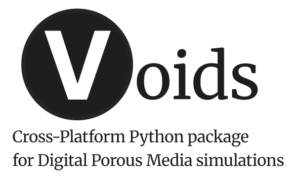

<p align="center">
  
</p>

# Overview

[](https://github.com/geomech-project/voids/actions/workflows/tests.yml)
[](https://codecov.io/gh/geomech-project/voids)
[](https://github.com/geomech-project/voids/actions/workflows/tests.yml)
[](https://pypi.org/project/voids/)
[](https://pypi.org/project/voids/)
[](https://doi.org/10.5281/zenodo.18937646)

**`voids`** is a scientific Python package for digital porous media research. Its
main modeling approach is pore-network modeling (PNM): images, extracted
networks, geometry, provenance, and transport assumptions are kept explicit so
permeability studies can be reproduced and compared.

Alongside PNM, `voids` provides complementary single-phase transport backends:
micro-continuum models with the finite-volume method (FVM) and finite-element
method (FEM), and direct numerical simulation (DNS) with the lattice Boltzmann
method (LBM). These backends make it possible to compare pore-network,
micro-continuum, and voxel-image descriptions of the same digital porous medium.
Interoperability with PoreSpy/OpenPNM-style data remains part of the package
contract.

---

## Why voids?

Digital porous-media transport research often struggles with reproducibility because
the mapping from segmented images or coefficient fields to simulation results involves
many implicit choices:

- Which pore and throat size definitions are used?
- How is the bulk volume defined relative to the image?
- What constitutive model is used for hydraulic conductance?
- What porosity/permeability closure, block size, and boundary conditions define a
  map-based continuum run?
- What lattice driving, wall treatment, and convergence diagnostics define a
  direct-image LBM run?

`voids` addresses these concerns by:

- enforcing an explicit, versioned **canonical network schema**
- requiring **provenance metadata** at construction time
- keeping **physics modules** narrowly scoped with documented assumptions
- providing **regression fixtures** to lock numerical results over time

---

## Recommended Reading Path

If you are new to the project, the shortest useful path is:

1. [Getting Started](getting_started.md) for installation and the minimal solve
2. [Concepts and Conventions](concepts.md) for the canonical data model and units
3. [Scientific Workflow](workflow.md) for image-based or imported-network studies
4. [Image Segmentation & Network Extraction](image_segmentation_network_extraction.md)
   for the segmented-image-to-network pipeline
5. [Theoretical Background](background.md) for governing equations and assumptions
6. [Examples](examples.md) for notebook-scale workflows
7. [Verification & Validation](verification/index.md) for benchmark evidence
8. [API Reference](api/index.md) for callable details

For contributors and local repository work, see [Development](development.md).

---

## Goals

- Make PNM the main modeling path for digital porous media studies
- Preserve sample geometry and provenance information needed for reproducible studies
- Support import and normalization of extracted networks from external tools
- Provide micro-continuum FVM/FEM and DNS LBM backends for single-phase comparison
  and upscaling
- Expose well-scoped physics modules with diagnostics and regression tests
- Build confidence from validated single-phase transport before adding richer models

---

## What `voids` Is And Is Not

`voids` is designed for explicit, scriptable scientific workflows.
It is not a GUI application, and it is not intended to replace upstream segmentation
or extraction tooling such as PoreSpy. The FEM, FVM, and LBM backends are provided
for documented digital-porous-media workflows and should be interpreted through
their stated governing equations, boundary conditions, map/image assumptions, and
solver diagnostics.

That division of responsibility is deliberate: segmentation assumptions and network
construction assumptions should remain visible in the provenance trail instead of
being hidden behind a single opaque entry point.

---

## Documentation Philosophy

The documentation is intended to answer two different kinds of questions:

- **Usage questions**: how to install `voids`, import a network, solve flow, and
  reproduce a workflow
- **Technical questions**: what the canonical schema means, what assumptions enter
  porosity and permeability calculations, and how the solver interprets boundary labels

Those two goals are intentionally separated across the documentation tree:

- [Getting Started](getting_started.md) and [Examples](examples.md) are task-oriented
- [Concepts and Conventions](concepts.md) and [Theoretical Background](background.md)
  are interpretation-oriented
- [API Reference](api/index.md) is interface-oriented

---

## Other User-Facing Capabilities

Some parts of `voids` were already implemented but easier to miss in the previous
docs structure because they mostly appeared under the API reference. The most
important ones are:

- [I/O](api/io.md): HDF5 persistence, external network interoperability,
  image-volume I/O, and surface-mesh export
- [Image Processing](api/image.md): segmentation helpers, spanning-cluster
  checks, and the native maximal-ball extraction backend
- [Generators](api/generators.md) and [Examples API](api/examples.md): synthetic
  porous images, deterministic network generators, and mesh-like fixtures
- [Visualization](api/visualization.md): Plotly and PyVista rendering for
  inspection and communication
- [Benchmarks](api/benchmarks.md): reusable wrappers for OpenPNM, segmented
  volume, and XLB cross-check workflows
- [Finite Volumes](api/fvm.md), [Finite Elements](api/fem.md), and
  [Lattice Boltzmann](api/lbm.md): map-based micro-continuum and direct-image
  single-phase backends
- [Simulators](api/simulators.md): ready-to-run single-phase workflow entry points

---

## Current Scope (v0.1.x)

| Feature | Status |
|---|---|
| Canonical `Network`, `SampleGeometry`, `Provenance` data structures | ✅ |
| Import of PoreSpy/OpenPNM-style dictionaries | ✅ |
| Geometry normalization helpers | ✅ |
| Absolute and effective porosity | ✅ |
| Connectivity metrics | ✅ |
| Single-phase incompressible flow | ✅ |
| Data-adaptive, size-factor, and shape-aware conductance models | ✅ |
| Pressure-dependent water viscosity via `thermo` / `CoolProp` | ✅ |
| Damped Newton and Picard nonlinear solves | ✅ |
| Krylov linear solvers with optional `pyamg` preconditioning | ✅ |
| Directional permeability estimation | ✅ |
| Porosity/permeability map generation and structured export | ✅ |
| TPFA finite-volume Darcy map upscaling | ✅ |
| FEniCSx finite-element Darcy-Darcy and Darcy-Brinkman map upscaling | ✅ Requires FEniCSx |
| XLB/JAX direct-image LBM Stokes-limit permeability estimates | ✅ Requires XLB/JAX |
| HDF5 serialization | ✅ |
| Plotly and PyVista visualization | ✅ |
| OpenPNM cross-checks | ✅ |
| Multiphase flow | ❌ Not yet |
| Basic grayscale thresholding and cylindrical crop preprocessing | ✅ |
| Advanced CT segmentation and manual/ML cleanup | ❌ Upstream preprocessing task |

---

## Quick Start

```python
from voids.examples import make_linear_chain_network
from voids.physics.petrophysics import absolute_porosity
from voids.physics.singlephase import FluidSinglePhase, PressureBC, solve

net = make_linear_chain_network()

result = solve(
    net,
    fluid=FluidSinglePhase(viscosity=1.0),
    bc=PressureBC("inlet_xmin", "outlet_xmax", pin=1.0, pout=0.0),
    axis="x",
)

print("phi_abs =", absolute_porosity(net))
print("Q =", result.total_flow_rate)
print("Kx =", result.permeability["x"])
print("mass_balance_error =", result.mass_balance_error)
```

See [Getting Started](getting_started.md) for installation and a full walkthrough.

For imported or extracted networks, the more realistic next step is
[Concepts and Conventions](concepts.md) and
[Scientific Workflow](workflow.md), which show how to attach units, geometry, and
provenance before solving.

---

## Status

`voids` is pre-alpha. The codebase is already useful for controlled single-phase
porous-media transport experiments, solver validation, and interoperability
studies, but it should not be described as a complete porous-media simulation
platform yet.

---

## AI Usage Statement

Starting with `v0.1.7`, `voids` development is aided by AI tools, including
Codex and GitHub Copilot. These tools are used to assist with refactoring,
fast code changes, code review, and documentation writing.

All scientific choices, implementation decisions, and final content remain
under human review and responsibility. This statement is intended as a
transparency measure aligned with current scientific-integrity expectations for
AI-assisted research and software development.

---

## Institutional Support

`voids` receives institutional support from the
[Laboratório Nacional de Computação Científica (LNCC)](https://www.gov.br/lncc/pt-br),
a research unit of the Ministério da Ciência, Tecnologia e Inovação (MCTI), Brazil.

<p align="center">
  <a href="https://www.gov.br/lncc/pt-br">
    
  </a>
</p>
