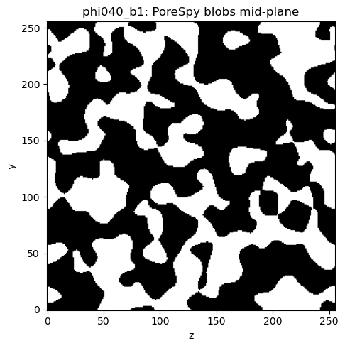
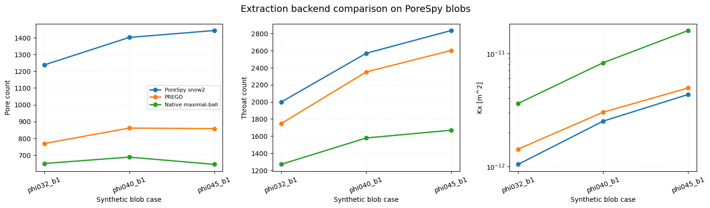
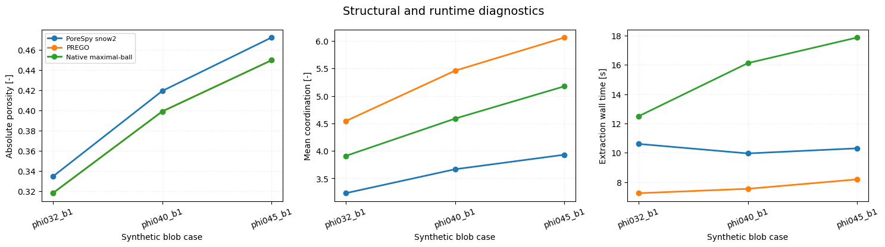
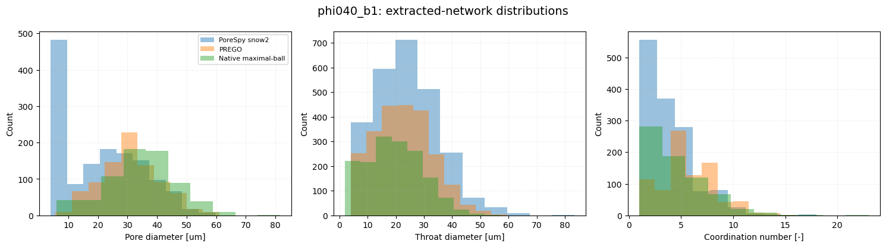

# MWE 32 - PREGO comparison on synthetic PoreSpy blobs

!!! warning "Rendered output needs refresh"
    The source notebook has been updated to use spherical seed search,
    level-queue growth, and the shared `hagen_poiseuille` conductance model for
    all backends. Re-run the notebook and refresh this report before using the
    rendered figures or tables as current benchmark evidence.

This notebook compares extraction backends on synthetic `256^3` PoreSpy
`blobs` volumes. It sends the same binary images through three extraction
backends:

- PoreSpy `snow2`, the established watershed/SNOW-style reference path in
  `voids`
- `prego`, the native PREGO-style seed-based region-growing backend
- `native_maximal_ball`, a separate native extraction reference already used
  elsewhere in this repository

Scientific scope and assumptions:

- the images are synthetic binary blobs, not scanner-derived segmentations
- the notebook compares extracted-network behavior, not direct image physics
- the same `voids` `hagen_poiseuille` conductance model and boundary
  conditions are used after extraction, so permeability differences mostly
  reflect extracted topology and geometry
- the PREGO implementation follows the paper's published algorithmic
  description, but it is not a bitwise reproduction of the authors' code
- `256^3` cases are large enough to expose runtime differences and give more
  meaningful network-size distributions, but they are still notebook-scale
  examples rather than a full scaling benchmark


```python
from __future__ import annotations

import time
from pathlib import Path

import matplotlib.pyplot as plt
import numpy as np
import pandas as pd
import porespy as ps

try:
    from IPython.display import display
except ImportError:  # pragma: no cover - notebook convenience fallback
    display = print

from voids.graph.metrics import coordination_numbers
from voids.image import construct_spanning_network, has_spanning_cluster
from voids.physics.petrophysics import absolute_porosity, effective_porosity
from voids.physics.singlephase import (
    FluidSinglePhase,
    PressureBC,
    SinglePhaseOptions,
    solve,
)


def _find_project_root() -> Path:
    cwd = Path.cwd().resolve()
    for candidate in (cwd, *cwd.parents):
        if (candidate / "mkdocs.yml").exists() and (candidate / "notebooks").exists():
            return candidate
    return cwd


def _finite_median(values: np.ndarray) -> float:
    finite = np.asarray(values, dtype=float)
    finite = finite[np.isfinite(finite)]
    if finite.size == 0:
        return float("nan")
    return float(np.median(finite))


def _finite_mean(values: np.ndarray) -> float:
    finite = np.asarray(values, dtype=float)
    finite = finite[np.isfinite(finite)]
    if finite.size == 0:
        return float("nan")
    return float(np.mean(finite))


def _diameter_array(container: dict[str, np.ndarray]) -> np.ndarray:
    if "diameter_inscribed" in container:
        return np.asarray(container["diameter_inscribed"], dtype=float)
    if "diameter_equivalent" in container:
        return np.asarray(container["diameter_equivalent"], dtype=float)
    if "radius_inscribed" in container:
        return 2.0 * np.asarray(container["radius_inscribed"], dtype=float)
    return np.asarray([], dtype=float)
```


```python
project_root = _find_project_root()
output_dir = (
    project_root / "notebooks" / "outputs" / "32_mwe_prego_blobs_backend_comparison"
)
output_dir.mkdir(parents=True, exist_ok=True)

flow_axis = "x"
axis_index = 0
voxel_size = 2.0e-6
fluid = FluidSinglePhase(viscosity=1.0e-3)
bc = PressureBC("inlet_xmin", "outlet_xmax", pin=1.0, pout=0.0)
options = SinglePhaseOptions(conductance_model="hagen_poiseuille", solver="direct")

sample_shape = (256, 256, 256)
case_specs = [
    {
        "case": "phi032_b1",
        "shape": sample_shape,
        "porosity": 0.32,
        "blobiness": 1,
        "seed_start": 100,
    },
    {
        "case": "phi040_b1",
        "shape": sample_shape,
        "porosity": 0.40,
        "blobiness": 1,
        "seed_start": 400,
    },
    {
        "case": "phi045_b1",
        "shape": sample_shape,
        "porosity": 0.45,
        "blobiness": 1,
        "seed_start": 500,
    },
]

backend_specs = [
    {
        "backend": "porespy",
        "label": "PoreSpy snow2",
        "extraction_kwargs": {"sigma": 0.4, "r_max": 4},
    },
    {
        "backend": "prego",
        "label": "PREGO",
        "extraction_kwargs": {
            "settings": {
                "r_max": 4,
                "sigma": 0.4,
                "peak_footprint": "sphere",
                "growth_mode": "level_queue",
                "distance_map_backend": "scipy",
            },
        },
    },
    {
        "backend": "native_maximal_ball",
        "label": "Native maximal-ball",
        "extraction_kwargs": {
            "distance_map_backend": "scipy",
            "apply_boundary_clipping": False,
            "settings": {"minimal_pore_radius_voxels": 1.0},
        },
    },
]

case_specs
```


    [{'case': 'phi032_b1',
      'shape': (256, 256, 256),
      'porosity': 0.32,
      'blobiness': 1,
      'seed_start': 100},
     {'case': 'phi040_b1',
      'shape': (256, 256, 256),
      'porosity': 0.4,
      'blobiness': 1,
      'seed_start': 400},
     {'case': 'phi045_b1',
      'shape': (256, 256, 256),
      'porosity': 0.45,
      'blobiness': 1,
      'seed_start': 500}]


## Generate spanning PoreSpy blob images

PoreSpy `blobs` images provide controlled, reproducible synthetic pore-space
morphologies. Here each case is generated directly from
`porespy.generators.blobs`, then accepted only if it has a face-connected void
path across the selected flow axis. The PREGO branch uses spherical seed search
and level-queue region growth; the faster cubic seed search and stamped-sphere
growth path remain available as explicit opt-in settings for runtime-focused
comparisons.


```python
images: dict[str, np.ndarray] = {}
image_rows: list[dict[str, object]] = []

for spec in case_specs:
    accepted_seed: int | None = None
    accepted_image: np.ndarray | None = None
    for seed in range(int(spec["seed_start"]), int(spec["seed_start"]) + 50):
        candidate = ps.generators.blobs(
            shape=list(spec["shape"]),
            porosity=float(spec["porosity"]),
            blobiness=int(spec["blobiness"]),
            seed=seed,
        )
        if has_spanning_cluster(candidate, axis_index=axis_index):
            accepted_seed = seed
            accepted_image = np.asarray(candidate, dtype=bool)
            break
    if accepted_image is None or accepted_seed is None:
        raise RuntimeError(
            f"Could not generate a spanning blob image for {spec['case']}"
        )

    case_name = str(spec["case"])
    images[case_name] = accepted_image
    image_rows.append(
        {
            **spec,
            "seed_used": accepted_seed,
            "phi_image": float(accepted_image.mean()),
            "spans_x": has_spanning_cluster(accepted_image, axis_index=0),
            "spans_y": has_spanning_cluster(accepted_image, axis_index=1),
            "spans_z": has_spanning_cluster(accepted_image, axis_index=2),
        }
    )

image_df = pd.DataFrame(image_rows)
image_df
```


<div>
<style scoped>
    .dataframe tbody tr th:only-of-type {
        vertical-align: middle;
    }

    .dataframe tbody tr th {
        vertical-align: top;
    }

    .dataframe thead th {
        text-align: right;
    }
</style>
<table border="1" class="dataframe">
  <thead>
    <tr style="text-align: right;">
      <th></th>
      <th>case</th>
      <th>shape</th>
      <th>porosity</th>
      <th>blobiness</th>
      <th>seed_start</th>
      <th>seed_used</th>
      <th>phi_image</th>
      <th>spans_x</th>
      <th>spans_y</th>
      <th>spans_z</th>
    </tr>
  </thead>
  <tbody>
    <tr>
      <th>0</th>
      <td>phi032_b1</td>
      <td>(256, 256, 256)</td>
      <td>0.32</td>
      <td>1</td>
      <td>100</td>
      <td>100</td>
      <td>0.32</td>
      <td>True</td>
      <td>True</td>
      <td>True</td>
    </tr>
    <tr>
      <th>1</th>
      <td>phi040_b1</td>
      <td>(256, 256, 256)</td>
      <td>0.40</td>
      <td>1</td>
      <td>400</td>
      <td>400</td>
      <td>0.40</td>
      <td>True</td>
      <td>True</td>
      <td>True</td>
    </tr>
    <tr>
      <th>2</th>
      <td>phi045_b1</td>
      <td>(256, 256, 256)</td>
      <td>0.45</td>
      <td>1</td>
      <td>500</td>
      <td>500</td>
      <td>0.45</td>
      <td>True</td>
      <td>True</td>
      <td>True</td>
    </tr>
  </tbody>
</table>
</div>


## Extract, solve, and summarize

The metrics below follow the paper's comparison categories: pore count, throat
count, pore/throat size, coordination number, porosity, permeability, and CPU
time. The reported CPU time is notebook-level wall time for extraction or
solve on these small cases; it should not be interpreted as the large-volume
scaling result from the paper. All extraction backends are solved with the
same `hagen_poiseuille` conductance model, so this comparison isolates
extraction behavior rather than mixing conductance closures. If an extracted
network lacks pore-throat-pore conduit lengths, `hagen_poiseuille` falls back
to the one-throat circular Poiseuille law.


```python
rows: list[dict[str, object]] = []
constructions: dict[tuple[str, str], object] = {}
solve_results: dict[tuple[str, str], object] = {}

for case_name, image in images.items():
    for backend_spec in backend_specs:
        extraction_start = time.perf_counter()
        construction = construct_spanning_network(
            backend=str(backend_spec["backend"]),
            phases=image.astype(int),
            voxel_size=voxel_size,
            flow_axis=flow_axis,
            extraction_kwargs=dict(backend_spec["extraction_kwargs"]),
            provenance_notes={
                "benchmark_kind": "prego_blobs_backend_comparison",
                "synthetic_generator": "porespy.generators.blobs",
                "case": case_name,
            },
        )
        extraction_seconds = time.perf_counter() - extraction_start

        solve_start = time.perf_counter()
        result = solve(
            construction.net,
            fluid=fluid,
            bc=bc,
            axis=flow_axis,
            options=options,
        )
        solve_seconds = time.perf_counter() - solve_start

        net = construction.net
        pore_diameter = _diameter_array(net.pore)
        throat_diameter = _diameter_array(net.throat)
        coordination = coordination_numbers(net)

        rows.append(
            {
                "case": case_name,
                "backend": backend_spec["backend"],
                "backend_label": backend_spec["label"],
                "backend_version": construction.backend_version,
                "conductance_model": options.conductance_model,
                "shape": str(image.shape),
                "phi_image": float(image.mean()),
                "phi_abs": float(absolute_porosity(net)),
                "phi_eff_x": float(effective_porosity(net, axis=flow_axis)),
                "Np": int(net.Np),
                "Nt": int(net.Nt),
                "mean_coordination": _finite_mean(coordination),
                "median_pore_diameter_m": _finite_median(pore_diameter),
                "median_throat_diameter_m": _finite_median(throat_diameter),
                "Kx_m2": float(result.permeability[flow_axis]),
                "Q_m3_s": float(result.total_flow_rate),
                "mass_balance_error": float(result.mass_balance_error),
                "extraction_seconds": float(extraction_seconds),
                "solve_seconds": float(solve_seconds),
            }
        )
        constructions[(case_name, str(backend_spec["backend"]))] = construction
        solve_results[(case_name, str(backend_spec["backend"]))] = result

summary_df = pd.DataFrame(rows)

reference = summary_df.loc[
    summary_df["backend"] == "porespy", ["case", "Kx_m2", "Np", "Nt"]
]
reference = reference.rename(
    columns={"Kx_m2": "Kx_snow2_m2", "Np": "Np_snow2", "Nt": "Nt_snow2"}
)
summary_df = summary_df.merge(reference, on="case", how="left")
summary_df["Kx_ratio_to_snow2"] = summary_df["Kx_m2"] / summary_df["Kx_snow2_m2"]
summary_df["Np_ratio_to_snow2"] = summary_df["Np"] / summary_df["Np_snow2"]
summary_df["Nt_ratio_to_snow2"] = summary_df["Nt"] / summary_df["Nt_snow2"]

display_columns = [
    "case",
    "backend_label",
    "phi_image",
    "phi_abs",
    "phi_eff_x",
    "Np",
    "Nt",
    "mean_coordination",
    "median_pore_diameter_m",
    "median_throat_diameter_m",
    "Kx_m2",
    "Kx_ratio_to_snow2",
    "extraction_seconds",
]
summary_df.loc[:, display_columns]
```

    OMP: Info #276: omp_set_nested routine deprecated, please use omp_set_max_active_levels instead.


<div>
<style scoped>
    .dataframe tbody tr th:only-of-type {
        vertical-align: middle;
    }

    .dataframe tbody tr th {
        vertical-align: top;
    }

    .dataframe thead th {
        text-align: right;
    }
</style>
<table border="1" class="dataframe">
  <thead>
    <tr style="text-align: right;">
      <th></th>
      <th>case</th>
      <th>backend_label</th>
      <th>phi_image</th>
      <th>phi_abs</th>
      <th>phi_eff_x</th>
      <th>Np</th>
      <th>Nt</th>
      <th>mean_coordination</th>
      <th>median_pore_diameter_m</th>
      <th>median_throat_diameter_m</th>
      <th>Kx_m2</th>
      <th>Kx_ratio_to_snow2</th>
      <th>extraction_seconds</th>
    </tr>
  </thead>
  <tbody>
    <tr>
      <th>0</th>
      <td>phi032_b1</td>
      <td>PoreSpy snow2</td>
      <td>0.32</td>
      <td>0.334429</td>
      <td>0.334429</td>
      <td>1237</td>
      <td>1998</td>
      <td>3.230396</td>
      <td>0.000020</td>
      <td>0.000022</td>
      <td>1.048927e-12</td>
      <td>1.000000</td>
      <td>10.602591</td>
    </tr>
    <tr>
      <th>1</th>
      <td>phi032_b1</td>
      <td>PREGO</td>
      <td>0.32</td>
      <td>0.317970</td>
      <td>0.317970</td>
      <td>769</td>
      <td>1746</td>
      <td>4.540962</td>
      <td>0.000029</td>
      <td>0.000022</td>
      <td>1.428455e-12</td>
      <td>1.361825</td>
      <td>7.236538</td>
    </tr>
    <tr>
      <th>2</th>
      <td>phi032_b1</td>
      <td>Native maximal-ball</td>
      <td>0.32</td>
      <td>0.317970</td>
      <td>0.317970</td>
      <td>650</td>
      <td>1270</td>
      <td>3.907692</td>
      <td>0.000032</td>
      <td>0.000018</td>
      <td>3.608839e-12</td>
      <td>3.440506</td>
      <td>12.486288</td>
    </tr>
    <tr>
      <th>3</th>
      <td>phi040_b1</td>
      <td>PoreSpy snow2</td>
      <td>0.40</td>
      <td>0.419214</td>
      <td>0.419214</td>
      <td>1401</td>
      <td>2568</td>
      <td>3.665953</td>
      <td>0.000020</td>
      <td>0.000023</td>
      <td>2.518224e-12</td>
      <td>1.000000</td>
      <td>9.952713</td>
    </tr>
    <tr>
      <th>4</th>
      <td>phi040_b1</td>
      <td>PREGO</td>
      <td>0.40</td>
      <td>0.398919</td>
      <td>0.398919</td>
      <td>861</td>
      <td>2350</td>
      <td>5.458769</td>
      <td>0.000030</td>
      <td>0.000023</td>
      <td>3.021492e-12</td>
      <td>1.199850</td>
      <td>7.537757</td>
    </tr>
    <tr>
      <th>5</th>
      <td>phi040_b1</td>
      <td>Native maximal-ball</td>
      <td>0.40</td>
      <td>0.398919</td>
      <td>0.398919</td>
      <td>688</td>
      <td>1578</td>
      <td>4.587209</td>
      <td>0.000035</td>
      <td>0.000019</td>
      <td>8.241014e-12</td>
      <td>3.272550</td>
      <td>16.117709</td>
    </tr>
    <tr>
      <th>6</th>
      <td>phi045_b1</td>
      <td>PoreSpy snow2</td>
      <td>0.45</td>
      <td>0.472200</td>
      <td>0.472200</td>
      <td>1442</td>
      <td>2834</td>
      <td>3.930652</td>
      <td>0.000020</td>
      <td>0.000025</td>
      <td>4.326223e-12</td>
      <td>1.000000</td>
      <td>10.299894</td>
    </tr>
    <tr>
      <th>7</th>
      <td>phi045_b1</td>
      <td>PREGO</td>
      <td>0.45</td>
      <td>0.449695</td>
      <td>0.449695</td>
      <td>858</td>
      <td>2601</td>
      <td>6.062937</td>
      <td>0.000032</td>
      <td>0.000024</td>
      <td>4.936248e-12</td>
      <td>1.141006</td>
      <td>8.180918</td>
    </tr>
    <tr>
      <th>8</th>
      <td>phi045_b1</td>
      <td>Native maximal-ball</td>
      <td>0.45</td>
      <td>0.449695</td>
      <td>0.449695</td>
      <td>645</td>
      <td>1669</td>
      <td>5.175194</td>
      <td>0.000038</td>
      <td>0.000020</td>
      <td>1.583461e-11</td>
      <td>3.660146</td>
      <td>17.867414</td>
    </tr>
  </tbody>
</table>
</div>


## Representative segmentation input

These are the binary images passed to all backends. The extraction backends
differ only after this point.


```python
representative_case = "phi040_b1"
representative_image = images[representative_case]
mid = representative_image.shape[0] // 2

fig, ax = plt.subplots(figsize=(5.6, 5.0))
ax.imshow(representative_image[mid, :, :], cmap="gray", origin="lower")
ax.set_title(f"{representative_case}: PoreSpy blobs mid-plane")
ax.set_xlabel("z")
ax.set_ylabel("y")
plt.tight_layout()
input_slice_path = output_dir / "representative_blobs_slice.png"
fig.savefig(input_slice_path, dpi=160, bbox_inches="tight")
plt.show()
print("Saved:", input_slice_path)
```





    Saved: /Users/dtvolpatto/Work/voids/notebooks/outputs/32_mwe_prego_blobs_backend_comparison/representative_blobs_slice.png


## Backend-level comparisons

PREGO in this notebook is allowed to be coarser than `snow2`: the paper
itself reports differences in pore and throat sizes, coordination number, and
contact areas. The important scientific question is whether those differences
are stable and whether transport-relevant quantities remain acceptable for the
intended application.


```python
fig, axes = plt.subplots(1, 3, figsize=(15, 4.4), sharex=True)

for backend_label, group in summary_df.groupby("backend_label", sort=False):
    axes[0].plot(
        group["case"], group["Np"], marker="o", linewidth=2, label=backend_label
    )
    axes[1].plot(
        group["case"], group["Nt"], marker="o", linewidth=2, label=backend_label
    )
    axes[2].plot(
        group["case"], group["Kx_m2"], marker="o", linewidth=2, label=backend_label
    )

axes[0].set_ylabel("Pore count")
axes[1].set_ylabel("Throat count")
axes[2].set_ylabel("Kx [m^2]")
axes[2].set_yscale("log")
for ax in axes:
    ax.set_xlabel("Synthetic blob case")
    ax.grid(alpha=0.3, linestyle=":")
    ax.tick_params(axis="x", rotation=20)
axes[0].legend(fontsize=8)
fig.suptitle("Extraction backend comparison on PoreSpy blobs", fontsize=14)
plt.tight_layout()
comparison_path = output_dir / "backend_counts_and_permeability.png"
fig.savefig(comparison_path, dpi=160, bbox_inches="tight")
plt.show()
print("Saved:", comparison_path)
```





    Saved: /Users/dtvolpatto/Work/voids/notebooks/outputs/32_mwe_prego_blobs_backend_comparison/backend_counts_and_permeability.png


```python
fig, axes = plt.subplots(1, 3, figsize=(15, 4.2), sharex=True)

for backend_label, group in summary_df.groupby("backend_label", sort=False):
    axes[0].plot(
        group["case"], group["phi_abs"], marker="o", linewidth=2, label=backend_label
    )
    axes[1].plot(
        group["case"],
        group["mean_coordination"],
        marker="o",
        linewidth=2,
        label=backend_label,
    )
    axes[2].plot(
        group["case"],
        group["extraction_seconds"],
        marker="o",
        linewidth=2,
        label=backend_label,
    )

axes[0].set_ylabel("Absolute porosity [-]")
axes[1].set_ylabel("Mean coordination [-]")
axes[2].set_ylabel("Extraction wall time [s]")
for ax in axes:
    ax.set_xlabel("Synthetic blob case")
    ax.grid(alpha=0.3, linestyle=":")
    ax.tick_params(axis="x", rotation=20)
axes[0].legend(fontsize=8)
fig.suptitle("Structural and runtime diagnostics", fontsize=14)
plt.tight_layout()
diagnostic_path = output_dir / "backend_structural_runtime_diagnostics.png"
fig.savefig(diagnostic_path, dpi=160, bbox_inches="tight")
plt.show()
print("Saved:", diagnostic_path)
```





    Saved: /Users/dtvolpatto/Work/voids/notebooks/outputs/32_mwe_prego_blobs_backend_comparison/backend_structural_runtime_diagnostics.png


## Representative size distributions

The paper compares pore diameter, throat diameter, coordination number, and
pore-to-pore spacing. Here we show the first three directly from the
canonical `voids.Network` fields for the representative case.


```python
fig, axes = plt.subplots(1, 3, figsize=(15, 4.2))

for backend_spec in backend_specs:
    backend = str(backend_spec["backend"])
    label = str(backend_spec["label"])
    net = constructions[(representative_case, backend)].net
    pore_diameter_um = 1.0e6 * _diameter_array(net.pore)
    throat_diameter_um = 1.0e6 * _diameter_array(net.throat)
    coordination = coordination_numbers(net)

    if pore_diameter_um.size:
        axes[0].hist(
            pore_diameter_um[np.isfinite(pore_diameter_um)], alpha=0.45, label=label
        )
    if throat_diameter_um.size:
        axes[1].hist(
            throat_diameter_um[np.isfinite(throat_diameter_um)], alpha=0.45, label=label
        )
    if coordination.size:
        axes[2].hist(coordination[np.isfinite(coordination)], alpha=0.45, label=label)

axes[0].set_xlabel("Pore diameter [um]")
axes[1].set_xlabel("Throat diameter [um]")
axes[2].set_xlabel("Coordination number [-]")
for ax in axes:
    ax.set_ylabel("Count")
    ax.grid(alpha=0.3, linestyle=":")
axes[0].legend(fontsize=8)
fig.suptitle(f"{representative_case}: extracted-network distributions", fontsize=14)
plt.tight_layout()
distribution_path = output_dir / "representative_backend_distributions.png"
fig.savefig(distribution_path, dpi=160, bbox_inches="tight")
plt.show()
print("Saved:", distribution_path)
```





    Saved: /Users/dtvolpatto/Work/voids/notebooks/outputs/32_mwe_prego_blobs_backend_comparison/representative_backend_distributions.png


## Save tabular outputs

The CSV files are useful for checking whether future PREGO changes move
structural or permeability metrics.


```python
summary_csv = output_dir / "prego_blobs_backend_summary.csv"
image_csv = output_dir / "prego_blobs_image_summary.csv"
summary_df.to_csv(summary_csv, index=False)
image_df.to_csv(image_csv, index=False)
print("Saved:", summary_csv)
print("Saved:", image_csv)
```

    Saved: /Users/dtvolpatto/Work/voids/notebooks/outputs/32_mwe_prego_blobs_backend_comparison/prego_blobs_backend_summary.csv
    Saved: /Users/dtvolpatto/Work/voids/notebooks/outputs/32_mwe_prego_blobs_backend_comparison/prego_blobs_image_summary.csv


```python
ratio_table = summary_df.pivot(
    index="case", columns="backend_label", values="Kx_ratio_to_snow2"
)
count_table = summary_df.pivot(
    index="case", columns="backend_label", values="Np_ratio_to_snow2"
)

print("Kx ratios relative to PoreSpy snow2:")
display(ratio_table)

print("Pore-count ratios relative to PoreSpy snow2:")
display(count_table)

max_mass_balance_error = float(summary_df["mass_balance_error"].abs().max())
print(f"Max absolute mass-balance error: {max_mass_balance_error:.3e}")

if max_mass_balance_error < 1.0e-8:
    print(
        "All backend solves satisfy the mass-balance tolerance used in this notebook."
    )
else:
    print(
        "At least one backend solve has a large mass-balance residual; inspect before using Kx."
    )
```

    Kx ratios relative to PoreSpy snow2:


<div>
<style scoped>
    .dataframe tbody tr th:only-of-type {
        vertical-align: middle;
    }

    .dataframe tbody tr th {
        vertical-align: top;
    }

    .dataframe thead th {
        text-align: right;
    }
</style>
<table border="1" class="dataframe">
  <thead>
    <tr style="text-align: right;">
      <th>backend_label</th>
      <th>Native maximal-ball</th>
      <th>PREGO</th>
      <th>PoreSpy snow2</th>
    </tr>
    <tr>
      <th>case</th>
      <th></th>
      <th></th>
      <th></th>
    </tr>
  </thead>
  <tbody>
    <tr>
      <th>phi032_b1</th>
      <td>3.440506</td>
      <td>1.361825</td>
      <td>1.0</td>
    </tr>
    <tr>
      <th>phi040_b1</th>
      <td>3.272550</td>
      <td>1.199850</td>
      <td>1.0</td>
    </tr>
    <tr>
      <th>phi045_b1</th>
      <td>3.660146</td>
      <td>1.141006</td>
      <td>1.0</td>
    </tr>
  </tbody>
</table>
</div>


    Pore-count ratios relative to PoreSpy snow2:


<div>
<style scoped>
    .dataframe tbody tr th:only-of-type {
        vertical-align: middle;
    }

    .dataframe tbody tr th {
        vertical-align: top;
    }

    .dataframe thead th {
        text-align: right;
    }
</style>
<table border="1" class="dataframe">
  <thead>
    <tr style="text-align: right;">
      <th>backend_label</th>
      <th>Native maximal-ball</th>
      <th>PREGO</th>
      <th>PoreSpy snow2</th>
    </tr>
    <tr>
      <th>case</th>
      <th></th>
      <th></th>
      <th></th>
    </tr>
  </thead>
  <tbody>
    <tr>
      <th>phi032_b1</th>
      <td>0.525465</td>
      <td>0.621665</td>
      <td>1.0</td>
    </tr>
    <tr>
      <th>phi040_b1</th>
      <td>0.491078</td>
      <td>0.614561</td>
      <td>1.0</td>
    </tr>
    <tr>
      <th>phi045_b1</th>
      <td>0.447295</td>
      <td>0.595007</td>
      <td>1.0</td>
    </tr>
  </tbody>
</table>
</div>


    Max absolute mass-balance error: 3.181e-26
    All backend solves satisfy the mass-balance tolerance used in this notebook.
