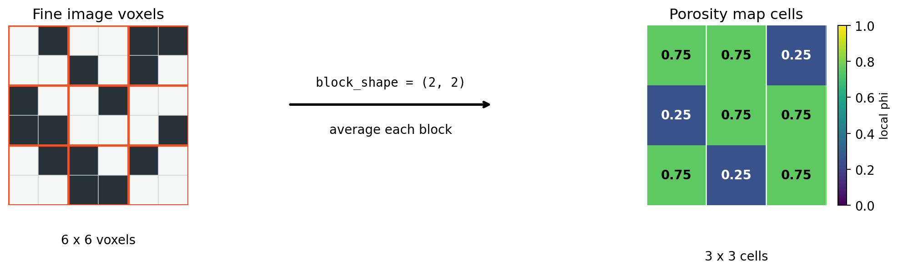
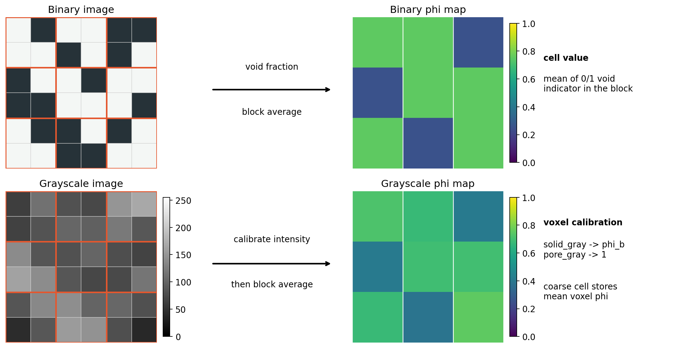
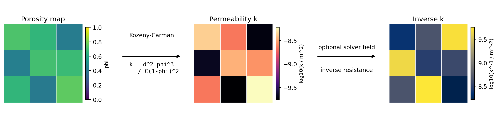
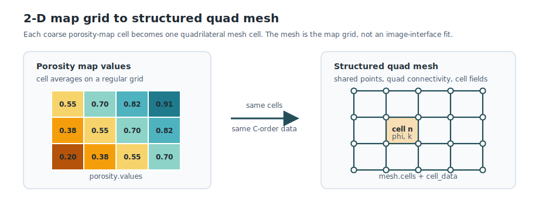
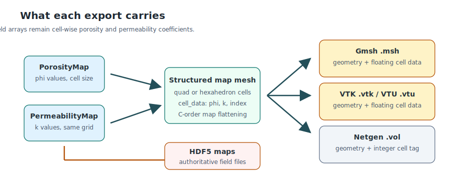

# Porosity Maps

This page documents the continuum porosity-map workflow implemented in
`voids.image.porosity`.
It is separate from pore-network porosity: here the output is a regular grid of
cell-average porosity values intended for continuum, FEM, finite-volume, or
external solver workflows.

The minimal demonstration is
`notebooks/33_mwe_synthetic_porosity_maps`, which builds porosity maps from a
synthetic PoreSpy `blobs` binary image and a derived toy grayscale image.

---

## What `block_shape` Means

`block_shape` defines how many fine image voxels are averaged into one porosity-map
cell.



The 2-D schematic shows the same operation used in 3-D: each highlighted fine
voxel block becomes one coarse cell whose value is the average porosity over
that block.

For a 3-D image with shape

\[
(n_0, n_1, n_2),
\]

and coarse-cell block sizes \((b_0, b_1, b_2)\), represented in code by
`block_shape=(b_0, b_1, b_2)`,

the output porosity map has shape

\[
\left(
\left\lfloor \frac{n_0}{b_0} \right\rfloor,
\left\lfloor \frac{n_1}{b_1} \right\rfloor,
\left\lfloor \frac{n_2}{b_2} \right\rfloor
\right).
\]

When `strict=True`, which is the default, every image dimension must be exactly
divisible by the corresponding block dimension.
For example:

```python
shape = (300, 300, 300)
block_shape = (10, 10, 10)
```

gives a porosity map with shape:

\[
(30, 30, 30).
\]

Each coarse porosity cell is the average over one \(10 \times 10 \times 10\)
voxel block.
If the fine voxel size is \(40\,\mu\mathrm{m}\), then the porosity-map cell size is:

\[
(10, 10, 10) \times 40\,\mu\mathrm{m}
=
(400, 400, 400)\,\mu\mathrm{m}.
\]

In code:

```python
porosity = porosity_map_from_binary(
    image,
    block_shape=(10, 10, 10),
    voxel_size=40.0e-6,
)

porosity.shape       # (30, 30, 30)
porosity.cell_size   # (4.0e-4, 4.0e-4, 4.0e-4) in meters
```

!!! note "Axis convention"
    `block_shape` follows the NumPy array axis order of the input image.
    `voids` does not silently reinterpret array axes as geological or scanner axes.
    If a dataset uses a different physical axis order, transpose or document that
    convention before exporting fields to another solver.

---

## Binary-Image Porosity

For a segmented binary image, the input is interpreted as a void mask.
By default:

- `True` or `1` means void,
- `False` or `0` means solid.

Let \(V_{ijk}\) be the fine-grid void indicator:

\[
V_{ijk}
=
\begin{cases}
1, & \text{if voxel }(i,j,k)\text{ is void}, \\
0, & \text{if voxel }(i,j,k)\text{ is solid}.
\end{cases}
\]

For porosity-map cell \((I,J,K)\), with block shape
\((b_0,b_1,b_2)\), the local porosity is:

\[
\phi^{\mathrm{bin}}_{IJK}
=
\frac{1}{b_0 b_1 b_2}
\sum_{i=I b_0}^{(I+1)b_0 - 1}
\sum_{j=J b_1}^{(J+1)b_1 - 1}
\sum_{k=K b_2}^{(K+1)b_2 - 1}
V_{ijk}.
\]

So the binary porosity map is exactly a local void-volume fraction on the
regular image grid.

If `image_is_void=False`, the input binary image is interpreted as a solid mask
and inverted before applying the same formula.

### Conservation Check

If the image shape is exactly divisible by `block_shape`, the mean of the local
porosity map equals the global void fraction:

\[
\overline{\phi}^{\mathrm{bin}}
=
\frac{1}{N_c}\sum_{IJK}\phi^{\mathrm{bin}}_{IJK}
=
\frac{1}{N_v}\sum_{ijk}V_{ijk},
\]

where \(N_c\) is the number of coarse cells and \(N_v\) is the number of fine
voxels.

This is one of the most important synthetic verification checks.

---

## Grayscale-Image Porosity

For a grayscale image, `voids` first maps each fine voxel intensity to a porosity
value using a two-point linear calibration.

The calibration inputs are:

| Parameter | Meaning |
|---|---|
| `solid_gray` | grayscale value assigned to `background_porosity` |
| `pore_gray` | grayscale value assigned to porosity \(1\) |
| `background_porosity` | porosity floor at the solid endpoint |

Let \(G_{ijk}\) be the grayscale value of voxel \((i,j,k)\), \(G_s\) be
`solid_gray`, \(G_p\) be `pore_gray`, and \(\phi_b\) be `background_porosity`.
The voxel-scale porosity is:

\[
\phi^{\mathrm{vox}}_{ijk}
=
\phi_b
+
(1-\phi_b)
\frac{G_{ijk} - G_s}{G_p - G_s}.
\]

By default, values are clipped to:

\[
\phi^{\mathrm{vox}}_{ijk} \in [\phi_b, 1].
\]

Then the coarse grayscale porosity map is a block average of those voxel
porosities:

\[
\phi^{\mathrm{gray}}_{IJK}
=
\frac{1}{b_0 b_1 b_2}
\sum_{i=I b_0}^{(I+1)b_0 - 1}
\sum_{j=J b_1}^{(J+1)b_1 - 1}
\sum_{k=K b_2}^{(K+1)b_2 - 1}
\phi^{\mathrm{vox}}_{ijk}.
\]



The top row corresponds to the binary void-fraction formula. The bottom row
corresponds to the grayscale calibration formula followed by the same block
average.

### Micro-CT Grayscale Calibration In The Literature

Ferreira et al. (2020) used resampled micro-CT images of carbonate plugs to
construct porosity fields for a two-scale continuum reactive-flow solver.
The image-to-porosity calculation assigns a pore grayscale threshold to 100%
porosity, a solid grayscale threshold to a background porosity \(BP\), and
linearly maps each micro-CT voxel between those endpoints.
In fractional notation, the same calculation is:

\[
\epsilon_{\mathrm{voxel}}
=
BP
+
(1-BP)
\frac{GS_{\mathrm{voxel}}-GS_{\mathrm{solid}}}
{GS_{\mathrm{pore}}-GS_{\mathrm{solid}}}.
\]

This is the same two-endpoint linear calibration implemented by
`calibrated_porosity_from_grayscale`, with `background_porosity` playing the
role of \(BP\). The additional `block_shape` averaging in `voids` is a separate
coarsening step: use `block_shape=(1, 1, 1)` when each image voxel is intended
to become one continuum cell, or use larger blocks when the target solver uses a
coarser regular grid.

### Dark-Pore And Bright-Pore Images

The formula does not require pores to be darker than solid.
It only requires `solid_gray` and `pore_gray` to be distinct.

For a dark-pore image:

\[
G_p < G_s.
\]

For a bright-pore image:

\[
G_p > G_s.
\]

Both cases are handled by the same denominator \(G_p - G_s\).

### Important Assumption

The grayscale path assumes that a linear grayscale interpolation is a defensible
proxy for local porosity between the two calibration endpoints.
That may be incorrect when the image has severe beam hardening, ring artifacts,
mixed mineral phases, uncorrected scanner drift, or a nonlinear intensity-density
relationship.
For real micro-CT data, calibration must be treated as part of the physical model,
not as a plotting choice.

---

## Physical Volumes

For a porosity map with cell size

\[
(\Delta x, \Delta y, \Delta z),
\]

the bulk volume of one porosity cell is:

\[
\Delta V = \Delta x \Delta y \Delta z.
\]

The total represented bulk volume is:

\[
V_{\mathrm{bulk}}
=
N_c \Delta V.
\]

The implied pore volume is:

\[
V_{\mathrm{void}}
=
\sum_{IJK}\phi_{IJK}\Delta V.
\]

The mean porosity is therefore:

\[
\overline{\phi}
=
\frac{V_{\mathrm{void}}}{V_{\mathrm{bulk}}}.
\]

This relation is used by `PorosityMap.bulk_volume`,
`PorosityMap.void_volume`, and `PorosityMap.mean_porosity`.

!!! warning "2-D maps"
    The same implementation accepts 2-D arrays, where the product of `cell_size`
    is an area. If the target solver expects a 3-D volume, supply a 3-D image or
    define an explicit thickness outside this 2-D helper.

---

## Kozeny-Carman Permeability Field

`voids` can also generate an associated permeability field from a porosity map
using the Kozeny-Carman closure.
For cell porosity \(\phi\), characteristic length \(d\), and Kozeny constant
\(C\), the implemented permeability form is:

\[
k(\phi)
=
\frac{d^2 \phi^3}{C(1-\phi)^2},
\quad 0 < \phi < 1.
\]

The equivalent inverse-permeability, or Darcy resistance, form is:

\[
k^{-1}(\phi)
=
\frac{C(1-\phi)^2}{d^2\phi^3},
\quad 0 < \phi < 1.
\]



The permeability map and inverse-permeability map live on the same regular grid
as the porosity map. The figure uses a logarithmic color scale for \(k\) and
\(k^{-1}\), because permeability closures can vary by orders of magnitude.

The default \(C=180\) is the common packed-sphere Kozeny-Carman value associated
with the classical Kozeny and Carman packed-bed relation.
The length \(d\) is a model parameter, not inferred automatically.
In a sub-resolution porosity interpretation, \(d\) is often tied to the voxel or
control-volume length scale when no better grain-scale or micropore-scale
calibration is available, but that choice is empirical and should be tested.

The endpoint limits are:

\[
\phi=0 \Rightarrow k=0,\quad k^{-1}=\infty,
\]

\[
\phi=1 \Rightarrow k=\infty,\quad k^{-1}=0.
\]

These are mathematical limits. Many external solvers require finite values, so
`voids` exposes explicit caps and endpoint parameters:

```python
from voids.image.porosity import permeability_map_from_porosity

permeability = permeability_map_from_porosity(
    porosity,
    characteristic_length=4.0e-4,
    kozeny_constant=180.0,
    max_permeability=1.0e-8,
)
```

The resulting object is a `PermeabilityMap` on the same grid as the input
porosity map:

```python
permeability.values          # k field
permeability.inverse_values  # k^{-1} field for Darcy-Brinkman resistance terms
permeability.cell_size       # inherited from the porosity map
```

!!! warning "Closure calibration"
    The Kozeny-Carman field is a closure model, not a direct measurement.
    The same porosity map can produce very different permeability fields if
    \(d\), \(C\), endpoint handling, or caps are changed. For real data, these
    parameters should be calibrated or at least sensitivity-tested against
    laboratory permeability, direct numerical simulation, or another reference.

---

## Exported HDF5 Files

`save_porosity_map_hdf5` writes:

- `/porosity`: the cell-average porosity array,
- root attribute `schema_version`,
- root attribute `metadata`, encoded as JSON.

`save_permeability_map_hdf5` writes:

- `/permeability`: the cell-wise permeability array,
- root attribute `schema_version`,
- root attribute `metadata`, encoded as JSON.

The metadata includes:

- porosity-map shape,
- cell size,
- origin,
- units,
- source/calibration metadata such as `block_shape`, `solid_gray`, `pore_gray`,
  and `background_porosity`.

This export is intentionally solver-neutral.
It is a stable field file, not a full FEM mesh.
Solver-specific exporters should define cell ordering, mesh topology, boundary
patches, and field naming explicitly.

---

## Structured Mesh Export

`voids.mesh` can convert a regular `PorosityMap`, optionally paired with a
matching `PermeabilityMap`, into a structured mesh. The default cells are
quadrilaterals for 2-D maps and hexahedra for 3-D maps. If a downstream solver
expects simplex cells, the same map grid can also be subdivided into triangles
in 2-D or tetrahedra in 3-D.
The cell data order is explicit:

```python
cell_data["porosity"][0][n] == porosity.values.ravel(order="C")[n]
```

This means the mesh is a representation of the coarse map grid, not a
segmentation-boundary mesh of the original image.
For a 2-D slice, each coarse porosity cell becomes one quadrilateral by default,
or two triangles when `element_type="triangle"`. For a 3-D map, each coarse
porosity cell becomes one hexahedron by default, or six tetrahedra when
`element_type="tetra"` or `element_type="tetrahedron"`. In the simplex exports,
the child cells inherit the same porosity, permeability, and parent
`cell_index` values as the original coarse map cell.



The 2-D scheme shows the default cell-for-cell quadrilateral export. The 3-D
default is analogous: each coarse map volume cell becomes one hexahedral mesh
cell instead of one quadrilateral. The simplex options subdivide those default
cells, but porosity and permeability remain cell-wise fields inherited from the
parent map cell.

```python
from voids.mesh import write_structured_map_meshes

paths = write_structured_map_meshes(
    porosity,
    "outputs/case_a",
    stem="case_a_porosity_permeability",
    permeability_map=permeability,
    formats=("gmsh", "vtk", "vtu", "netgen"),
)

triangle_paths = write_structured_map_meshes(
    porosity,
    "outputs/case_a",
    stem="case_a_porosity_permeability_triangles",
    permeability_map=permeability,
    formats=("gmsh", "vtk", "vtu"),
    element_type="triangle",
)
```

The Gmsh `.msh`, VTK `.vtk`, and VTU `.vtu` exports are intended to carry the
floating porosity and permeability arrays as cell data.
The Netgen `.vol` writer available through `meshio` can write the structured
geometry, but it should not be treated as the authoritative carrier of
floating porosity/permeability fields. Keep the HDF5 map files, or a
cell-data-preserving format such as VTU, as the source of truth for the
coefficients.



`voids` uses [`meshio`](https://github.com/nschloe/meshio) for mesh-file I/O.
The meshio project documents support for Gmsh, VTK, VTU, Netgen, and many other
formats, but format support does not imply that every downstream code preserves
the same field-data names, physical tags, or boundary-region conventions.
Check the exported mesh in the target solver before interpreting a simulation.

!!! warning "Gmsh export versus Gmsh meshing"
    The `.msh` export is a structured map mesh written in Gmsh format. It does
    not run Gmsh to remesh the bone/marrow interface. The triangular and
    tetrahedral options are structured subdivisions of the porosity-map cells,
    not boundary-conforming image-to-geometry meshes. If a later workflow needs
    a boundary-conforming triangular or tetrahedral mesh, the image-to-geometry
    step and boundary labels should be specified as a separate model.

---

## Synthetic Verification Plan

Synthetic cases are useful because the expected porosity is known before running
the code.
They should be used before interpreting real scanner-derived fields.

### 1. All-Void And All-Solid Images

For an all-void binary image:

\[
V_{ijk}=1
\quad\Rightarrow\quad
\phi_{IJK}=1
\quad\text{for all cells}.
\]

For an all-solid binary image:

\[
V_{ijk}=0
\quad\Rightarrow\quad
\phi_{IJK}=0
\quad\text{for all cells}.
\]

These cases verify phase polarity and the averaging formula.

### 2. Known Block Fractions

Construct a small image where each block has a manually known number of void
voxels.
For example, a \(2 \times 2\) block with three void voxels must give:

\[
\phi = \frac{3}{4}.
\]

This verifies that `block_shape` is applied in the expected axis order.

### 3. Global Conservation

For a binary image whose shape is divisible by `block_shape`, verify:

\[
\mathrm{mean}(\phi_{\mathrm{map}})
=
\mathrm{mean}(V_{\mathrm{image}}).
\]

This check is robust and should hold for random synthetic images, PoreSpy
`blobs`, checkerboards, and hand-built masks.

### 4. Grayscale Endpoint Calibration

Use a tiny grayscale image containing only the calibration endpoints:

\[
G=G_p \Rightarrow \phi=1,
\]

\[
G=G_s \Rightarrow \phi=\phi_b.
\]

The midpoint should give:

\[
G=\frac{G_p+G_s}{2}
\Rightarrow
\phi=\phi_b+\frac{1-\phi_b}{2}.
\]

This verifies the linear calibration independently of block averaging.

### 5. Binary-To-Grayscale Consistency

Generate a grayscale image directly from a binary image using exactly the two
calibration endpoint intensities and no blur or noise:

\[
G_{ijk}
=
\begin{cases}
G_p, & V_{ijk}=1,\\
G_s, & V_{ijk}=0.
\end{cases}
\]

If `background_porosity=0`, then:

\[
\phi^{\mathrm{gray}}_{IJK}
=
\phi^{\mathrm{bin}}_{IJK}.
\]

If `background_porosity > 0`, then:

\[
\phi^{\mathrm{gray}}_{IJK}
=
\phi_b + (1-\phi_b)\phi^{\mathrm{bin}}_{IJK}.
\]

This is the cleanest synthetic test connecting the binary and grayscale
workflows.

### 6. HDF5 Round Trip

After export and import, verify:

\[
\phi_{\mathrm{loaded}} = \phi_{\mathrm{original}},
\]

and check that `cell_size`, `origin`, `units`, and calibration metadata are
unchanged.

This verifies the interchange format, not the physical calibration.

### 7. Kozeny-Carman Closure Checks

For the permeability closure, verify the exact interior formula:

\[
k(\phi)
=
\frac{d^2 \phi^3}{C(1-\phi)^2},
\quad 0<\phi<1,
\]

and the reciprocal relation:

\[
k(\phi)k^{-1}(\phi)=1.
\]

Also verify endpoint behavior:

\[
\phi=0 \Rightarrow k=0,
\]

\[
\phi=1 \Rightarrow k^{-1}=0.
\]

If finite caps are supplied, verify that the cap is the only reason the output
differs from the mathematical closure.

### 8. PoreSpy Blob Sanity Check

For a PoreSpy `blobs` realization with target porosity \(\phi_t\), check:

\[
\mathrm{mean}(V_{\mathrm{image}}) \approx \phi_t,
\]

then check conservation:

\[
\mathrm{mean}(\phi_{\mathrm{map}})
=
\mathrm{mean}(V_{\mathrm{image}}).
\]

This verifies that the workflow preserves the realized synthetic image porosity.
It does not prove that the morphology is realistic for a particular rock.

---

## What This Does Not Validate

These calculations validate the mechanics of local porosity mapping.
They do not, by themselves, validate:

- scanner grayscale calibration,
- beam-hardening correction,
- mineral-density interpretation,
- unresolved microporosity,
- permeability closure,
- connectivity or flow behavior,
- or agreement with laboratory porosity.

For real datasets, a defensible validation sequence should include:

1. record voxel size, image crop, support mask, and preprocessing,
2. document `solid_gray`, `pore_gray`, and `background_porosity`,
3. compare mean porosity against laboratory porosity or a trusted image-derived
   reference,
4. inspect slices of the grayscale image, binary segmentation, and porosity map,
5. test sensitivity to the calibration endpoints and block size,
6. only then export the field to an external continuum solver.

---

## Relation To Published Micro-Continuum Models

The `voids` porosity-map representation is compatible with the micro-continuum
porosity fields described by Soulaine and Tchelepi (2016) and Soulaine et al.
(2016), but it does not implement their Darcy-Brinkman or
Darcy-Brinkman-Stokes solver.

In Soulaine and Tchelepi (2016) and Soulaine et al. (2016), the central
image-derived field is a local void fraction:

\[
\epsilon_f(\mathbf{x}) \in [0, 1],
\]

and, specifically in the sub-resolution porosity formulation of Soulaine et al.
(2016),

\[
\epsilon_{\mathrm{micro}}(\mathbf{x}) \in [0, 1].
\]

Cells with \(\epsilon_f=1\) represent fully resolved free-flow regions, cells with
\(\epsilon_f=0\) represent solid or no-flow regions, and intermediate values
represent porous control volumes whose sub-cell pore structure is not resolved.
The flow model then uses a single-domain Darcy-Brinkman-type equation, with a
permeability or inverse-permeability field coupled to porosity.

The `voids` porosity map stores the same type of mathematical object:

\[
\phi_{IJK} \in [0, 1],
\]

a cell-average void fraction on a regular grid.
Therefore, a `PorosityMap.values` array can be interpreted as a candidate
\(\epsilon_f\) field for a micro-continuum solver if the control-volume size,
axis order, and physical units are aligned with that solver.

The important difference is what `voids` currently does with the field.

| Aspect | `voids` porosity map | Published micro-continuum model |
|---|---|---|
| Main field | Cell-average porosity \(\phi\) | Void fraction \(\epsilon_f\) or microporosity \(\epsilon_{\mathrm{micro}}\) |
| Binary image route | Block-average of a resolved void indicator | Compatible with a filtered control-volume porosity |
| Grayscale route | Linear grayscale-to-porosity calibration, then block average | Compatible only if calibration matches the image-processing assumptions |
| Flow equations | Not solved by this feature | Darcy-Brinkman or Darcy-Brinkman-Stokes single-domain solve |
| Permeability closure | Optional Kozeny-Carman \(k(\phi)\) and \(k^{-1}(\phi)\) field generation | Required, commonly specified as a porosity-dependent \(k=k(\epsilon)\) relation |
| Free-flow handling | Stored only as \(\phi=1\) cells | Solver switches toward Stokes/Navier-Stokes behavior |
| Porous/no-flow handling | Stored only as \(\phi=0\) or \(0<\phi<1\) cells | Solver gives high resistance or no flow depending on closure |

### Same Interpretation When `block_shape=(1, 1, 1)`

If the input image voxel is the intended micro-continuum control volume, then:

```python
porosity = porosity_map_from_binary(
    image,
    block_shape=(1, 1, 1),
    voxel_size=voxel_size,
)
```

produces one porosity-map cell per image voxel.
For a binary image, each value is either 0 or 1.
For a calibrated grayscale image, each value can be intermediate and may be used
as a sub-resolution porosity estimate.

This is closest to the voxel-wise porosity-field interpretation used in the
sub-resolution porosity formulation of Soulaine et al. (2016).

### Filtered Interpretation When `block_shape > 1`

When `block_shape` is larger than one, `voids` is not merely copying voxel labels.
It is applying a spatial filter:

\[
\phi_{IJK}
=
\frac{1}{|B_{IJK}|}
\sum_{(i,j,k)\in B_{IJK}}\phi^{\mathrm{vox}}_{ijk}.
\]

This is compatible with the general micro-continuum idea of averaging below a
chosen cutoff length.
However, the physical interpretation changes:

- intermediate \(\phi\) values may represent resolved pores and grains mixed by
  coarse graining,
- not necessarily true sub-resolution microporosity inside each original voxel,
- so the permeability closure should be chosen for the chosen filter scale, not
  blindly copied from a voxel-scale model.

### Remaining Solver-Input Requirements

To use these compatible porosity and permeability fields as solver inputs for
the Darcy-Brinkman and Darcy-Brinkman-Stokes micro-continuum formulations
described by Soulaine and Tchelepi (2016) and Soulaine et al. (2016), the next
pieces are:

1. optional lower/upper clamps for \(\phi=0\) and \(\phi=1\) depending on the
   external solver formulation,
2. explicit cell ordering and axis convention for the target solver,
3. solver-specific export, for example OpenFOAM scalar fields for porosity and
   permeability,
4. validation against known synthetic cases before real micro-CT data.

So the safest statement is:

!!! summary
    `voids` now computes a porosity field that is mathematically compatible with
    the \(\epsilon_f\) field used in published micro-continuum models, and
    it can derive an associated Kozeny-Carman permeability or inverse-permeability
    field.
    It does not implement the associated Darcy-Brinkman-Stokes equations or a
    solver-specific field export.

## References

- Ferreira, L. P., Surmas, R., Tonietto, S. N., Silva, M. A. P., Peçanha,
  R. P. (2020). *Modeling reactive flow on carbonates with realistic porosity
  and permeability fields*. Advances in Water Resources, 139, 103564.
  <https://doi.org/10.1016/j.advwatres.2020.103564>
- Kozeny, J. (1927). *Uber kapillare Leitung des Wassers im Boden*.
  Sitzungsberichte der Akademie der Wissenschaften in Wien,
  Mathematisch-Naturwissenschaftliche Klasse, 136(2a), 271-306.
  <https://www.zobodat.at/publikation_articles.php?id=185297>
- Carman, P. C. (1937). *Fluid flow through granular beds*.
  Transactions of the Institution of Chemical Engineers, 15, 150-166.
  Reprinted in Chemical Engineering Research and Design, 75, S32-S48.
  <https://doi.org/10.1016/S0263-8762(97)80003-2>
- Soulaine, C., Tchelepi, H. A. (2016). *Micro-continuum Approach for
  Pore-Scale Simulation of Subsurface Processes*. Transport in Porous Media.
  <https://doi.org/10.1007/s11242-016-0701-3>
- Soulaine, C., Gjetvaj, F., Garing, C., Roman, S., Russian, A., Gouze, P.,
  Tchelepi, H. A. (2016). *The Impact of Sub-Resolution Porosity of X-ray
  Microtomography Images on the Permeability*. Transport in Porous Media,
  113(1). <https://doi.org/10.1007/s11242-016-0690-2>
