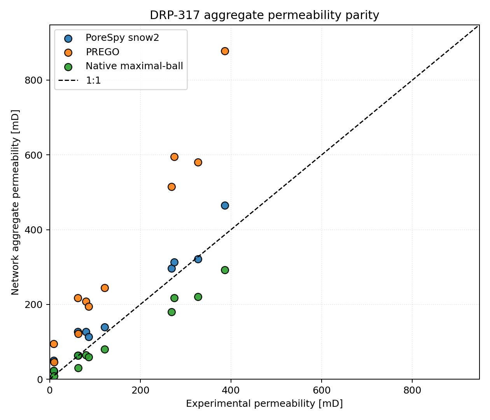
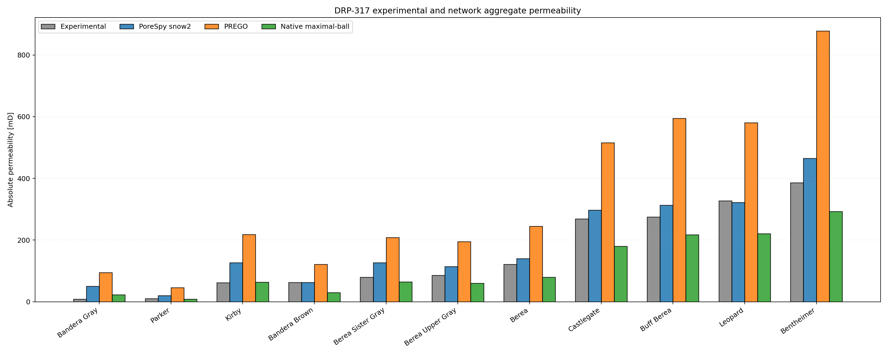
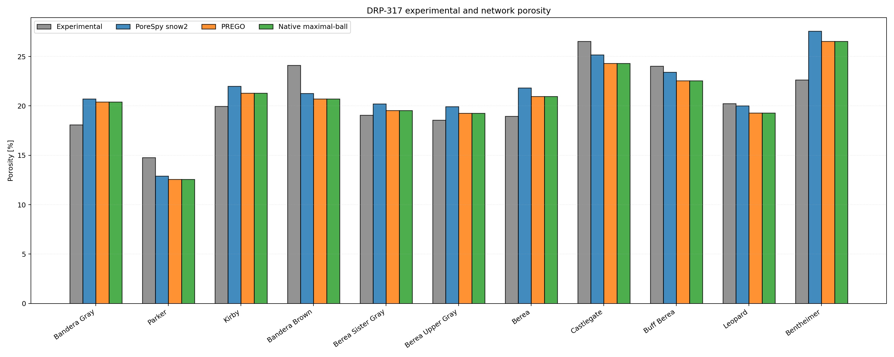

# DRP-317 Sandstone Validation Overview

This report summarizes the current `voids` validation workflow for all eleven
DRP-317 sandstone notebooks and all currently configured image-to-network
extraction backends:

- `PoreSpy snow2`, the historical baseline for these notebooks
- `PREGO`, the native PREGO-style seeded region-growing backend
- `Native maximal-ball`, the dependency-light maximal-ball backend in `voids`

The comparison is a workflow-level comparison: every backend starts from the same
segmented DRP-317 image, ROI selection, boundary-pressure convention, fluid model,
and conductance model, but each backend produces a different reduced pore
network. Agreement or disagreement with experiment should therefore be interpreted
as extraction-plus-solve behavior, not as isolated solver parity.

A focused set of same-ROI studies is also available for the newer map-based
single-phase solvers:

- [DRP-317 Berea same-ROI map solver validation](drp317_berea_block3_same_roi.md)
- [DRP-317 Bentheimer same-ROI map solver validation](drp317_bentheimer_block3_same_roi.md)
- [DRP-317 Parker same-ROI map solver validation](drp317_parker_block3_same_roi.md)
- [DRP-317 LBM default sensitivity](drp317_lbm_sensitivity.md)

## Sources

- Dataset: Neumann, R., ANDREETA, M., Lucas-Oliveira, E. (2020, October 7).
  *11 Sandstones: raw, filtered and segmented data* [Dataset].
  Digital Porous Media Portal. <https://www.doi.org/10.17612/f4h1-w124>
- Experimental reference paper: Neumann, R. F., Barsi-Andreeta, M., Lucas-Oliveira, E.,
  Barbalho, H., Trevizan, W. A., Bonagamba, T. J., & Steiner, M. B. (2021).
  *High accuracy capillary network representation in digital rock reveals permeability scaling functions*.
  *Scientific Reports, 11*, 11370. <https://doi.org/10.1038/s41598-021-90090-0>

## Current Notebook Setup

!!! warning "Rendered results need refresh"
    Most DRP-317 notebook sources use the published-reference
    `generic_poiseuille` conductance model for all extraction backends. The
    Bentheimer report has additionally been rerun with the new PoreSpy/PREGO
    external-reservoir transport geometry and a same-network conductance-model
    audit. Re-run the full notebook batch before treating cross-sample trends as
    final.

All DRP-317 notebooks share the same current modeling choices:

- a porosity-matched coarse ROI scan rather than a fixed centered ROI
- extraction with `backend="porespy"`, `backend="prego"`, and
  `backend="native_maximal_ball"`
- conductance model: `generic_poiseuille` for all extraction backends
- Bentheimer additionally reports a same-network conductance audit for
  `generic_poiseuille`, `hagen_poiseuille`, `valvatne_blunt`, and `auto`
- pressure-dependent water viscosity from the `thermo` backend
- absolute outlet pressure `5.0 MPa`
- imposed pressure gradient `10 kPa/m`
- reported aggregate permeability as the quadratic mean across `Kx`, `Ky`, and `Kz`

## Summary Table

The underlying summary CSV is committed as
[`docs/assets/validation/drp317_summary.csv`](../assets/validation/drp317_summary.csv).

| Sample | Backend | Exp. phi [%] | Network phi [%] | Exp. K [mD] | Agg. K [mD] | Rel. K error [%] |
|---|---|---:|---:|---:|---:|---:|
| Bandera Gray | PoreSpy snow2 | 18.10 | 20.70 | 9.0 | 49.99 | 455.40 |
| Bandera Gray | PREGO | 18.10 | 20.40 | 9.0 | 95.13 | 957.01 |
| Bandera Gray | Native maximal-ball | 18.10 | 20.40 | 9.0 | 22.74 | 152.68 |
| Parker | PoreSpy snow2 | 14.77 | 12.90 | 10.0 | 20.43 | 104.32 |
| Parker | PREGO | 14.77 | 12.57 | 10.0 | 45.62 | 356.24 |
| Parker | Native maximal-ball | 14.77 | 12.57 | 10.0 | 8.79 | -12.14 |
| Kirby | PoreSpy snow2 | 19.95 | 22.00 | 62.0 | 127.01 | 104.85 |
| Kirby | PREGO | 19.95 | 21.30 | 62.0 | 217.91 | 251.48 |
| Kirby | Native maximal-ball | 19.95 | 21.30 | 62.0 | 63.73 | 2.79 |
| Bandera Brown | PoreSpy snow2 | 24.11 | 21.25 | 63.0 | 63.12 | 0.18 |
| Bandera Brown | PREGO | 24.11 | 20.70 | 63.0 | 121.44 | 92.76 |
| Bandera Brown | Native maximal-ball | 24.11 | 20.70 | 63.0 | 30.33 | -51.85 |
| Berea Sister Gray | PoreSpy snow2 | 19.07 | 20.20 | 80.0 | 127.01 | 58.77 |
| Berea Sister Gray | PREGO | 19.07 | 19.55 | 80.0 | 207.94 | 159.92 |
| Berea Sister Gray | Native maximal-ball | 19.07 | 19.55 | 80.0 | 64.75 | -19.06 |
| Berea Upper Gray | PoreSpy snow2 | 18.56 | 19.91 | 86.0 | 113.97 | 32.52 |
| Berea Upper Gray | PREGO | 18.56 | 19.26 | 86.0 | 194.80 | 126.52 |
| Berea Upper Gray | Native maximal-ball | 18.56 | 19.26 | 86.0 | 59.79 | -30.48 |
| Berea | PoreSpy snow2 | 18.96 | 21.82 | 121.0 | 139.98 | 15.69 |
| Berea | PREGO | 18.96 | 20.96 | 121.0 | 244.93 | 102.42 |
| Berea | Native maximal-ball | 18.96 | 20.96 | 121.0 | 80.05 | -33.84 |
| Castlegate | PoreSpy snow2 | 26.54 | 25.16 | 269.0 | 296.91 | 10.37 |
| Castlegate | PREGO | 26.54 | 24.29 | 269.0 | 515.24 | 91.54 |
| Castlegate | Native maximal-ball | 26.54 | 24.29 | 269.0 | 179.69 | -33.20 |
| Buff Berea | PoreSpy snow2 | 24.02 | 23.40 | 275.0 | 313.23 | 13.90 |
| Buff Berea | PREGO | 24.02 | 22.56 | 275.0 | 594.86 | 116.31 |
| Buff Berea | Native maximal-ball | 24.02 | 22.56 | 275.0 | 217.36 | -20.96 |
| Leopard | PoreSpy snow2 | 20.22 | 20.01 | 327.0 | 321.66 | -1.63 |
| Leopard | PREGO | 20.22 | 19.30 | 327.0 | 580.20 | 77.43 |
| Leopard | Native maximal-ball | 20.22 | 19.30 | 327.0 | 220.38 | -32.61 |
| Bentheimer | PoreSpy snow2 | 22.64 | 27.57 | 386.0 | 465.11 | 20.49 |
| Bentheimer | PREGO | 22.64 | 26.53 | 386.0 | 877.84 | 127.42 |
| Bentheimer | Native maximal-ball | 22.64 | 26.53 | 386.0 | 292.38 | -24.25 |

## Figures

## Interpretation

Across all eleven samples, backend choice is now a first-order part of the
validation result. The `PoreSpy snow2`, `PREGO`, and native maximal-ball networks
can have similar image porosity context but substantially different pore counts,
throat counts, coordination statistics, and permeability estimates.

These pages should therefore be read as a backend-sensitivity study for the
current `voids` image-to-network workflow. The comparison does not establish that
one backend is physically correct in isolation; it identifies how much the final
single-phase permeability depends on the extraction/reduction stage for each
sample.

## Sample Reports

- [DRP-317 Bandera Gray notebook report](drp317_banderagray.md)
- [DRP-317 Parker notebook report](drp317_parker.md)
- [DRP-317 Parker same-ROI map solver validation](drp317_parker_block3_same_roi.md)
- [DRP-317 Kirby notebook report](drp317_kirby.md)
- [DRP-317 Bandera Brown notebook report](drp317_bandera_brown.md)
- [DRP-317 Berea Sister Gray notebook report](drp317_berea_sister_gray.md)
- [DRP-317 Berea Upper Gray notebook report](drp317_berea_upper_gray.md)
- [DRP-317 Berea notebook report](drp317_berea.md)
- [DRP-317 Castlegate notebook report](drp317_castlegate.md)
- [DRP-317 Buff Berea notebook report](drp317_buff_berea.md)
- [DRP-317 Leopard notebook report](drp317_leopard.md)
- [DRP-317 Bentheimer notebook report](drp317_bentheimer.md)
