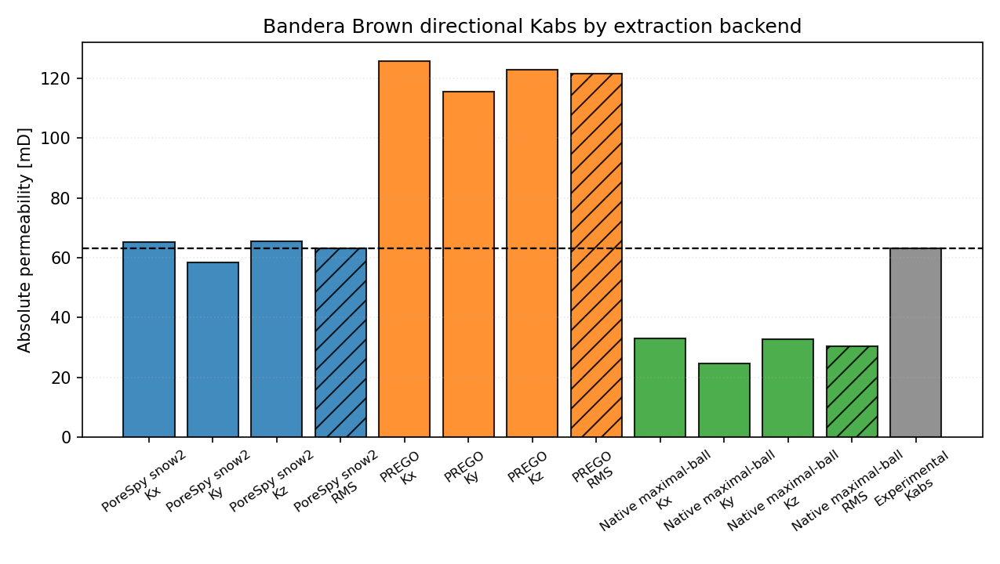

# DRP-317 Bandera Brown Notebook Report

Notebook: `21_mwe_drp317_banderabrown_raw_porosity_perm`

## Sources

- Dataset: Neumann, R., ANDREETA, M., Lucas-Oliveira, E. (2020, October 7).
  *11 Sandstones: raw, filtered and segmented data* [Dataset].
  Digital Porous Media Portal. <https://www.doi.org/10.17612/f4h1-w124>
- Experimental reference paper: Neumann, R. F., Barsi-Andreeta, M., Lucas-Oliveira, E.,
  Barbalho, H., Trevizan, W. A., Bonagamba, T. J., & Steiner, M. B. (2021).
  *High accuracy capillary network representation in digital rock reveals permeability scaling functions*.
  *Scientific Reports, 11*, 11370. <https://doi.org/10.1038/s41598-021-90090-0>

## Current Setup

- Raw volume: `BanderaBrown_2d25um_binary.raw`
- ROI size: `(300, 300, 300)` voxels
- Selected ROI origin: `(700, 350, 350)`
- ROI porosity: `21.13%`
- Extraction backends: `porespy`, `prego`, `native_maximal_ball`
- Conductance model: `generic_poiseuille`
- Viscosity model: tabulated water viscosity from `thermo`, `298.15 K`
- Boundary pressures: `pout = 5.0 MPa`, `pin = pout + 10 kPa/m * L`

## Key Results

| Quantity | Value |
|---|---:|
| Experimental porosity [%] | 24.11 |
| Full-image porosity [%] | 21.18 |
| ROI porosity [%] | 21.13 |
| Experimental permeability [mD] | 63.0 |

| Backend | Network phi [%] | Kx [mD] | Ky [mD] | Kz [mD] | RMS K [mD] | Rel. K error [%] | Np | Nt |
|---|---|---:|---:|---:|---:|---:|---:|---:|
| PoreSpy snow2 | 21.25 | 65.33 | 58.30 | 65.45 | 63.12 | 0.18 | 5205 | 8207 |
| PREGO | 20.70 | 125.74 | 115.41 | 122.93 | 121.44 | 92.76 | 3304 | 6623 |
| Native maximal-ball | 20.70 | 32.92 | 24.55 | 32.77 | 30.33 | -51.85 | 2928 | 4876 |

## Network Statistics Snapshot

| Backend | Mean coordination | Dead-end pore fraction |
|---|---:|---:|
| PoreSpy snow2 | 3.15 | 0.276 |
| PREGO | 4.01 | 0.098 |
| Native maximal-ball | 3.33 | 0.210 |

## Interpretation

For `Bandera Brown`, the closest aggregate permeability in this rerun is
from `PoreSpy snow2` with a relative permeability error of
`0.18%`. The spread between the
largest and smallest backend aggregate permeability is about `4.00`x,
which makes extraction sensitivity a material part of this sample's validation
result.

This is a pore-network comparison against a laboratory-scale experimental
reference. The numbers depend on the selected ROI, segmentation convention,
boundary labeling, network reduction, and conductance closure; they should not be
read as a direct voxel-scale flow simulation.
