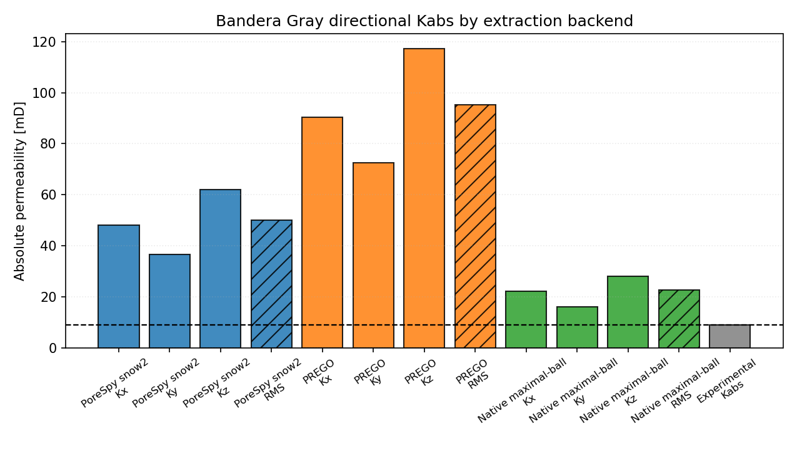

# DRP-317 Bandera Gray Notebook Report

Notebook: `20_mwe_drp317_banderagray_raw_porosity_perm`

## Sources

- Dataset: Neumann, R., ANDREETA, M., Lucas-Oliveira, E. (2020, October 7).
  *11 Sandstones: raw, filtered and segmented data* [Dataset].
  Digital Porous Media Portal. <https://www.doi.org/10.17612/f4h1-w124>
- Experimental reference paper: Neumann, R. F., Barsi-Andreeta, M., Lucas-Oliveira, E.,
  Barbalho, H., Trevizan, W. A., Bonagamba, T. J., & Steiner, M. B. (2021).
  *High accuracy capillary network representation in digital rock reveals permeability scaling functions*.
  *Scientific Reports, 11*, 11370. <https://doi.org/10.1038/s41598-021-90090-0>

## Current Setup

- Raw volume: `BanderaGray_2d25um_binary.raw`
- ROI size: `(500, 500, 500)` voxels
- Selected ROI origin: `(500, 500, 250)`
- ROI porosity: `20.99%`
- Extraction backends: `porespy`, `prego`, `native_maximal_ball`
- Conductance model: `generic_poiseuille`
- Viscosity model: tabulated water viscosity from `thermo`, `298.15 K`
- Boundary pressures: `pout = 5.0 MPa`, `pin = pout + 10 kPa/m * L`

## Key Results

| Quantity | Value |
|---|---:|
| Experimental porosity [%] | 18.10 |
| Full-image porosity [%] | 21.03 |
| ROI porosity [%] | 20.99 |
| Experimental permeability [mD] | 9.0 |

| Backend | Network phi [%] | Kx [mD] | Ky [mD] | Kz [mD] | RMS K [mD] | Rel. K error [%] | Np | Nt |
|---|---|---:|---:|---:|---:|---:|---:|---:|
| PoreSpy snow2 | 20.70 | 48.04 | 36.63 | 62.02 | 49.99 | 455.40 | 27913 | 48477 |
| PREGO | 20.40 | 90.29 | 72.47 | 117.24 | 95.13 | 957.01 | 17527 | 38704 |
| Native maximal-ball | 20.40 | 22.30 | 16.15 | 28.16 | 22.74 | 152.68 | 18541 | 31886 |

## Network Statistics Snapshot

| Backend | Mean coordination | Dead-end pore fraction |
|---|---:|---:|
| PoreSpy snow2 | 3.47 | 0.231 |
| PREGO | 4.42 | 0.090 |
| Native maximal-ball | 3.44 | 0.242 |

## Interpretation

For `Bandera Gray`, the closest aggregate permeability in this rerun is
from `Native maximal-ball` with a relative permeability error of
`152.68%`. The spread between the
largest and smallest backend aggregate permeability is about `4.18`x,
which makes extraction sensitivity a material part of this sample's validation
result.

This is a pore-network comparison against a laboratory-scale experimental
reference. The numbers depend on the selected ROI, segmentation convention,
boundary labeling, network reduction, and conductance closure; they should not be
read as a direct voxel-scale flow simulation.
