# DRP-317 Bentheimer Same-ROI Map Solver Validation

This validation study applies the same direct-image, map-based, and
pore-network single-phase comparison used for Berea to the DRP-317
Bentheimer sandstone sample. It asks the same focused question:

> If every method sees the same small 3-D image crop, how do the predicted
> directional permeabilities compare with the published bulk Bentheimer
> measurement?

The study is based on the notebook source
`notebooks/43_mwe_drp317_bentheimer_block3_same_roi_comparison.py`. The
committed tables and figures below are snapshots of that run, copied into
`docs/assets/validation/` so the public documentation does not depend on local
notebook-output directories.

!!! warning "Validation scope"
    The experimental permeability is a bulk scalar measurement for the
    Bentheimer sample, while the simulations use a small \(75^3\) voxel ROI.
    Agreement or mismatch therefore combines solver behavior, segmentation
    convention, coefficient-map closure, ROI representativeness, and finite-size
    anisotropy. This is a validation study for the current workflow, not a claim
    that a \(75^3\) crop is a representative elementary volume.

## Public Sources

- Dataset: Neumann, R., ANDREETA, M., Lucas-Oliveira, E. (2020, October 7).
  *11 Sandstones: raw, filtered and segmented data* [Dataset].
  Digital Porous Media Portal. <https://www.doi.org/10.17612/f4h1-w124>
- Experimental reference paper: Neumann, R. F., Barsi-Andreeta, M.,
  Lucas-Oliveira, E., Barbalho, H., Trevizan, W. A., Bonagamba, T. J., &
  Steiner, M. B. (2021). *High accuracy capillary network representation in
  digital rock reveals permeability scaling functions*. *Scientific Reports,
  11*, 11370. <https://doi.org/10.1038/s41598-021-90090-0>

## Case Definition

| Quantity | Value |
|---|---:|
| Sample | DRP-317 Bentheimer |
| Segmented raw file | `Bentheimer_2d25um_binary.raw` |
| Raw image shape | \(1000 \times 1000 \times 1000\) voxels |
| Phase convention | `0 = void/pore`, `1 = solid` |
| Voxel size | \(2.25 \times 10^{-6}\) m |
| ROI origin | `(0, 694, 694)` voxels |
| ROI shape | \(75 \times 75 \times 75\) voxels |
| ROI physical length per axis | \(168.75\) um |
| Porosity/permeability block shape | \(3 \times 3 \times 3\) voxels |
| Map shape | \(25 \times 25 \times 25\) cells |
| Map cell size | \(6.75\) um |
| Dynamic viscosity | \(1.0 \times 10^{-3}\) Pa s |
| Pressure drop for map/FEM solves | 1 Pa |

The ROI was selected from a coarse scan of candidate origins to match the full
segmented-image porosity, not the lower experimental porosity. This keeps the
crop representative of the segmented image being simulated, while making the
porosity mismatch with the laboratory reference explicit.

| Porosity quantity | Value [%] |
|---|---:|
| Published experimental porosity | 22.64 |
| Full segmented image porosity, with `0 = void` | 26.72 |
| Selected ROI porosity | 26.62 |
| Porosity-map mean | 26.62 |

The ROI porosity is \(3.98\) percentage points above the published porosity.
That difference is large enough to be a first-order part of the permeability
comparison, especially for methods that operate directly on the binary pore
space.

## Coefficient Map

The porosity map is the cell-average void fraction in each \(3^3\) block. The
permeability map is generated with the Kozeny-Carman closure documented in
[Porosity Maps](../porosity_maps.md):

\[
k(\phi) = \frac{d^2\phi^3}{C(1-\phi)^2},
\qquad
d = 6.75~\mu\mathrm{m},
\qquad
C = 180.
\]

The endpoint and cap choices used in this run were:

| Parameter | Value |
|---|---:|
| Solid permeability, \(\phi=0\) | \(1.0 \times 10^{-20}\) m^2 |
| Free-flow permeability, \(\phi=1\) | \(1.0 \times 10^{-8}\) m^2 |
| Maximum permeability cap | \(1.0 \times 10^{-8}\) m^2 |
| FEM porosity floor | \(1.0 \times 10^{-3}\) |
| FEM permeability floor | \(1.0 \times 10^{-20}\) m^2 |

| Field | Shape | Min | Mean | Max | Units |
|---|---:|---:|---:|---:|---|
| Porosity | \(25^3\) | \(0.0\) | \(2.662 \times 10^{-1}\) | \(1.0\) | dimensionless |
| Permeability | \(25^3\) | \(1.0 \times 10^{-20}\) | \(1.874 \times 10^{-9}\) | \(1.0 \times 10^{-8}\) | m^2 |

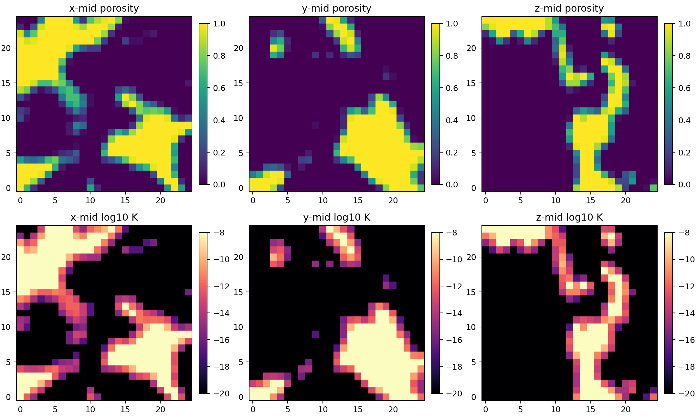

## Methods

All methods used the same \(75^3\) binary ROI or the \(25^3\)
porosity/permeability map derived from that ROI.

| Method label | Input | Equation or model | Discretization/backend |
|---|---|---|---|
| Direct-image LBM DNS (XLB, Stokes-limit preset) | Binary image | Low-Mach, low-Reynolds lattice-Boltzmann creeping-flow estimate | XLB/JAX adapter, 12-cell inlet/outlet buffers |
| Darcy-Brinkman micro-continuum USFEM CG1 x DG1 | \(\phi\) and \(k(\phi)\) maps | Darcy-Brinkman micro-continuum | FEniCSx, stabilized CG1 velocity and DG1 pressure, PETSc LU with SuperLU_DIST |
| Darcy-Brinkman coefficient-field Taylor-Hood CG2 x CG1 | \(\phi\) and \(k(\phi)\) maps | Darcy-Brinkman micro-continuum | FEniCSx, CG2 velocity and CG1 pressure, PETSc LU with MUMPS |
| Darcy-Darcy coefficient-field Taylor-Hood CG2 x CG1 | \(k(\phi)\) map | Mixed Darcy flow everywhere | FEniCSx, CG2 velocity and CG1 pressure, PETSc LU with MUMPS |
| TPFA finite-volume Darcy-Darcy | \(k(\phi)\) map | Cell-centered Darcy flow | TPFA, SciPy CG with PyAMG preconditioning |
| PoreSpy snow2 | Binary image | Reduced pore-network model | `generic_poiseuille`, direct network solve |
| PREGO | Binary image | Reduced pore-network model | `generic_poiseuille`, direct network solve |
| Native maximal-ball | Binary image | Reduced pore-network model | `generic_poiseuille`, direct network solve |

The direct-image LBM row solves the binary ROI rather than the Kozeny-Carman
map. The Darcy-Darcy FEM and TPFA rows are retained as controls: they test the
same permeability map without the Brinkman viscous term and should not be read
as calibrated predictors for this cap choice.

For the direct-image LBM runs, all three directions converged under the
configured steady-state criterion. The maximum lattice Mach number remained
below \(5.2 \times 10^{-4}\), and the maximum voxel Reynolds diagnostic remained
below \(3.0 \times 10^{-3}\).

The LBM row uses the package-recommended Stokes-limit preset selected in the
[DRP-317 LBM default sensitivity](drp317_lbm_sensitivity.md) study:
12-cell inlet/outlet reservoirs, `max_steps=8000`, `min_steps=1200`, and
`steady_rtol=1e-4`.

## Field Outputs

The notebook writes pressure and velocity field diagnostics for the volumetric
methods. TPFA and LBM velocity fields are exported as VTU files on their regular
grids. FEM pressure and velocity fields are exported as XDMF/HDF5 files after
interpolation to first-order visualization spaces so they can be opened directly
in ParaView.

The ParaView files contain the raw solver fields. The mid-slice pressure PNGs
apply only an additive pressure-gauge shift for plotting: the mean outlet-layer
pressure is set to \(10^5\) Pa, while the imposed pressure drop remains
\(\Delta p=1\) Pa. Therefore the pressure panels should show values near
\(10^5\) Pa and variations of order 1 Pa. This shift does not change pressure
gradients, fluxes, or permeability. The velocity PNGs use the raw solver scale:
TPFA and FEM velocities are plotted in m/s, while the LBM velocity is plotted in
lattice units because this validation workflow exports the raw lattice field.
Within each PNG, the midplane panels share one color scale computed from the
full plotted 3-D field.

!!! note "Interpreting quiver slices"
    Each quiver panel can only draw the two velocity components lying in that
    slice. If the dominant velocity component is normal to the plane, the arrow
    overlay may be weak even when the velocity-magnitude color map is nonzero.

The gallery below shows the \(x\)-direction flow solve for the volumetric
methods. The field-output manifest linked at the end of the page lists the
corresponding files for \(x\), \(y\), and \(z\).

### TPFA Darcy-Darcy

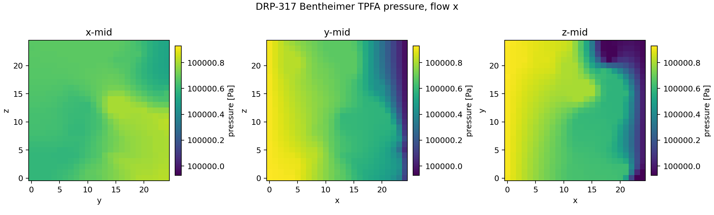

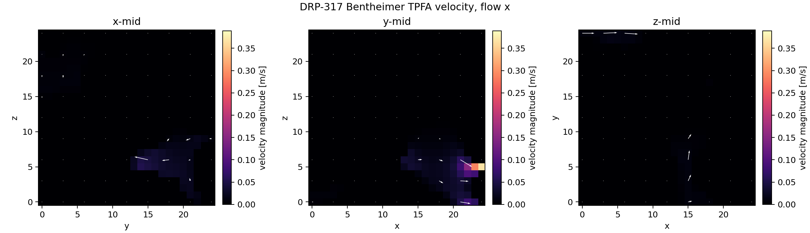

### USFEM Brinkman

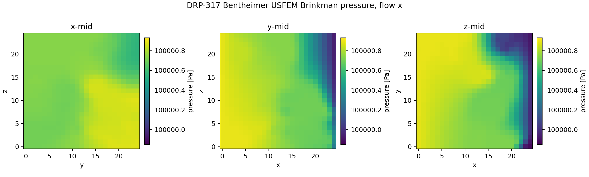

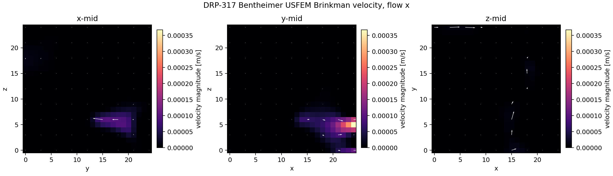

### Taylor-Hood Brinkman

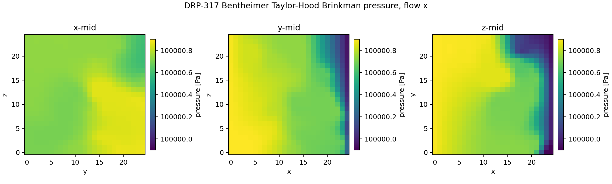

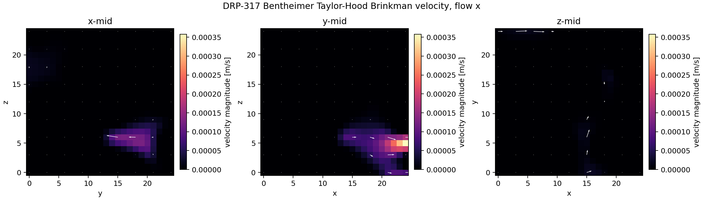

### Taylor-Hood Darcy-Darcy

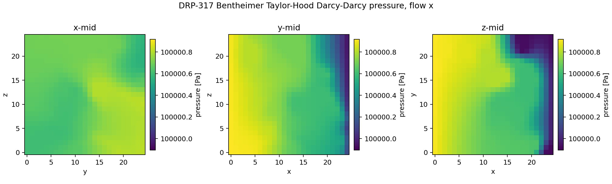

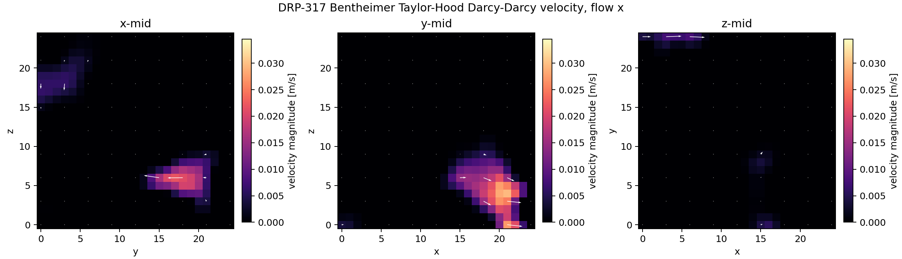

### Direct-Image LBM

The LBM row exports a velocity field on the binary-image grid. It does not write
a continuum pressure field in this validation workflow.

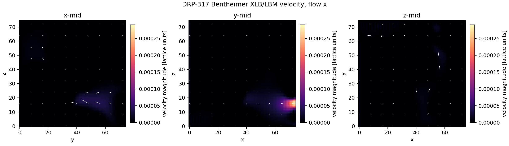

Pore-network models are graph-valued reductions of the image and therefore do
not produce a voxel- or element-based volumetric pressure/velocity field in this
study.

## Permeability Results

The published experimental permeability for Bentheimer is \(386.0\) mD. The
table below assigns this scalar reference to \(K_x\), \(K_y\), and \(K_z\) only
to make the directional simulation results visually comparable.

| Method | Solver/backend | \(K_x\) [mD] | \(K_y\) [mD] | \(K_z\) [mD] |
|---|---|---:|---:|---:|
| Experimental Kabs | `-` | 386.0 | 386.0 | 386.0 |
| Direct-image LBM DNS (XLB, Stokes-limit preset) | `xlb:jax` | 1076.1 | 3700.7 | 2529.2 |
| Darcy-Brinkman micro-continuum USFEM CG1 x DG1 | `fenicsx:petsc-lu-superlu_dist` | 599.4 | 1557.9 | 1279.3 |
| Darcy-Brinkman coefficient-field Taylor-Hood CG2 x CG1 | `fenicsx:petsc-lu-mumps` | 905.1 | 2170.3 | 1868.7 |
| Darcy-Darcy coefficient-field Taylor-Hood CG2 x CG1 | `fenicsx:petsc-lu-mumps` | 309,128 | 511,618 | 446,132 |
| TPFA finite-volume Darcy-Darcy | `cg+pyamg` | 315,397 | 498,455 | 437,645 |
| PoreSpy snow2 | `-` | 215.8 | 578.7 | 546.8 |
| PREGO | `-` | 769.9 | 662.0 | 355.5 |
| Native maximal-ball | `-` | 552.1 | 346.4 | 375.7 |

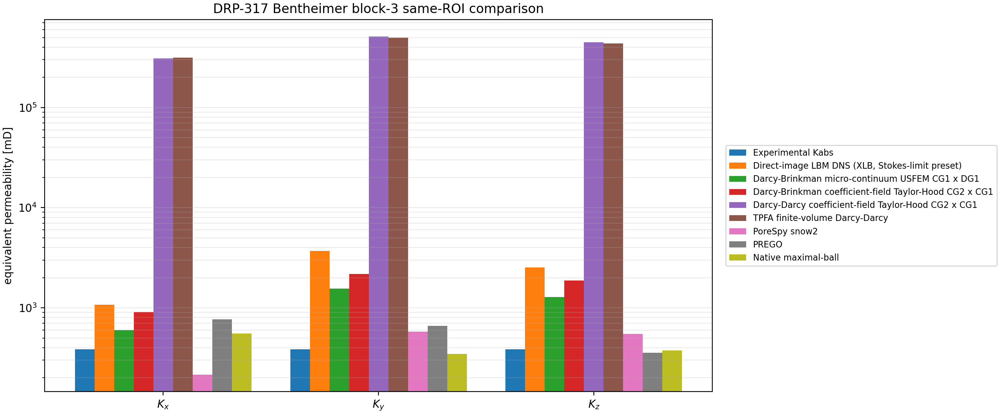

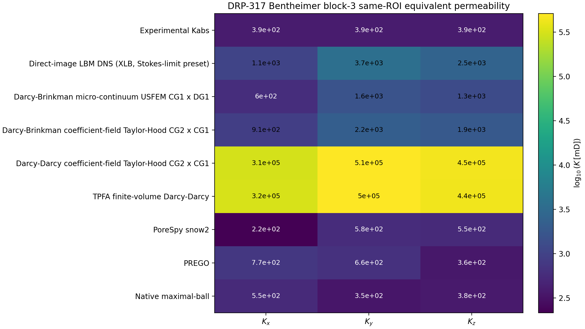

### Bulk Scalar Summaries

The experimental value is reported as a scalar bulk permeability. For the
directional simulations, the table and plot below summarize \(K_x\), \(K_y\),
and \(K_z\) with both arithmetic and harmonic means:

\[
K_\mathrm{arith} = \frac{K_x + K_y + K_z}{3},
\qquad
K_\mathrm{harm} = \frac{3}{1/K_x + 1/K_y + 1/K_z}.
\]

These are scalar summaries of an anisotropic small ROI, not a substitute for
the directional permeability tensor. The harmonic mean is more sensitive to the
least permeable direction, while the arithmetic mean is more sensitive to highly
permeable connected paths.

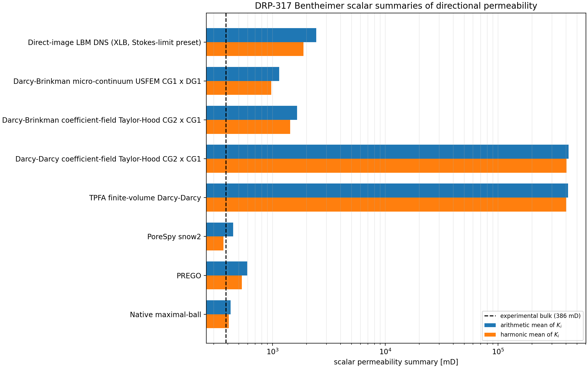

| Method | Arithmetic mean [mD] | Harmonic mean [mD] | Arithmetic / exp | Harmonic / exp | Max/min directional K |
|---|---:|---:|---:|---:|---:|
| Direct-image LBM DNS (XLB, Stokes-limit preset) | 2435.3 | 1881.0 | 6.31 | 4.87 | 3.44 |
| Darcy-Brinkman micro-continuum USFEM CG1 x DG1 | 1145.6 | 970.3 | 2.97 | 2.51 | 2.60 |
| Darcy-Brinkman coefficient-field Taylor-Hood CG2 x CG1 | 1648.0 | 1428.1 | 4.27 | 3.70 | 2.40 |
| Darcy-Darcy coefficient-field Taylor-Hood CG2 x CG1 | 422292.9 | 403715.7 | 1094.02 | 1045.90 | 1.66 |
| TPFA finite-volume Darcy-Darcy | 417165.6 | 402049.7 | 1080.74 | 1041.58 | 1.58 |
| PoreSpy snow2 | 447.1 | 366.2 | 1.16 | 0.95 | 2.68 |
| PREGO | 595.8 | 533.6 | 1.54 | 1.38 | 2.17 |
| Native maximal-ball | 424.7 | 407.6 | 1.10 | 1.06 | 1.59 |

Relative to the 386 mD scalar experimental reference:

| Method | \(K_x/K_{\mathrm{exp}}\) | \(K_y/K_{\mathrm{exp}}\) | \(K_z/K_{\mathrm{exp}}\) | Mean absolute directional error [%] |
|---|---:|---:|---:|---:|
| Direct-image LBM DNS (XLB, Stokes-limit preset) | 2.79 | 9.59 | 6.55 | 530.9 |
| Darcy-Brinkman micro-continuum USFEM CG1 x DG1 | 1.55 | 4.04 | 3.31 | 196.8 |
| Darcy-Brinkman coefficient-field Taylor-Hood CG2 x CG1 | 2.34 | 5.62 | 4.84 | 327.0 |
| Darcy-Darcy coefficient-field Taylor-Hood CG2 x CG1 | 800.85 | 1325.44 | 1155.78 | 109302.3 |
| TPFA finite-volume Darcy-Darcy | 817.09 | 1291.33 | 1133.79 | 107974.0 |
| PoreSpy snow2 | 0.56 | 1.50 | 1.42 | 45.2 |
| PREGO | 1.99 | 1.72 | 0.92 | 59.6 |
| Native maximal-ball | 1.43 | 0.90 | 0.97 | 18.7 |

## Performance

The table reports the solver wall times recorded by the notebook for this local
run. These timings are useful for comparing methods within the same machine and
software stack, but they are not portable benchmark guarantees.

| Method | Mean time per direction [s] | Total 3-axis time [s] | Total 3-axis time [min] |
|---|---:|---:|---:|
| Direct-image LBM DNS (XLB, Stokes-limit preset) | 63.7 | 191.2 | 3.19 |
| Darcy-Brinkman micro-continuum USFEM CG1 x DG1 | 149.2 | 447.6 | 7.46 |
| Darcy-Brinkman coefficient-field Taylor-Hood CG2 x CG1 | 166.0 | 498.1 | 8.30 |
| Darcy-Darcy coefficient-field Taylor-Hood CG2 x CG1 | 166.1 | 498.3 | 8.30 |
| TPFA finite-volume Darcy-Darcy | 0.2 | 0.6 | 0.01 |
| PoreSpy snow2 | 0.5 | 1.5 | 0.03 |
| PREGO | 0.3 | 0.9 | 0.01 |
| Native maximal-ball | 0.2 | 0.7 | 0.01 |

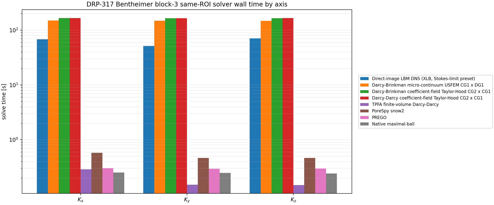

The shipped FEM rows completed the three directions in roughly eight minutes
each for the \(25^3\) map on this machine. The TPFA and pore-network solves are
much faster on this small problem. That runtime should not be confused with
greater physical fidelity: the TPFA row is solving a different, pure Darcy
coefficient-field model.

## Interpretation

Several conclusions are scientifically useful:

- The same ROI is strongly anisotropic. The direct-image LBM and Brinkman rows
  predict much larger \(K_y\) and \(K_z\) than \(K_x\), unlike the Berea ROI,
  where the strongest direction was \(x\). This reinforces that the \(75^3\)
  crop is not a bulk representative volume.
- The scalar-summary plot shows that the pore-network rows are closest to
  the reported bulk scalar once \(K_x\), \(K_y\), and \(K_z\) are compressed to
  arithmetic or harmonic means. The native maximal-ball harmonic mean is about
  \(1.06 K_\mathrm{exp}\), but this should still be read together with the
  directional anisotropy and ROI-size caveats.
- The Darcy-Brinkman USFEM row gives the closest map-based continuum value in
  the \(x\) direction, but it overpredicts \(y\) and \(z\) by factors of about
  4.0 and 3.3. The Taylor-Hood Brinkman row is consistently more permeable with
  the current coefficient map.
- The pure Darcy-Darcy rows again produce enormous values because the
  Kozeny-Carman map contains connected cells at the \(10^{-8}\,\mathrm{m^2}\)
  cap. These rows are diagnostics for the coefficient map, not validated
  predictors for this cap choice.
- The pore-network rows are closer to the scalar experimental reference than
  the continuum-map and LBM rows for this ROI. The native maximal-ball row is
  especially close directionally, but that agreement should be read as a
  workflow result for this small crop, not as proof that the pore network is
  physically correct in isolation.
- The direct-image LBM row does not use the Kozeny-Carman map and still
  overpredicts the scalar experimental reference, especially in \(y\). This
  makes ROI representativeness and segmentation/porosity mismatch central to the
  validation error. The separate LBM sensitivity study shows that the stricter
  12-cell reservoir preset changes the same-ROI LBM values by only a few
  percent, so the mismatch should not be explained away as a loose steady-state
  tolerance artifact.

The conservative reading is the same as for Berea: the FEniCSx Brinkman
implementations are numerically usable at this map size, but experiment-level
agreement is dominated by ROI representativeness, phase convention,
coefficient-map closure, and the \(k_{\max}\) cap. Larger ROIs and sensitivity
studies for \(d\), \(C\), \(k_{\max}\), and porosity mismatch are required
before treating any row as a calibrated predictor for the full Bentheimer
sample.

## Reproducible Artifacts

- [Case summary CSV](../assets/validation/drp317_bentheimer_block3_same_roi_summary.csv)
- [Map summary CSV](../assets/validation/drp317_bentheimer_block3_same_roi_map_summary.csv)
- [Model comparison CSV](../assets/validation/drp317_bentheimer_block3_same_roi_model_comparison.csv)
- [Ratios to experiment CSV](../assets/validation/drp317_bentheimer_block3_same_roi_model_ratios_to_experiment.csv)
- [Bulk permeability means CSV](../assets/validation/drp317_bentheimer_block3_same_roi_bulk_permeability_means.csv)
- [Direct-image LBM directional CSV](../assets/validation/drp317_bentheimer_block3_same_roi_xlb_lbm_directional.csv)
- [Direct-image LBM status JSON](../assets/validation/drp317_bentheimer_block3_same_roi_xlb_lbm_status.json)
- [Field-output manifest CSV](../assets/validation/drp317_bentheimer_block3_same_roi_field_outputs.csv)
