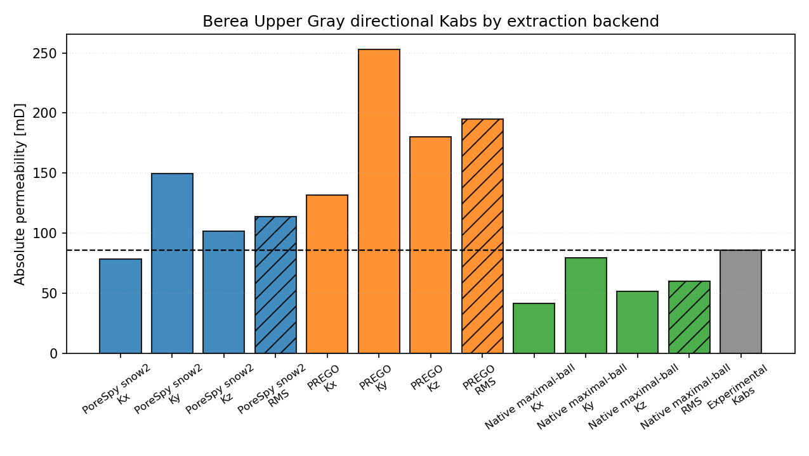

# DRP-317 Berea Upper Gray Notebook Report

Notebook: `23_mwe_drp317_bereauppergray_raw_porosity_perm`

## Sources

- Dataset: Neumann, R., ANDREETA, M., Lucas-Oliveira, E. (2020, October 7).
  *11 Sandstones: raw, filtered and segmented data* [Dataset].
  Digital Porous Media Portal. <https://www.doi.org/10.17612/f4h1-w124>
- Experimental reference paper: Neumann, R. F., Barsi-Andreeta, M., Lucas-Oliveira, E.,
  Barbalho, H., Trevizan, W. A., Bonagamba, T. J., & Steiner, M. B. (2021).
  *High accuracy capillary network representation in digital rock reveals permeability scaling functions*.
  *Scientific Reports, 11*, 11370. <https://doi.org/10.1038/s41598-021-90090-0>

## Current Setup

- Raw volume: `BUG_2d25um_binary.raw`
- ROI size: `(300, 300, 300)` voxels
- Selected ROI origin: `(0, 700, 0)`
- ROI porosity: `19.63%`
- Extraction backends: `porespy`, `prego`, `native_maximal_ball`
- Conductance model: `generic_poiseuille`
- Viscosity model: tabulated water viscosity from `thermo`, `298.15 K`
- Boundary pressures: `pout = 5.0 MPa`, `pin = pout + 10 kPa/m * L`

## Key Results

| Quantity | Value |
|---|---:|
| Experimental porosity [%] | 18.56 |
| Full-image porosity [%] | 19.65 |
| ROI porosity [%] | 19.63 |
| Experimental permeability [mD] | 86.0 |

| Backend | Network phi [%] | Kx [mD] | Ky [mD] | Kz [mD] | RMS K [mD] | Rel. K error [%] | Np | Nt |
|---|---|---:|---:|---:|---:|---:|---:|---:|
| PoreSpy snow2 | 19.91 | 78.48 | 149.87 | 101.71 | 113.97 | 32.52 | 2904 | 4673 |
| PREGO | 19.26 | 131.58 | 252.97 | 180.38 | 194.80 | 126.52 | 1704 | 3602 |
| Native maximal-ball | 19.26 | 41.78 | 79.54 | 51.50 | 59.79 | -30.48 | 1394 | 2247 |

## Network Statistics Snapshot

| Backend | Mean coordination | Dead-end pore fraction |
|---|---:|---:|
| PoreSpy snow2 | 3.22 | 0.312 |
| PREGO | 4.23 | 0.090 |
| Native maximal-ball | 3.22 | 0.243 |

## Interpretation

For `Berea Upper Gray`, the closest aggregate permeability in this rerun is
from `Native maximal-ball` with a relative permeability error of
`-30.48%`. The spread between the
largest and smallest backend aggregate permeability is about `3.26`x,
which makes extraction sensitivity a material part of this sample's validation
result.

This is a pore-network comparison against a laboratory-scale experimental
reference. The numbers depend on the selected ROI, segmentation convention,
boundary labeling, network reduction, and conductance closure; they should not be
read as a direct voxel-scale flow simulation.
