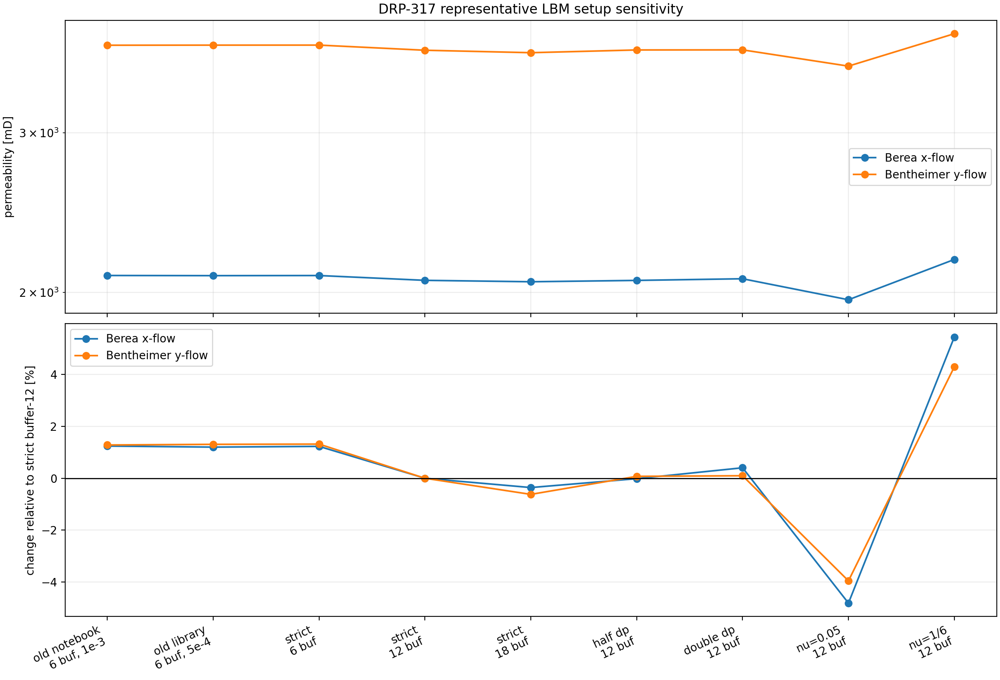
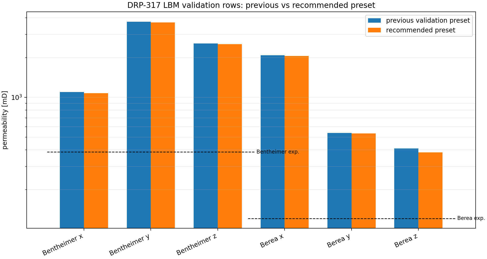

# DRP-317 LBM Default Sensitivity

This validation note records the setup study used to choose the default
`XLBOptions.steady_stokes_defaults()` preset for direct-image LBM permeability
estimates in `voids`. The question was narrow: whether the poor LBM agreement
with the DRP-317 Berea and Bentheimer experimental bulk permeabilities could be
explained by an obviously weak numerical setup.

The answer is no. The stricter setup improves numerical hygiene and is now the
recommended default, but it changes the DRP-317 same-ROI permeability estimates
by only about 1-6 %. The remaining mismatch with experiment is therefore not
removed by LBM tolerance, driving, or reservoir-length tuning alone.

## Recommended Default

The recommended steady Stokes-limit preset is:

| Option | Value |
|---|---:|
| `formulation` | `steady_stokes_limit` |
| `lattice_viscosity` | `0.10` |
| `pressure_drop_lattice` | `6.667e-5` |
| `inlet_outlet_buffer_cells` | `12` |
| `max_steps` | `8000` |
| `min_steps` | `1200` |
| `check_interval` | `100` |
| `steady_rtol` | `1.0e-4` |

The preset still uses XLB's incompressible Navier-Stokes LBM stepper. The
`steady_stokes_limit` label means that `voids` uses small lattice pressure
driving, reservoir buffers, and steady-state diagnostics so the result can be
interpreted as a low-Mach, low-Reynolds creeping-flow estimate.

For the meaning of each LBM option and a reusable tuning workflow for new
samples, see the LBM section of
[Map-Based Single-Phase Solvers](../map_based_singlephase_solvers.md).

## Sensitivity Design

Two representative axes were selected from the same \(75^3\) ROIs used in the
same-ROI map-solver validation pages:

| Sample | Axis | ROI origin [voxels] | ROI porosity |
|---|---|---:|---:|
| Berea | \(x\) | `(694, 462, 462)` | 21.666 % |
| Bentheimer | \(y\) | `(0, 694, 694)` | 26.624 % |

The sweep varied four numerical choices:

- steady-state tolerance and minimum iteration count,
- inlet/outlet reservoir length,
- pressure-drop magnitude, to test Darcy-linearity of the response,
- BGK lattice viscosity, to expose relaxation-time and wall-location
  sensitivity.

The table reports permeability and percent change relative to the selected
recommended preset:

| Configuration | Berea \(x\) [mD] | Change | Bentheimer \(y\) [mD] | Change |
|---|---:|---:|---:|---:|
| previous notebook preset | 2087.9 | +1.24 % | 3748.2 | +1.28 % |
| previous library preset | 2087.1 | +1.20 % | 3749.1 | +1.31 % |
| strict, buffer 6 | 2087.7 | +1.23 % | 3749.4 | +1.32 % |
| recommended strict, buffer 12 | 2062.3 | +0.00 % | 3700.7 | +0.00 % |
| strict, buffer 18 | 2055.0 | -0.36 % | 3677.7 | -0.62 % |
| recommended with half pressure drop | 2062.0 | -0.02 % | 3703.4 | +0.07 % |
| recommended with double pressure drop | 2070.7 | +0.40 % | 3704.3 | +0.10 % |
| recommended with `nu_lu=0.05` | 1963.1 | -4.81 % | 3554.3 | -3.95 % |
| recommended with `nu_lu=1/6` | 2174.6 | +5.44 % | 3859.6 | +4.29 % |

## Interpretation

The pressure-drop tests are the most important physical sanity check. Halving
or doubling the lattice pressure drop changes the inferred permeability by less
than 0.5 % in these representative runs, while reducing or increasing Mach and
voxel-Reynolds diagnostics approximately as expected. That supports the
Darcy-linearity of the selected pressure drop.

The buffer-length tests show a small but systematic reservoir effect. Moving
from 6 to 12 reservoir cells lowers the permeability by about 1.2-1.3 % in the
representative axes; moving from 12 to 18 cells adds less than another 1 %. The
12-cell buffer is therefore a useful compromise between boundary-condition
separation and runtime.

The BGK viscosity tests are larger, around 4-5 %. This is a numerical-model
sensitivity of the current BGK, bounce-back, voxel-staircase setup. It is not a
parameter that should be fitted to experimental permeability. A future TRT/MRT
or grid-refinement study would be a better way to reduce or quantify this
source of uncertainty.

## Full Same-ROI Update

After selecting the strict buffer-12 preset, all six Berea and Bentheimer
directions were rerun. The plot below compares the previous validation preset
with the recommended preset.

| Sample | Axis | Previous K [mD] | Recommended K [mD] | Change | Steps | Time [s] |
|---|---|---:|---:|---:|---:|---:|
| Berea | \(x\) | 2087.9 | 2062.3 | -1.23 % | 1400 | 55.2 |
| Berea | \(y\) | 537.1 | 532.2 | -0.92 % | 2800 | 106.7 |
| Berea | \(z\) | 409.9 | 383.8 | -6.37 % | 4000 | 159.9 |
| Bentheimer | \(x\) | 1097.3 | 1076.1 | -1.93 % | 1700 | 68.3 |
| Bentheimer | \(y\) | 3748.2 | 3700.7 | -1.27 % | 1300 | 51.9 |
| Bentheimer | \(z\) | 2556.2 | 2529.2 | -1.06 % | 1800 | 71.0 |

All six recommended runs converged under the stricter criterion. The maximum
observed lattice Mach number was \(5.03\times10^{-4}\), and the maximum
voxel-scale Reynolds diagnostic was \(2.90\times10^{-3}\), both from the
Bentheimer \(x\)-direction run.

## Consequence For The Validation Studies

The updated LBM rows remain substantially above the published scalar bulk
permeabilities:

- Berea: \(K_x=2062.3\) mD, \(K_y=532.2\) mD, and \(K_z=383.8\) mD versus
  \(K_\mathrm{exp}=121\) mD.
- Bentheimer: \(K_x=1076.1\) mD, \(K_y=3700.7\) mD, and \(K_z=2529.2\) mD
  versus \(K_\mathrm{exp}=386\) mD.

Because the direct-image LBM solve does not use the Kozeny-Carman permeability
map, this overprediction cannot be attributed to the map cap alone. The most
conservative interpretation is that the small \(75^3\) ROIs, segmentation /
porosity mismatch, voxel-scale boundary treatment, and sample
representativeness remain the controlling uncertainty sources. The default
update makes the LBM row more defensible numerically, but it does not calibrate
the method to the experiments.

## Reproducible Artifacts

- [Representative sensitivity CSV](../assets/validation/drp317_lbm_representative_sensitivity.csv)
- [Recommended all-axis CSV](../assets/validation/drp317_lbm_recommended_all_axes.csv)
- [Default-update all-axis CSV](../assets/validation/drp317_lbm_default_update_all_axes.csv)
- [Previous validation defaults CSV](../assets/validation/drp317_lbm_previous_validation_defaults.csv)
