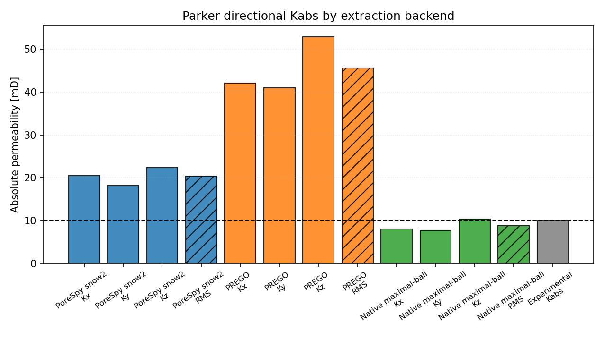

# DRP-317 Parker Notebook Report

Notebook: `28_mwe_drp317_parker_raw_porosity_perm`

## Sources

- Dataset: Neumann, R., ANDREETA, M., Lucas-Oliveira, E. (2020, October 7).
  *11 Sandstones: raw, filtered and segmented data* [Dataset].
  Digital Porous Media Portal. <https://www.doi.org/10.17612/f4h1-w124>
- Experimental reference paper: Neumann, R. F., Barsi-Andreeta, M., Lucas-Oliveira, E.,
  Barbalho, H., Trevizan, W. A., Bonagamba, T. J., & Steiner, M. B. (2021).
  *High accuracy capillary network representation in digital rock reveals permeability scaling functions*.
  *Scientific Reports, 11*, 11370. <https://doi.org/10.1038/s41598-021-90090-0>

## Current Setup

- Raw volume: `Parker_2d25um_binary.raw`
- ROI size: `(300, 300, 300)` voxels
- Selected ROI origin: `(700, 350, 0)`
- ROI porosity: `13.68%`
- Extraction backends: `porespy`, `prego`, `native_maximal_ball`
- Conductance model: `generic_poiseuille`
- Viscosity model: tabulated water viscosity from `thermo`, `298.15 K`
- Boundary pressures: `pout = 5.0 MPa`, `pin = pout + 10 kPa/m * L`

## Key Results

| Quantity | Value |
|---|---:|
| Experimental porosity [%] | 14.77 |
| Full-image porosity [%] | 13.65 |
| ROI porosity [%] | 13.68 |
| Experimental permeability [mD] | 10.0 |

| Backend | Network phi [%] | Kx [mD] | Ky [mD] | Kz [mD] | RMS K [mD] | Rel. K error [%] | Np | Nt |
|---|---|---:|---:|---:|---:|---:|---:|---:|
| PoreSpy snow2 | 12.90 | 20.51 | 18.17 | 22.40 | 20.43 | 104.32 | 3454 | 5647 |
| PREGO | 12.57 | 42.06 | 40.96 | 52.90 | 45.62 | 356.24 | 2022 | 4147 |
| Native maximal-ball | 12.57 | 7.99 | 7.76 | 10.37 | 8.79 | -12.14 | 1975 | 3133 |

## Network Statistics Snapshot

| Backend | Mean coordination | Dead-end pore fraction |
|---|---:|---:|
| PoreSpy snow2 | 3.27 | 0.290 |
| PREGO | 4.10 | 0.116 |
| Native maximal-ball | 3.17 | 0.270 |

## Interpretation

For `Parker`, the closest aggregate permeability in this rerun is
from `Native maximal-ball` with a relative permeability error of
`-12.14%`. The spread between the
largest and smallest backend aggregate permeability is about `5.19`x,
which makes extraction sensitivity a material part of this sample's validation
result.

This is a pore-network comparison against a laboratory-scale experimental
reference. The numbers depend on the selected ROI, segmentation convention,
boundary labeling, network reduction, and conductance closure; they should not be
read as a direct voxel-scale flow simulation.
