# DRP-317 Parker Same-ROI Map Solver Validation

This validation study applies the same direct-image, map-based, and
pore-network single-phase comparison used for Berea and Bentheimer to the
DRP-317 Parker sandstone sample. It asks the same focused question:

> If every method sees the same small 3-D image crop, how do the predicted
> directional permeabilities compare with the published bulk Parker
> measurement?

The study is based on the notebook source
`notebooks/44_mwe_drp317_parker_block3_same_roi_comparison.py`. The committed
tables and figures below are snapshots of that run, copied into
`docs/assets/validation/` so the public documentation does not depend on local
notebook-output directories.

!!! warning "Validation scope"
    The experimental permeability is a bulk scalar measurement for the Parker
    sample, while the simulations use a small \(75^3\) voxel ROI. Agreement or
    mismatch therefore combines solver behavior, segmentation convention,
    coefficient-map closure, ROI representativeness, and finite-size anisotropy.
    This is a validation study for the current workflow, not a claim that a
    \(75^3\) crop is a representative elementary volume.

## Public Sources

- Dataset: Neumann, R., ANDREETA, M., Lucas-Oliveira, E. (2020, October 7).
  *11 Sandstones: raw, filtered and segmented data* [Dataset].
  Digital Porous Media Portal. <https://www.doi.org/10.17612/f4h1-w124>
- Experimental reference paper: Neumann, R. F., Barsi-Andreeta, M.,
  Lucas-Oliveira, E., Barbalho, H., Trevizan, W. A., Bonagamba, T. J., &
  Steiner, M. B. (2021). *High accuracy capillary network representation in
  digital rock reveals permeability scaling functions*. *Scientific Reports,
  11*, 11370. <https://doi.org/10.1038/s41598-021-90090-0>

## Case Definition

| Quantity | Value |
|---|---:|
| Sample | DRP-317 Parker |
| Segmented raw file | `Parker_2d25um_binary.raw` |
| Raw image shape | \(1000 \times 1000 \times 1000\) voxels |
| Phase convention | `0 = void/pore`, `1 = solid` |
| Voxel size | \(2.25 \times 10^{-6}\) m |
| ROI origin | `(694, 925, 925)` voxels |
| ROI shape | \(75 \times 75 \times 75\) voxels |
| ROI physical length per axis | \(168.75\) um |
| Porosity/permeability block shape | \(3 \times 3 \times 3\) voxels |
| Map shape | \(25 \times 25 \times 25\) cells |
| Map cell size | \(6.75\) um |
| Dynamic viscosity | \(1.0 \times 10^{-3}\) Pa s |
| Pressure drop for map/FEM solves | 1 Pa |

The ROI was selected from a coarse scan of candidate origins to match the full
segmented-image porosity, not the experimental porosity. This keeps the crop
representative of the segmented image being simulated, while making the porosity
mismatch with the laboratory reference explicit.

| Porosity quantity | Value [%] |
|---|---:|
| Published experimental porosity | 14.77 |
| Full segmented image porosity, with `0 = void` | 13.65 |
| Selected ROI porosity | 13.58 |
| Porosity-map mean | 13.58 |

The ROI porosity is \(1.19\) percentage points below the published porosity and
very close to the full segmented-image porosity. That makes this case useful for
separating coefficient-map and solver behavior from a large global porosity
offset, although the small ROI still has strong finite-size connectivity
effects.

## Coefficient Map

The porosity map is the cell-average void fraction in each \(3^3\) block. The
permeability map is generated with the Kozeny-Carman closure documented in
[Porosity Maps](../porosity_maps.md):

\[
k(\phi) = \frac{d^2\phi^3}{C(1-\phi)^2},
\qquad
d = 6.75~\mu\mathrm{m},
\qquad
C = 180.
\]

The endpoint and cap choices used in this run were:

| Parameter | Value |
|---|---:|
| Solid permeability, \(\phi=0\) | \(1.0 \times 10^{-20}\) m^2 |
| Free-flow permeability, \(\phi=1\) | \(1.0 \times 10^{-8}\) m^2 |
| Maximum permeability cap | \(1.0 \times 10^{-8}\) m^2 |
| FEM porosity floor | \(1.0 \times 10^{-3}\) |
| FEM permeability floor | \(1.0 \times 10^{-20}\) m^2 |

| Field | Shape | Min | Mean | Max | Units |
|---|---:|---:|---:|---:|---|
| Porosity | \(25^3\) | \(0.0\) | \(1.358 \times 10^{-1}\) | \(1.0\) | dimensionless |
| Permeability | \(25^3\) | \(1.0 \times 10^{-20}\) | \(4.674 \times 10^{-10}\) | \(1.0 \times 10^{-8}\) | m^2 |

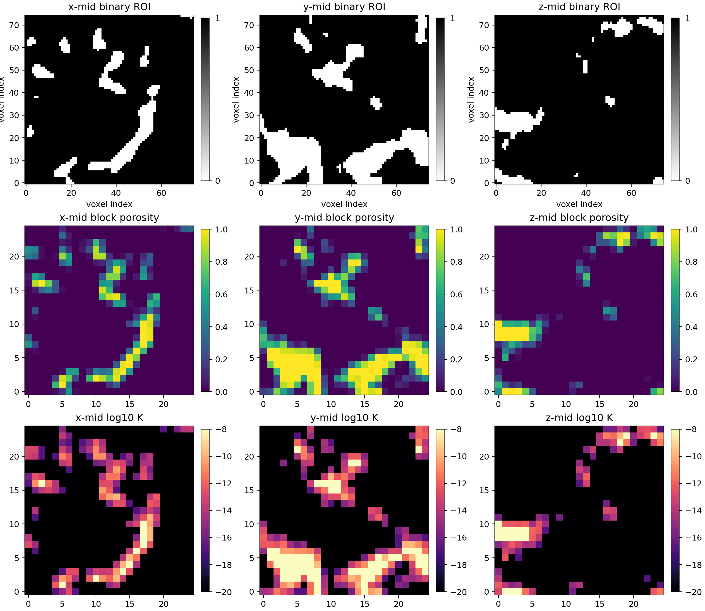

The binary and map midplanes show why the pure Darcy-Darcy rows are fragile for
this crop: a small number of high-porosity cells reach the \(10^{-8}\,\mathrm{m^2}\)
cap and create a very conductive x-oriented path. The Brinkman rows damp this
cap-driven path with the viscous term, while the pore-network and LBM rows solve
different representations of the original binary image.

## Methods

All methods used the same \(75^3\) binary ROI or the \(25^3\)
porosity/permeability map derived from that ROI.

| Method label | Input | Equation or model | Discretization/backend |
|---|---|---|---|
| Direct-image LBM DNS (XLB, Stokes-limit preset) | Binary image | Low-Mach, low-Reynolds lattice-Boltzmann creeping-flow estimate | XLB/JAX adapter, 12-cell inlet/outlet buffers |
| Darcy-Brinkman micro-continuum USFEM CG1 x DG1 | \(\phi\) and \(k(\phi)\) maps | Darcy-Brinkman micro-continuum | FEniCSx, stabilized CG1 velocity and DG1 pressure, PETSc LU with SuperLU_DIST |
| Darcy-Brinkman coefficient-field Taylor-Hood CG2 x CG1 | \(\phi\) and \(k(\phi)\) maps | Darcy-Brinkman micro-continuum | FEniCSx, CG2 velocity and CG1 pressure, PETSc LU with MUMPS |
| Darcy-Darcy coefficient-field Taylor-Hood CG2 x CG1 | \(k(\phi)\) map | Mixed Darcy flow everywhere | FEniCSx, CG2 velocity and CG1 pressure, PETSc LU with MUMPS |
| TPFA finite-volume Darcy-Darcy | \(k(\phi)\) map | Cell-centered Darcy flow | TPFA, SciPy CG with PyAMG preconditioning |
| PoreSpy snow2 | Binary image | Reduced pore-network model | `generic_poiseuille`, direct network solve |
| PREGO | Binary image | Reduced pore-network model | `generic_poiseuille`, direct network solve |
| Native maximal-ball | Binary image | Reduced pore-network model | `generic_poiseuille`, direct network solve |

The direct-image LBM row solves the binary ROI rather than the Kozeny-Carman
map. The Darcy-Darcy FEM and TPFA rows are retained as controls: they test the
same permeability map without the Brinkman viscous term and should not be read
as calibrated predictors for this cap choice.

For the direct-image LBM runs, all three directions satisfied the configured
steady-state criterion after increasing the Parker run cap to
`max_steps=20000`. The \(x\), \(y\), and \(z\) directions converged after 2800,
13400, and 8200 steps, respectively. The maximum lattice Mach number stayed
below \(1.5 \times 10^{-4}\), and the maximum voxel Reynolds diagnostic stayed
below \(8.2 \times 10^{-4}\).

The LBM row uses the package-recommended Stokes-limit preset selected in the
[DRP-317 LBM default sensitivity](drp317_lbm_sensitivity.md) study:
12-cell inlet/outlet reservoirs, `min_steps=1200`, and `steady_rtol=1e-4`.
Only `max_steps` is overridden from 8000 to 20000 for this Parker run because
the slowest direction converges after the default cap.

## Field Outputs

The notebook writes pressure and velocity field diagnostics for the volumetric
methods. TPFA and LBM velocity fields are exported as VTU files on their regular
grids. FEM pressure and velocity fields are exported as XDMF/HDF5 files after
interpolation to first-order visualization spaces so they can be opened directly
in ParaView.

The ParaView files contain the raw solver fields. The mid-slice pressure PNGs
apply only an additive pressure-gauge shift for plotting: the mean outlet-layer
pressure is set to \(10^5\) Pa, while the imposed pressure drop remains
\(\Delta p=1\) Pa. Therefore the pressure panels should show values near
\(10^5\) Pa and variations of order 1 Pa. This shift does not change pressure
gradients, fluxes, or permeability. The velocity PNGs use the raw solver scale:
TPFA and FEM velocities are plotted in m/s, while the LBM velocity is plotted in
lattice units because this validation workflow exports the raw lattice field.
Within each PNG, the midplane panels share one color scale computed from the
full plotted 3-D field.

!!! note "Interpreting quiver slices"
    Each quiver panel can only draw the two velocity components lying in that
    slice. If the dominant velocity component is normal to the plane, the arrow
    overlay may be weak even when the velocity-magnitude color map is nonzero.

The gallery below shows the \(x\)-direction flow solve for the volumetric
methods. The field-output manifest linked at the end of the page lists the
corresponding files for \(x\), \(y\), and \(z\).

### TPFA Darcy-Darcy

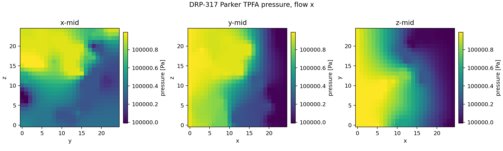

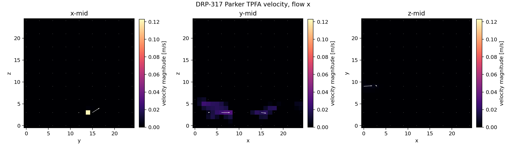

### USFEM Brinkman

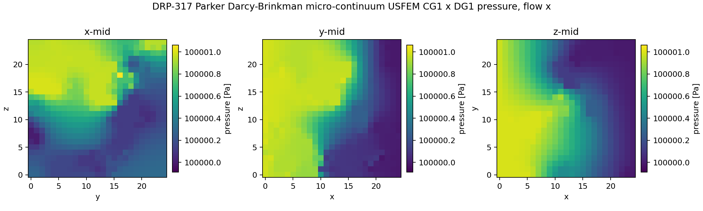

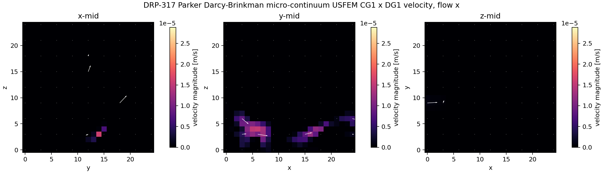

### Taylor-Hood Brinkman

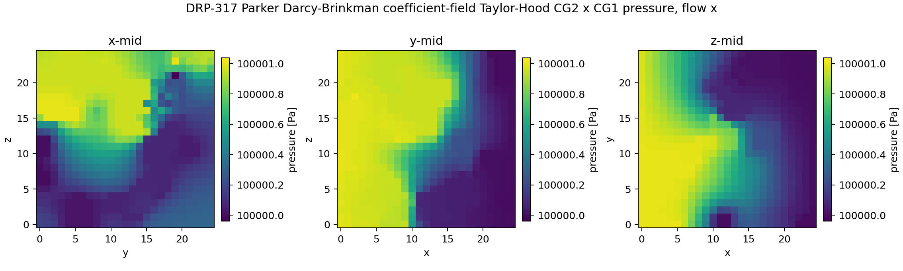

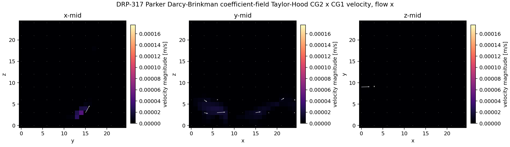

### Taylor-Hood Darcy-Darcy

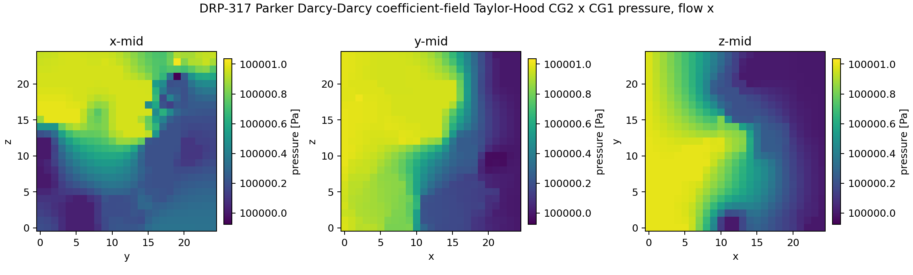

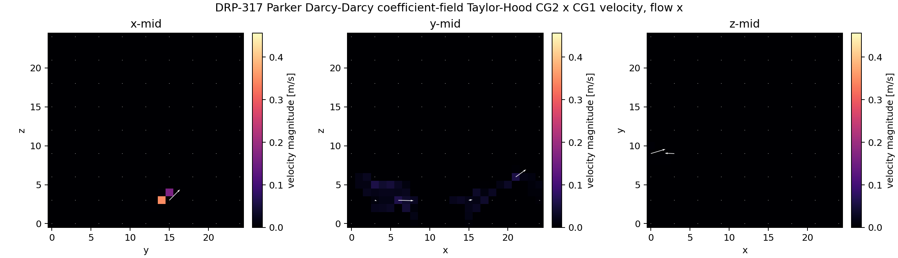

### Direct-Image LBM

The LBM row exports a velocity field on the binary-image grid. It does not write
a continuum pressure field in this validation workflow.

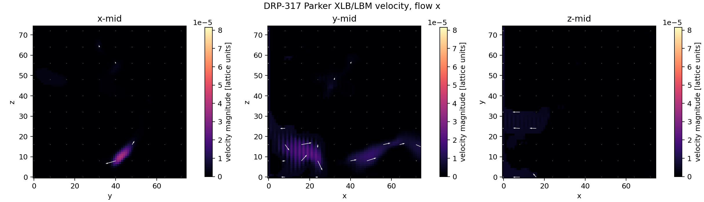

Pore-network models are graph-valued reductions of the image and therefore do
not produce a voxel- or element-based volumetric pressure/velocity field in this
study.

## Permeability Results

The published experimental permeability for Parker is \(10.0\) mD. The table
below assigns this scalar reference to \(K_x\), \(K_y\), and \(K_z\) only to make
the directional simulation results visually comparable.

| Method | Solver/backend | \(K_x\) [mD] | \(K_y\) [mD] | \(K_z\) [mD] |
|---|---|---:|---:|---:|
| Experimental Kabs | `-` | 10.0 | 10.0 | 10.0 |
| Direct-image LBM DNS (XLB, Stokes-limit preset) | `xlb:jax` | 133.0 | 36.1 | 49.9 |
| Darcy-Brinkman micro-continuum USFEM CG1 x DG1 | `fenicsx:petsc-lu-superlu_dist` | 23.3 | 6.6 | 11.3 |
| Darcy-Brinkman coefficient-field Taylor-Hood CG2 x CG1 | `fenicsx:petsc-lu-mumps` | 26.5 | 10.4 | 30.8 |
| Darcy-Darcy coefficient-field Taylor-Hood CG2 x CG1 | `fenicsx:petsc-lu-mumps` | 34,786 | 421.1 | 453.9 |
| TPFA finite-volume Darcy-Darcy | `cg+pyamg` | 33,628 | 163.1 | 113.9 |
| PoreSpy snow2 | `-` | 18.8 | 8.7 | 23.4 |
| PREGO | `-` | 54.6 | 17.0 | 51.1 |
| Native maximal-ball | `-` | 7.0 | 3.7 | 32.4 |

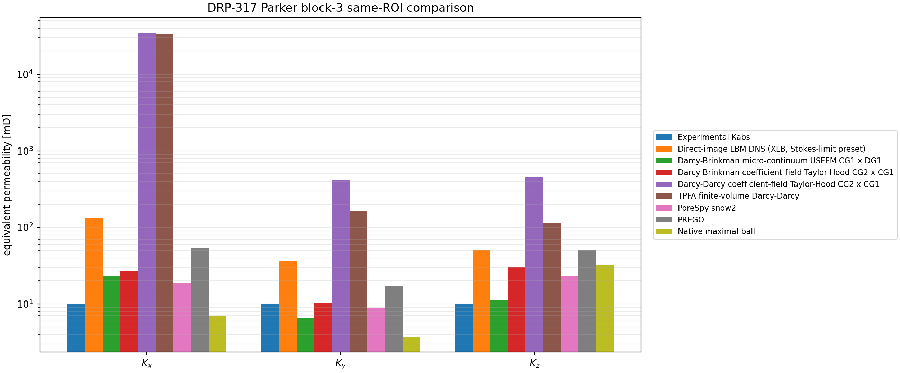

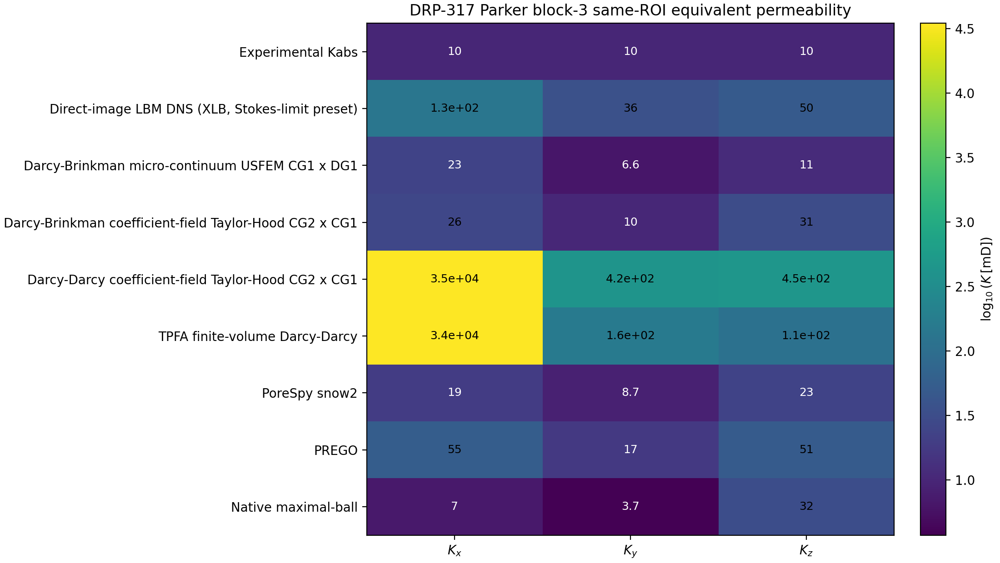

### Bulk Scalar Summaries

The experimental value is reported as a scalar bulk permeability. For the
directional simulations, the table and plot below summarize \(K_x\), \(K_y\),
and \(K_z\) with both arithmetic and harmonic means:

\[
K_\mathrm{arith} = \frac{K_x + K_y + K_z}{3},
\qquad
K_\mathrm{harm} = \frac{3}{1/K_x + 1/K_y + 1/K_z}.
\]

These are scalar summaries of an anisotropic small ROI, not a substitute for
the directional permeability tensor. The harmonic mean is more sensitive to the
least permeable direction, while the arithmetic mean is more sensitive to highly
permeable connected paths.

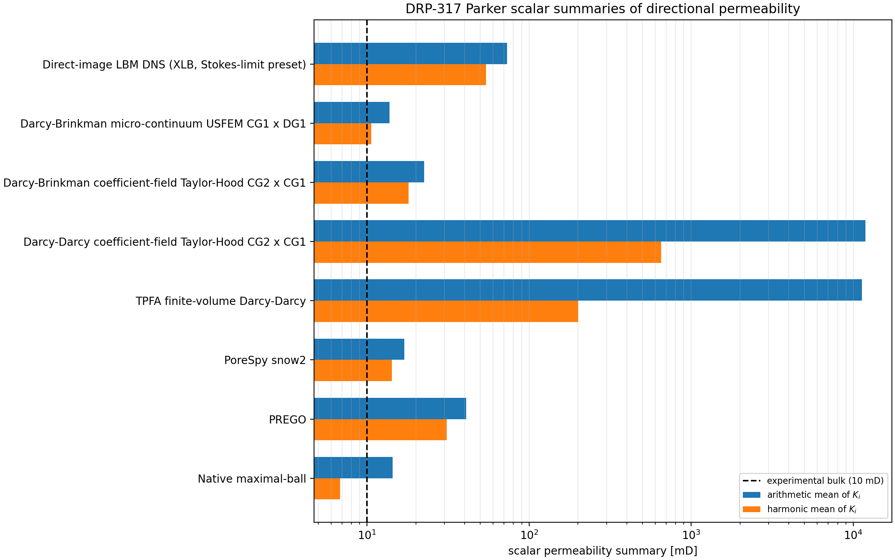

| Method | Arithmetic mean [mD] | Harmonic mean [mD] | Arithmetic / exp | Harmonic / exp | Max/min directional K |
|---|---:|---:|---:|---:|---:|
| Direct-image LBM DNS (XLB, Stokes-limit preset) | 73.0 | 54.3 | 7.30 | 5.43 | 3.69 |
| Darcy-Brinkman micro-continuum USFEM CG1 x DG1 | 13.7 | 10.6 | 1.37 | 1.06 | 3.54 |
| Darcy-Brinkman coefficient-field Taylor-Hood CG2 x CG1 | 22.5 | 18.0 | 2.25 | 1.80 | 2.97 |
| Darcy-Darcy coefficient-field Taylor-Hood CG2 x CG1 | 11,886.9 | 651.2 | 1188.69 | 65.12 | 82.61 |
| TPFA finite-volume Darcy-Darcy | 11,301.5 | 200.7 | 1130.15 | 20.07 | 295.31 |
| PoreSpy snow2 | 17.0 | 14.3 | 1.70 | 1.43 | 2.69 |
| PREGO | 40.9 | 31.0 | 4.09 | 3.10 | 3.21 |
| Native maximal-ball | 14.4 | 6.8 | 1.44 | 0.68 | 8.66 |

Relative to the 10 mD scalar experimental reference:

| Method | \(K_x/K_{\mathrm{exp}}\) | \(K_y/K_{\mathrm{exp}}\) | \(K_z/K_{\mathrm{exp}}\) | Mean absolute directional error [%] |
|---|---:|---:|---:|---:|
| Direct-image LBM DNS (XLB, Stokes-limit preset) | 13.30 | 3.61 | 4.99 | 630.0 |
| Darcy-Brinkman micro-continuum USFEM CG1 x DG1 | 2.33 | 0.66 | 1.13 | 60.2 |
| Darcy-Brinkman coefficient-field Taylor-Hood CG2 x CG1 | 2.65 | 1.04 | 3.08 | 125.4 |
| Darcy-Darcy coefficient-field Taylor-Hood CG2 x CG1 | 3478.56 | 42.11 | 45.39 | 118768.5 |
| TPFA finite-volume Darcy-Darcy | 3362.76 | 16.31 | 11.39 | 112915.1 |
| PoreSpy snow2 | 1.88 | 0.87 | 2.34 | 78.5 |
| PREGO | 5.46 | 1.70 | 5.11 | 309.0 |
| Native maximal-ball | 0.70 | 0.37 | 3.24 | 105.4 |

## Performance

The table reports the solver wall times recorded by the notebook for this local
run. These timings are useful for comparing methods within the same machine and
software stack, but they are not portable benchmark guarantees.

| Method | Mean time per direction [s] | Total 3-axis time [s] | Total 3-axis time [min] |
|---|---:|---:|---:|
| Direct-image LBM DNS (XLB, Stokes-limit preset) | 436.7 | 1310.1 | 21.83 |
| Darcy-Brinkman micro-continuum USFEM CG1 x DG1 | 179.7 | 539.1 | 8.98 |
| Darcy-Brinkman coefficient-field Taylor-Hood CG2 x CG1 | 200.7 | 602.0 | 10.03 |
| Darcy-Darcy coefficient-field Taylor-Hood CG2 x CG1 | 193.7 | 581.1 | 9.69 |
| TPFA finite-volume Darcy-Darcy | 0.5 | 1.4 | 0.02 |
| PoreSpy snow2 | 0.9 | 2.6 | 0.04 |
| PREGO | 0.4 | 1.2 | 0.02 |
| Native maximal-ball | 0.2 | 0.5 | 0.01 |

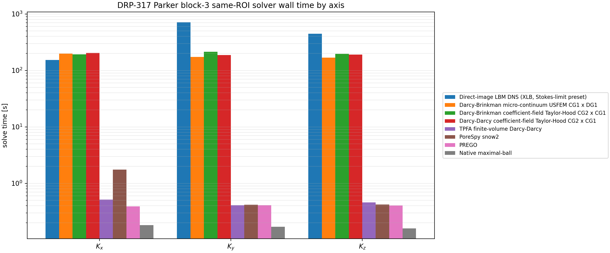

The shipped FEM rows completed the three directions in roughly 9-10 minutes
each for the \(25^3\) map on this machine. The LBM row took longer because the
Parker \(y\) direction needed 13400 steps to satisfy the same steady-state
criterion. The TPFA and
pore-network solves are much faster on this small problem. That runtime should
not be confused with greater physical fidelity: the TPFA row is solving a
different, pure Darcy coefficient-field model.

## Interpretation

Several conclusions are scientifically useful:

- The selected Parker ROI is close to the full segmented-image porosity, but it
  is still a small and anisotropic crop. This is visible in the binary and
  map midplanes and in the large spread among \(K_x\), \(K_y\), and \(K_z\).
- The Darcy-Brinkman USFEM row is the closest continuum-map result by harmonic
  mean: \(K_\mathrm{harm}=10.6\) mD, about \(1.06K_\mathrm{exp}\). This should
  still be read with the directional spread: \(K_x\) is about \(2.33K_\mathrm{exp}\),
  while \(K_y\) is below experiment.
- The Taylor-Hood Brinkman row is consistently more permeable than USFEM with
  the current coefficient map, especially in \(x\) and \(z\).
- The pure Darcy-Darcy rows again produce enormous values because the
  Kozeny-Carman map contains connected cells at the \(10^{-8}\,\mathrm{m^2}\)
  cap. The binary/map diagnostic figure makes that cap-connected pathway clear.
  These rows are diagnostics for the coefficient map, not validated predictors
  for this cap choice.
- The pore-network rows are in the same order of magnitude as the scalar
  experimental reference, but the backend sensitivity is large. Native
  maximal-ball undershoots \(y\), PREGO overpredicts all directions, and PoreSpy
  snow2 gives a moderate overprediction in \(x\) and \(z\).
- The direct-image LBM row does not use the Kozeny-Carman map and still
  overpredicts the scalar experimental reference after all axes are converged.
  Increasing the cap from 8000 to 20000 steps fixed the Parker non-convergence
  without materially changing the ordering of the LBM directional values.

The conservative reading is that the FEniCSx Brinkman implementations are
numerically usable at this map size, and Parker is the strongest current case
for the USFEM micro-continuum row as a bulk scalar predictor. Larger ROIs and
sensitivity studies for \(d\), \(C\), \(k_{\max}\), block size, and LBM
steady-state settings are still required before treating the result as a
calibrated predictor for the full Parker sample.

## Reproducible Artifacts

- [Case summary CSV](../assets/validation/drp317_parker_block3_same_roi_summary.csv)
- [Map summary CSV](../assets/validation/drp317_parker_block3_same_roi_map_summary.csv)
- [Model comparison CSV](../assets/validation/drp317_parker_block3_same_roi_model_comparison.csv)
- [Ratios to experiment CSV](../assets/validation/drp317_parker_block3_same_roi_model_ratios_to_experiment.csv)
- [Bulk permeability means CSV](../assets/validation/drp317_parker_block3_same_roi_bulk_permeability_means.csv)
- [Direct-image LBM directional CSV](../assets/validation/drp317_parker_block3_same_roi_xlb_lbm_directional.csv)
- [Direct-image LBM status JSON](../assets/validation/drp317_parker_block3_same_roi_xlb_lbm_status.json)
- [Field-output manifest CSV](../assets/validation/drp317_parker_block3_same_roi_field_outputs.csv)
