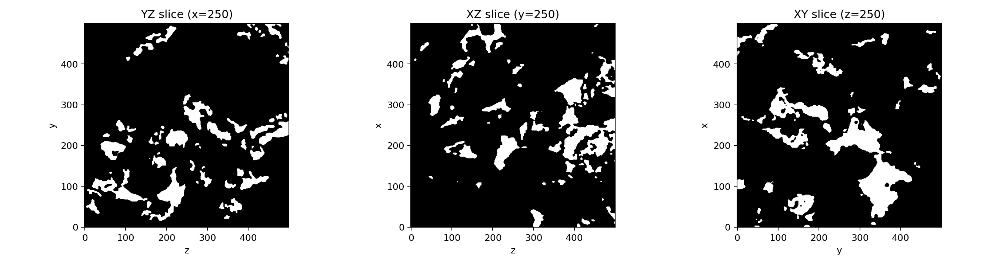
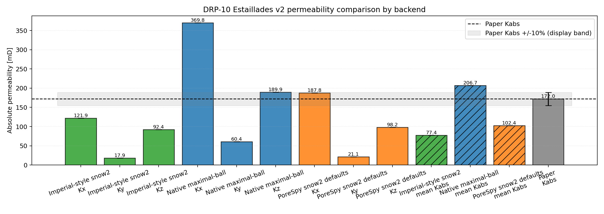
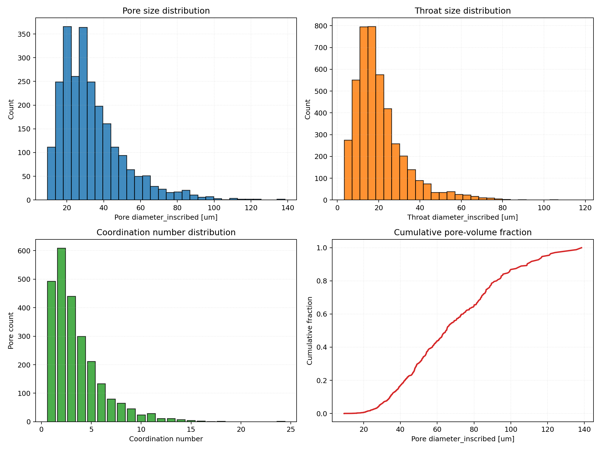

# DRP-10 Estaillades Verification Overview

This report documents a controlled DRP-10 benchmark where the current `voids`
image-to-network workflow is compared against the published Estaillades
reference values reported by Muljadi et al. (2016).

The reproducible artifact for this report is notebook
`notebooks/31_mwe_drp10_estaillades_raw_porosity_perm.ipynb`.

---

## Goal

The benchmark answers the following question:

Given the same DRP-10 Estaillades binary image, how closely does the current
`voids` extraction-plus-PNM workflow reproduce the published-reference porosity and
absolute permeability?

In this documentation split, DRP-10 is classified as verification because the
paper reference values were obtained from a numerical OpenFOAM workflow, not
from a laboratory core-flood experiment.

---

## Studied Notebook

- `31_mwe_drp10_estaillades_raw_porosity_perm`

---

## Sources

- Dataset: Digital Porous Media Portal, DRP-10
  <https://digitalporousmedia.org/published-datasets/drp.project.published.DRP-10>
- Reference paper: Muljadi, B. P., Blunt, M. J., Raeini, A. Q., & Bijeljic, B.
  (2016). *The impact of porous media heterogeneity on non-Darcy flow behaviour
  from pore-scale simulation*. *Advances in Water Resources, 95*, 329-340.
  <https://doi.org/10.1016/j.advwatres.2015.05.019>

---

## Current Notebook Setup

The DRP-10 notebook currently uses:

- full-sample analysis (`500 x 500 x 500` voxels), no ROI cropping
- RAW decoding with C-style voxel ordering (`order='C'`)
- void convention `raw == 0`
- optional pre-trimming to axis-percolating paths (`trim_nonpercolating_paths = True`)
- native maximal-ball extraction as the primary `voids` workflow
- comparison extraction with PoreSpy `snow2` default settings
- comparison extraction with PoreSpy `snow2` plus compatibility geometry repairs
- conductance model `valvatne_blunt`
- pressure-dependent water viscosity from `thermo`, `298.15 K`
- reference outlet pressure `5.0 MPa`
- imposed pressure gradient `10 kPa/m`
- directional permeability in `x`, `y`, and `z` for each backend
- scalar summaries using arithmetic-mean and RMS `Kabs` across solved axes

---

## Figures

Representative orthogonal slices of the segmented Estaillades volume used in
the benchmark.

Directional permeability from the current `voids` run, backend-comparison
workflows, backend mean values, and the paper flow-axis reference (`Kx`,
Table 2).

Extracted-network diagnostics for pore/throat counts, size distribution, and
topological quality indicators.

---

## Results

The full CSV outputs are available here:

- [drp10_estaillades_summary.csv](../assets/verification/drp10_estaillades_summary.csv)
- [drp10_estaillades_directional.csv](../assets/verification/drp10_estaillades_directional.csv)
- [drp10_estaillades_directional_by_backend.csv](../assets/verification/drp10_estaillades_directional_by_backend.csv)
- [drp10_estaillades_summary_by_backend.csv](../assets/verification/drp10_estaillades_summary_by_backend.csv)

### Porosity and Permeability Against Paper Reference

| Quantity | `voids` estimate | Paper reference | Relative error |
|---|---:|---:|---:|
| Full-image porosity [%] | 10.8180 | 10.8 | +0.17% |
| Network absolute porosity [%] | 10.8180 | 10.8 | +0.17% |
| Primary-backend permeability `Kx` [mD] | 369.8386 | 172.0 | +115.02% |

### Directional Permeability By Backend (Current Run)

| Backend | `Kx` [mD] | `Ky` [mD] | `Kz` [mD] | Mean `Kabs` [mD] |
|---|---:|---:|---:|---:|
| Native maximal-ball | 369.84 | 60.40 | 189.90 | 206.71 |
| PoreSpy `snow2` defaults | 187.81 | 21.12 | 98.15 | 102.36 |
| Compatibility-repaired `snow2` | 121.92 | 17.91 | 92.44 | 77.43 |

### Network Statistics (Current Run)

| Metric | Value |
|---|---:|
| `Np` | 2477 |
| `Nt` | 4392 |
| Mean coordination | 3.55 |
| Max coordination | 24 |
| Mean pore diameter-equivalent [um] | 33.77 |
| Mean throat diameter-equivalent [um] | 20.53 |
| Connected components | 1 |
| Giant component fraction | 1.00 |
| Dead-end pore fraction | 0.199 |

---

## Interpretation

The DRP-10 case shows strong agreement in full-image porosity, while the
permeability estimate remains strongly extraction-dependent. The primary native
maximal-ball workflow over-predicts the paper flow-direction permeability in
this snapshot (`+115.02%` in `Kx`). The PoreSpy `snow2` default comparison is
much closer to the paper `Kx` value, while the compatibility-repaired `snow2`
variant is lower.

All three backend configurations preserve the same qualitative anisotropy
(`Kx > Kz > Ky`), but not the same absolute scale. That spread is expected to
affect which scalar permeability is comparable to a paper-reported directional
value.

For this reason, the current DRP-10 benchmark is best interpreted as
workflow-sensitivity evidence under explicit extraction and closure
assumptions, not as universal physical calibration.

---

## Limits Of This Verification

Important limits and assumptions:

- single DRP-10 sample (`Estaillades v2`) under one current workflow setup
- no ROI/subvolume sensitivity analysis in this notebook
- permeability comparison uses paper directionality assumptions from Table 2
- extraction and constitutive choices can shift
  `Kabs` independently of linear solver correctness
- the native maximal-ball extraction is still under active verification against
  backend-comparison and intermediate-quantity checks
- agreement with one OpenFOAM-referenced paper does not imply agreement with
  all carbonate datasets or all simulator setups

---

## Reproducible Artifacts

- Notebook: `notebooks/31_mwe_drp10_estaillades_raw_porosity_perm.ipynb`
- Outputs:
  - `examples/data/drp-10/Estaillades_v2_estimated_properties.csv`
  - `examples/data/drp-10/Estaillades_v2_kabs_directional.csv`
  - `examples/data/drp-10/Estaillades_v2_kabs_directional_by_backend.csv`
  - `examples/data/drp-10/Estaillades_v2_kabs_summary_by_backend.csv`
  - `examples/data/drp-10/Estaillades_v2_network_stats.csv`
  - `examples/data/drp-10/Estaillades_v2_slices.png`
  - `examples/data/drp-10/Estaillades_v2_kabs_comparison.png`
  - `examples/data/drp-10/Estaillades_v2_network_stats.png`
  - `examples/data/drp-10/Estaillades_v2_network_plotly.html`
