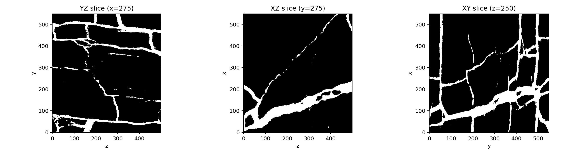
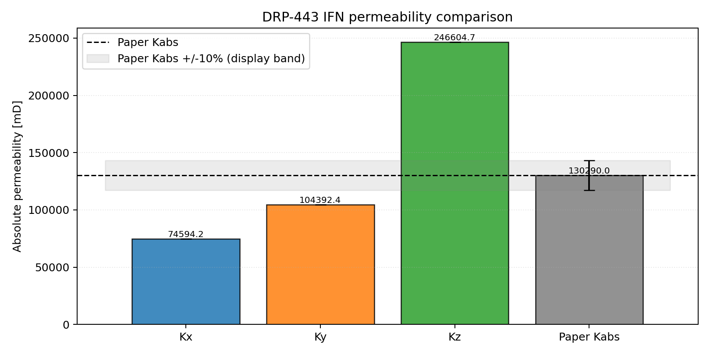
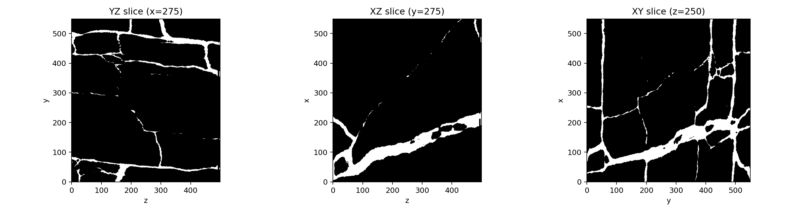
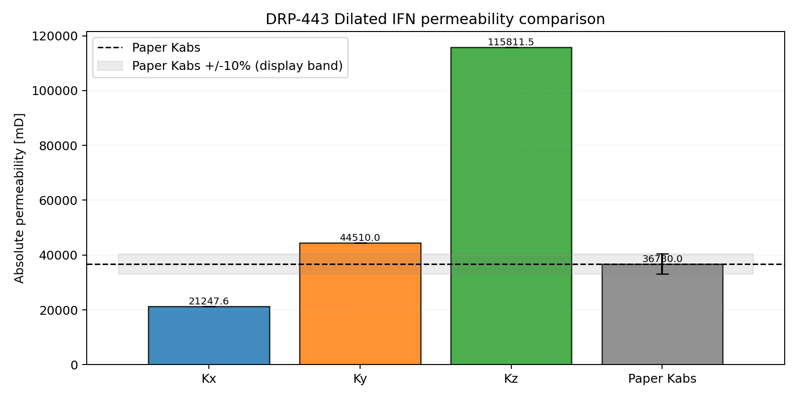

# DRP-443 Fracture-Network Verification Overview

This report summarizes the current `voids` verification workflow for the two
DRP-443 notebook studies:

- `29_mwe_drp443_ifn_raw_porosity_perm`
- `30_mwe_drp443_dilatedifn_raw_porosity_perm`

## Sources

- Dataset: Digital Porous Media Portal, DRP-443
  <https://digitalporousmedia.org/published-datasets/drp.project.published.DRP-443>
- Experimental reference paper: Song, W., Prodanovic, M., Santos, J. E., Yao, J.,
  Zhang, K., & Yang, Y. (2022). *Upscaling of Transport Properties in Complex
  Hydraulic Fracture Systems*. *SPE Journal*.
  <https://doi.org/10.2118/212849-PA>

## Current Notebook Setup

Both DRP-443 notebooks share the same current modeling choices:

- full-sample analysis (`550 x 550 x 500` voxels), no ROI cropping
- RAW decoding with Fortran-style voxel ordering (`order='F'`)
- void convention `raw == 0`
- optional pre-trimming to axis-percolating paths (`trim_nonpercolating_paths = True`)
- PoreSpy extraction with `geometry_repairs = "imperial_export"`
- conductance model `valvatne_blunt`
- pressure-dependent water viscosity from `thermo`, `298.15 K`
- reference outlet pressure `5.0 MPa`
- imposed pressure gradient `10 kPa/m`

## Summary Table

The underlying summary CSV is committed as
[`docs/assets/validation/drp443_summary.csv`](../assets/validation/drp443_summary.csv).

| Sample | Full-image porosity [%] | Network porosity [%] | Paper permeability [mD] | Kx [mD] | Arithmetic-mean permeability [mD] | Quadratic-mean permeability [mD] | Kx relative error [%] |
|---|---:|---:|---:|---:|---:|---:|---:|
| IFN | 16.51 | 16.77 | 130290.0 | 74594.21 | 141863.78 | 160495.03 | -42.75 |
| Dilated IFN | 11.24 | 11.42 | 36730.0 | 21247.64 | 60523.02 | 72674.83 | -42.15 |

The directional permeability data used for this table is committed as
[`docs/assets/validation/drp443_directional.csv`](../assets/validation/drp443_directional.csv).

## Figures

### IFN

### Dilated IFN

## Interpretation

Under the current setup, both DRP-443 cases show a strong directional
anisotropy (`Kz > Ky > Kx`) and a similar bias in the paper flow direction:
`Kx` is about `42%` below the paper value for both IFN and Dilated IFN.

The direction-averaged permeabilities remain above the paper `Kx` references,
which reinforces that anisotropy and flow-direction definition are central in
this dataset. In this documentation split, DRP-443 is treated as verification
because the paper references are numerical LBM results rather than laboratory
experimental measurements.

## Reproducible Artifacts

- Notebook: `notebooks/29_mwe_drp443_ifn_raw_porosity_perm.ipynb`
- Notebook: `notebooks/30_mwe_drp443_dilatedifn_raw_porosity_perm.ipynb`
- Outputs:
  - `examples/data/drp-443/IFN_estimated_properties.csv`
  - `examples/data/drp-443/IFN_kabs_directional.csv`
  - `examples/data/drp-443/IFN_network_stats.csv`
  - `examples/data/drp-443/DilatedIFN_estimated_properties.csv`
  - `examples/data/drp-443/DilatedIFN_kabs_directional.csv`
  - `examples/data/drp-443/DilatedIFN_network_stats.csv`
