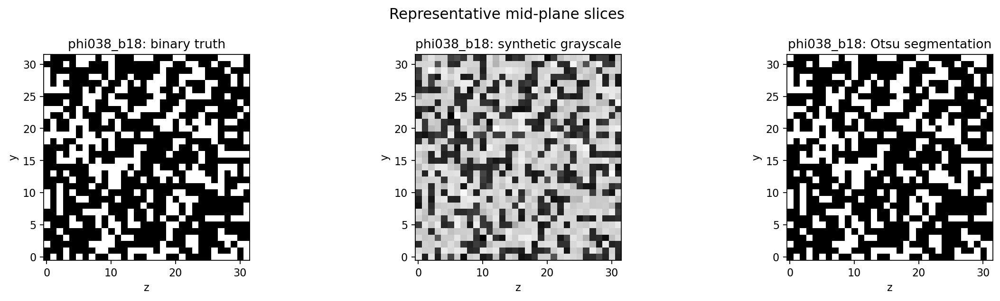
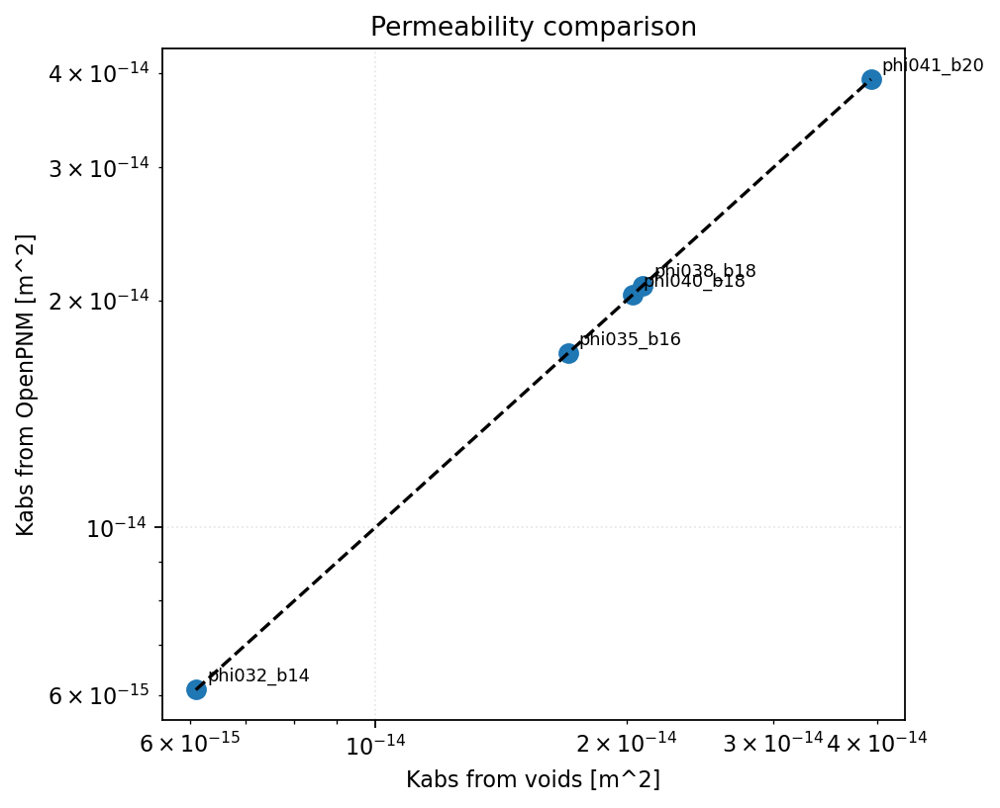
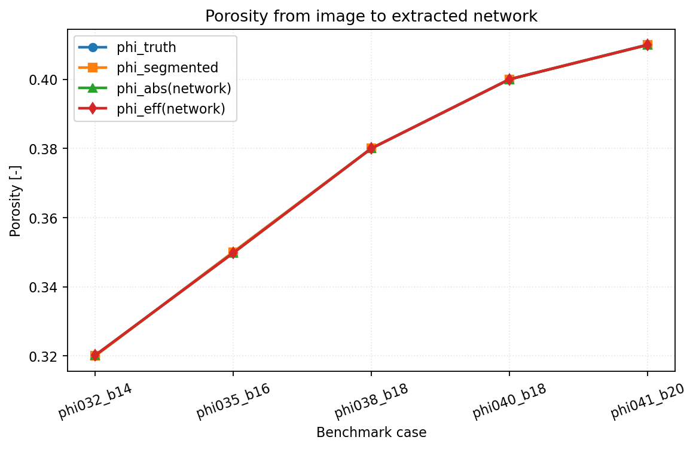

# OpenPNM Extracted-Network Cross-Check

This report documents a controlled verification study of `voids` against
OpenPNM on the same extracted pore network. The purpose is narrower than the
XLB benchmark: here the goal is to verify representation consistency,
boundary-condition handling, and single-phase solver agreement, not to compare
different geometric reductions of the same image.

The reproducible artifact for this report is notebook
`notebooks/12_mwe_synthetic_volume_openpnm_benchmark.ipynb`.

---

## Goal

The benchmark answers the following question:

Given the same segmented image and the same extracted spanning network, do
`voids` and OpenPNM return the same absolute permeability when the OpenPNM side
is given the exact same throat hydraulic conductances?

That is the correct verification target for this comparison. If the agreement
stops being essentially exact, the likely causes are:

- a change in PoreSpy extraction or boundary labeling
- an import/export bug between `voids` and OpenPNM-style data
- a regression in solver assembly or sign conventions
- an OpenPNM API change that breaks the adapter assumptions

---

## Governing Formulations

### `voids` Solve

For each segmented image, `voids`:

1. extracts a network with `snow2`
2. prunes to the axis-spanning subnetwork
3. solves the steady pressure system

$$
\mathbf{A}\,\mathbf{p} = \mathbf{b},
$$

with throat fluxes

$$
q_t = g_t (p_i - p_j),
$$

and apparent permeability from Darcy's law,

$$
K = \frac{|Q|\,\mu\,L}{A\,|\Delta p|}.
$$

For this benchmark, the `voids` side uses:

- `conductance_model = "valvatne_blunt"`
- `solver = "direct"`
- $\mu = 1.0 \times 10^{-3}$ Pa s

### OpenPNM Reference Solve

This benchmark does **not** ask OpenPNM to reconstruct its own conductances
from geometry. Instead, the wrapper exports the extracted `voids` network to an
OpenPNM-compatible structure, injects the `voids` throat hydraulic
conductances, and runs OpenPNM `StokesFlow` with the same pressure boundary
conditions.

Scientifically, that means:

- geometry is shared
- conductance closure is shared
- only network representation, BC application, and linear-solver path differ

This is why machine-precision agreement is the expected result. It is a strong
regression test for the interoperability layer, but it is **not** an
independent constitutive-model validation.

---

## Synthetic Benchmark Setup

All cases in this report use:

- synthetic spanning binary volumes generated with `generate_spanning_blobs_matrix`
- shape `(32, 32, 32)`
- flow axis `x`
- voxel size `2.0e-6 m`
- fluid viscosity `1.0e-3 Pa s`
- preferred benchmark input `delta_p = 1 Pa`
- synthetic grayscale observations followed by Otsu thresholding

The five-case set is:

| Case | Target porosity | Blobiness | Seed used |
|---|---:|---:|---:|
| `phi032_b14` | 0.32 | 1.4 | 401 |
| `phi035_b16` | 0.35 | 1.6 | 501 |
| `phi038_b18` | 0.38 | 1.8 | 601 |
| `phi040_b18` | 0.40 | 1.8 | 901 |
| `phi041_b20` | 0.41 | 2.0 | 701 |

The synthetic grayscale model is intentionally simple and high-contrast. It is
used here only to exercise the image-to-segmentation-to-network workflow under
controlled conditions.

---

## Figures

Representative mid-plane slices for case `phi038_b18`: binary truth, synthetic
grayscale observation, and the Otsu-segmented image passed to the benchmark.

`voids` permeability against OpenPNM permeability. The identity line is
expected because both sides solve the same extracted network with the same
hydraulic conductances.

Porosity traced through the workflow: binary truth, segmented image, absolute
network porosity, and effective network porosity.

---

## Results

The full CSV generated by the notebook is available here:
[openpnm_5_case_results.csv](../assets/verification/openpnm_5_case_results.csv).

| Case | Segmentation mismatch | `Np` | `Nt` | `K_voids` [m^2] | `K_openpnm` [m^2] | Rel. diff. |
|---|---:|---:|---:|---:|---:|---:|
| `phi032_b14` | `3.05e-05` | 53 | 150 | `6.097e-15` | `6.097e-15` | `1.16e-15` |
| `phi035_b16` | `0.00e+00` | 26 | 79 | `1.702e-14` | `1.702e-14` | `9.27e-16` |
| `phi038_b18` | `0.00e+00` | 36 | 106 | `2.092e-14` | `2.092e-14` | `1.51e-15` |
| `phi040_b18` | `0.00e+00` | 45 | 134 | `2.033e-14` | `2.033e-14` | `1.09e-15` |
| `phi041_b20` | `6.10e-05` | 37 | 106 | `3.928e-14` | `3.928e-14` | `8.03e-16` |

Summary statistics for this five-case set:

- maximum relative permeability difference: `1.51e-15`
- mean relative permeability difference: `1.10e-15`
- maximum relative total-flow difference: `1.47e-15`
- mean segmentation mismatch: `1.83e-05`
- OpenPNM version in this run: `3.6.1`

Those numbers are in the machine-precision regime and are exactly what this
benchmark should show when the adapter is working correctly.

---

## Interpretation

These results support the following conclusions:

1. The current `voids` OpenPNM interoperability path is numerically consistent
   for the tested cases.
2. The benchmark is sensitive enough to catch future regressions in BC labels,
   solver assembly, or OpenPNM API adaptation because the present baseline is
   effectively exact.
3. The small nonzero values in the error columns are not physically meaningful;
   they are floating-point roundoff.

The practical interpretation is straightforward: if this benchmark starts to
show visible scatter away from the identity line, treat that as a likely bug
until proven otherwise.

---

## Limits Of This Verification

This report is intentionally narrow.

Important limits and assumptions:

- OpenPNM is **not** used here as an independent physics reference
- the OpenPNM side receives `voids` throat conductances directly
- the images are small synthetic cases, not real rock volumes
- the grayscale model is synthetic and should not be interpreted as scanner
  realism
- agreement here does not imply agreement with independent extracted-network or
  direct-image references
