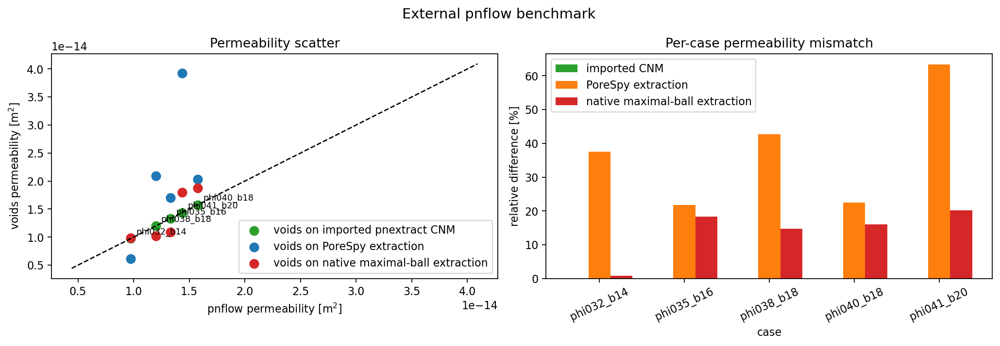
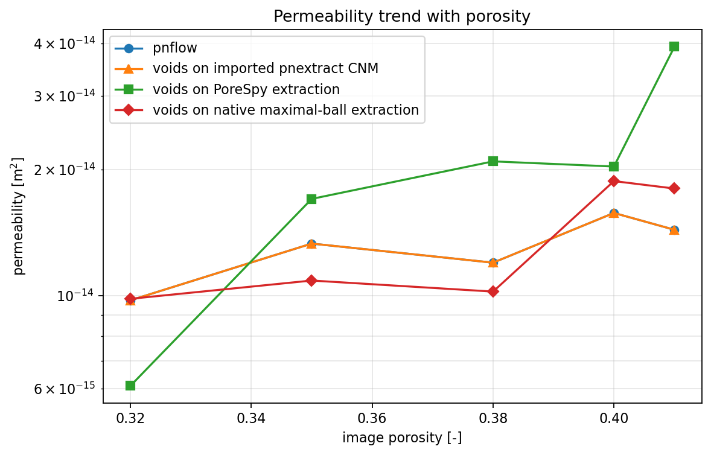

# External `pnextract` / `pnflow` Benchmark

This report documents a controlled verification study of `voids` against a
fixed external reference dataset generated with the Imperial College
`pnextract` + `pnflow` workflow. After instrumenting the checked-in reference
codes, the benchmark is now interpreted in three layers:

1. imported-CNM parity, where `voids` solves the saved `pnextract` network, and
2. full-workflow comparison, where `voids` re-extracts the binary image with
   `snow2` before solving, and
3. native maximal-ball comparison, where `voids` uses its dependency-free
   maximal-ball extractor with external-reservoir boundary pores on the flow
   axis.

That split matters scientifically. The first layer is now a same-network
software-verification test, while the image-extraction layers remain
end-to-end workflow comparisons against an independent external PNM pipeline.

The reproducible artifact for this report is notebook
`notebooks/15_mwe_external_pnflow_benchmark.ipynb`.

---

## Goal

The benchmark answers the following question:

Given the same binary segmented volume, how different is the apparent
permeability predicted by:

1. `voids` after importing the saved `pnextract` CNM network and solving it
   with explicit `pnflow` compatibility enabled,
2. `voids` after `snow2` extraction and single-phase PNM solution, and
3. `voids` after native maximal-ball extraction and single-phase PNM solution,
   and
4. the saved external reference built from `pnextract` network extraction plus
   `pnflow` transport simulation?

The imported-CNM branch is not a workflow-level comparison anymore. It is a
same-network transport cross-check against the checked-in `pnflow` code path.
The `snow2` and native maximal-ball branches are still workflow-level
comparisons. A mismatch there is not automatically a `voids` bug, because the
two sides differ in:

- extracted topology
- pore and throat geometry assignment
- constitutive closure
- single-phase solver implementation

---

## Governing Formulations

### `voids` PNM Workflow

For each committed binary volume, `voids`:

1. extracts a pore network with either `snow2` or native maximal-ball extraction
2. prunes to the `x`-spanning subnetwork
3. solves the steady graph pressure system

$$
\mathbf{A}\,\mathbf{p} = \mathbf{b},
$$

with throat fluxes

$$
q_t = g_t (p_i - p_j),
$$

and apparent permeability from Darcy's law

$$
K = \frac{|Q|\,\mu\,L}{A\,|\Delta p|}.
$$

For this benchmark, the `voids` side uses:

- `conductance_model = "valvatne_blunt"`
- `solver = "direct"`
- $\mu = 1.0 \times 10^{-3}$ Pa s

For the imported-CNM branch, `voids` also enables the explicit importer option
`pnflow_solver_box_compat=True`. This reproduces a checked-in Imperial
preprocessing quirk that excludes the first physical pore from the solver box
and promotes it to a solver-boundary pore. That option is deliberately opt-in
in the public API because it reflects `pnflow` compatibility, not a generic
physical boundary rule.

### External `pnextract` / `pnflow` Reference

The reference data committed in `examples/data/external_pnflow_benchmark/`
were generated earlier by:

1. exporting the binary image to MetaImage format
2. extracting a network with `pnextract`
3. running `pnflow` on the resulting `*_node*.dat` / `*_link*.dat` files
4. recording the upscaled permeability and porosity from `*_upscaled.tsv`

The current notebook does not rerun those binaries. It reads the committed
reference outputs instead. That is an intentional reproducibility choice: the
benchmark remains runnable even if `pnextract` or `pnflow` are unavailable in
future environments.

Scientifically, the correct statement is:

- the benchmark compares `voids` against a fixed external workflow reference
- it does **not** re-verify future upstream `pnextract` / `pnflow` revisions
- the imported-CNM branch now isolates the checked-in `pnflow` single-phase
  transport path from extraction differences
- the `snow2` branch still mixes extraction and constitutive-model differences

---

## Fixed Reference Dataset

The committed reference bundle lives in
`examples/data/external_pnflow_benchmark/` and includes:

- `manifest.csv` with case metadata and file paths
- exact binary benchmark volumes as `void_volume.npy`
- saved `pnflow` reports (`*_pnflow.prt`, `*_upscaled.tsv`)
- saved extracted-network files (`*_node*.dat`, `*_link*.dat`)

This design matters because it makes the benchmark stable against future
changes in:

- the random generator implementation
- local build details of the external codes
- availability of the external binaries

All cases in this report use:

- shape `(32, 32, 32)`
- flow axis `x`
- voxel size `2.0e-6 m`
- fluid viscosity `1.0e-3 Pa s`

The five-case set is:

| Case | Target porosity | Blobiness | Seed used |
|---|---:|---:|---:|
| `phi032_b14` | 0.32 | 1.4 | 401 |
| `phi035_b16` | 0.35 | 1.6 | 501 |
| `phi038_b18` | 0.38 | 1.8 | 601 |
| `phi040_b18` | 0.40 | 1.8 | 901 |
| `phi041_b20` | 0.41 | 2.0 | 701 |

---

## Why The Two Methods Differ

Even when both workflows are implemented correctly, the benchmark branches
do not answer the same question.

| Aspect | `voids` imported CNM | `voids` from image | External reference |
|---|---|---|
| Input geometry | Saved `pnextract` CNM | Same committed binary image | Same committed binary image |
| Extraction backend | Reuse saved external extraction | `snow2` or native maximal-ball | `pnextract` |
| Unknowns | Imported CNM pores plus explicit `pnflow` compatibility on solver-box handling | One pressure unknown per retained pore | `pnflow` network unknowns on `pnextract` output |
| Conductance closure | `valvatne_blunt` conduit model, matched throat-by-throat to checked-in `pnflow` | `valvatne_blunt` conduit model | `pnflow` internal network model |
| Main question | Does `voids` reproduce the checked-in `pnflow` single-phase solve on the same pore network? | How different is the full `voids` image-to-network workflow from the external workflow? | Reference branch |

Therefore, near machine-precision agreement is expected for the imported-CNM
branch, while much larger disagreement is expected for the image-re-extraction
branch. That contrast is now the main signal this benchmark is meant to expose.

---

## Figures

Left: `voids` permeability against the saved `pnflow` permeability with the
identity line. The imported-CNM points sit on the identity line at plotting
resolution once `pnflow` compatibility is enabled. Right: per-case relative
difference for the imported-CNM and `snow2` branches.

Porosity-permeability trend for the five committed benchmark cases. This is
useful for checking whether `voids` and the external reference follow the same
macroscopic trend even when the pointwise values differ.

---

## Results

The full CSV generated by the notebook is available here:
[pnflow_5_case_results.csv](../assets/verification/pnflow_5_case_results.csv).
[pnflow_maxball_matched_physical_throat_summary.csv](../assets/verification/pnflow_maxball_matched_physical_throat_summary.csv)
and
[pnflow_maxball_matched_physical_throats.csv](../assets/verification/pnflow_maxball_matched_physical_throats.csv)
record the deeper physical-throat matching diagnostic generated from the
instrumented `pnextract` voxel-region outputs.

| Case | `K_imported` [m^2] | `K_pnflow` [m^2] | Imported rel. diff. [%] | `K_snow2` [m^2] | `snow2` rel. diff. [%] | `K_maxball` [m^2] | maxball rel. diff. [%] |
|---|---:|---:|---:|---:|---:|---:|---:|
| `phi032_b14` | `9.752e-15` | `9.752e-15` | `0.000024` | `6.097e-15` | `37.48` | `1.016e-14` | `4.00` |
| `phi035_b16` | `1.332e-14` | `1.332e-14` | `0.000031` | `1.702e-14` | `21.76` | `1.084e-14` | `18.64` |
| `phi038_b18` | `1.199e-14` | `1.199e-14` | `0.000235` | `2.092e-14` | `42.67` | `1.023e-14` | `14.68` |
| `phi040_b18` | `1.576e-14` | `1.576e-14` | `0.000301` | `2.033e-14` | `22.51` | `1.909e-14` | `17.45` |
| `phi041_b20` | `1.437e-14` | `1.437e-14` | `0.000125` | `3.926e-14` | `63.40` | `1.796e-14` | `19.98` |

Summary statistics for this five-case set:

- imported-CNM mean relative permeability difference: `0.000143 %`
- imported-CNM maximum relative permeability difference: `0.000301 %`
- `snow2` mean relative permeability difference: `37.56 %`
- `snow2` maximum relative permeability difference: `63.40 %`
- native maximal-ball mean relative permeability difference: `14.95 %`
- native maximal-ball maximum relative permeability difference: `19.98 %`
- imported-CNM physical pore counts match the saved `pnflow` pore counts on all
  five cases
- imported-CNM throat counts match the saved `pnflow` throat counts on all five
  cases
- the native maximal-ball branch is closer than plain `snow2` on mean
  permeability error for this five-case set, with mixed-sign residual errors
  across the five cases
- after excluding explicit reservoir helper pores, native maximal-ball physical
  pore-count differences are `1.19-7.25 %` and physical throat-count differences
  are `2.00-5.81 %` across the five cases
- the native maximal-ball branch now uses explicit helper boundary pores on the
  flow axis; this avoids imposing Dirichlet pressure directly at internal pore
  centers
- native maximal-ball conduit lengths are anchored on the ordered pair's second
  interface-supporting ball, matching the reference writer's use of its
  second-side throat ball when computing pore-to-throat lengths

Together, these checks are the key outcome of the investigation: once the same
pore network and the checked-in `pnflow` preprocessing are used, the
single-phase `voids` solve agrees with `pnflow` to plotting precision. The
remaining mismatch is therefore dominated by image-to-network extraction and
geometric reduction, especially conduit-area, shape-factor, and boundary
reservoir reduction details, not by the single-phase pressure solve.

The matched-throat diagnostic makes this more specific. Native physical
maximal-ball throats could be matched to `77-85 %` of native physical
connections and `77-80 %` of reference physical connections by voxel-region
overlap. On those matched physical throats, median radius differences are only
about `0.4-0.6 %`, but median area differences are about `30-34 %`, median
shape-factor differences are about `29 %`, and median equivalent-conductance
differences are about `27-37 %`. This points to conduit cross-section and
shape-factor reduction as the main remaining target.

The checked `pnextract` writer computes throat shape factors from
`R^2 / (4 * |CrosArea|)`, where `CrosArea` is a vector of oriented interface
face counts. `voids` now exposes this convention for controlled experiments via
native maximal-ball `extraction_kwargs={"throat_area_mode": "vector_magnitude"}`.
`voids` also exposes a separate radius convention for the shape-factor
calculation via
`extraction_kwargs={"throat_shape_factor_radius_mode": "surface_ball"}`. These
are not defaults for the five-case benchmark because changing either scalar
convention alone did not improve the end-to-end permeability error. This
indicates that the remaining `pnextract` details, such as throat-surface ball
selection, oriented cross-area, and exported/raw throat-radius semantics, must
be matched together rather than one scalar convention at a time.

The one reference-logic change promoted to the default is the throat-length
anchor: the native maximal-ball builder now uses the second side of each
ordered region pair rather than whichever side has the larger supporting
radius. On the five committed cases this slightly reduced the native
maximal-ball mean relative permeability difference, but the change was adopted
primarily because it matches the reference length construction.

We also tested a dependency-free internal approximation mode exposed as
`backend="porespy_imperial"`. This still uses `snow2`, but starts from a
benchmark-tuned parameter profile (`sigma=1.0`, `r_max=4`,
`boundary_width=1`) chosen to move the five-case benchmark closer to the
committed `pnextract` reference without invoking any external binaries. On the
same five cases, that reduced the mean relative permeability difference from
about `37.56 %` for the plain `snow2` default to about `30.13 %`, with the
maximum case dropping from about `63.40 %` to about `47.50 %`.

---

## Interpretation

These results support the following conclusions:

1. The `voids` single-phase solver, conduit conductance model, and pressure
   boundary treatment reproduce the checked-in Imperial `pnflow` path on the
   saved CNM networks to near machine precision once explicit compatibility is
   enabled.
2. The remaining mismatch in the image-extraction branches is
   morphology-sensitive and dominated by extraction differences rather than the
   single-phase solver.
3. The imported-CNM parity result should be interpreted as compatibility with
   the checked-in `pnflow` code path, not as proof that every Imperial
   preprocessing choice is a generic physical modeling rule.
4. The practical next target for closer workflow agreement is the native
   maximal-ball geometry/topology reduction, especially throat-surface grouping
   and high-connectivity cases, not a rewrite of the single-phase solver.

The practical interpretation is now split:

- the imported-CNM branch behaves like a strong software-verification test
- the `snow2` and native maximal-ball branches remain external workflow
  comparisons between different image-to-network reductions

---

## Limits Of This Verification

This report is intentionally narrow.

Important limits and assumptions:

- the reference is a committed saved dataset, not a rerun of the latest
  upstream `pnextract` / `pnflow` source tree
- the cases are small synthetic volumes, not real rocks
- the benchmark does not isolate extraction from constitutive-model effects
- the external reference was generated on one specific local build path, so it
  should be treated as a fixed comparison baseline
- agreement here does not imply agreement with direct-image references such as
  XLB
