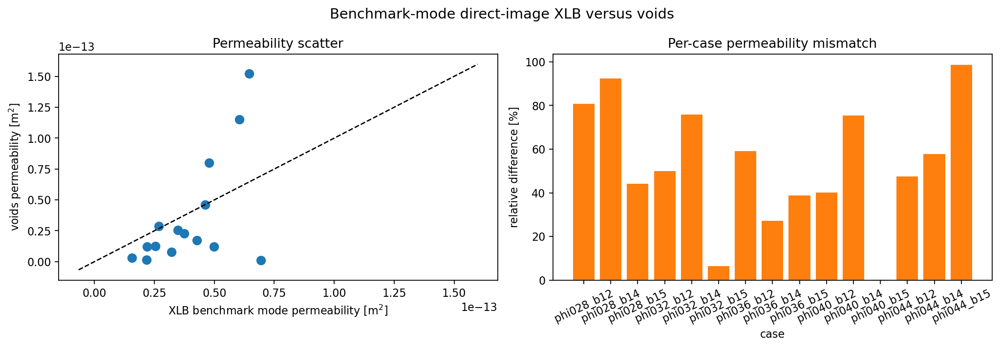
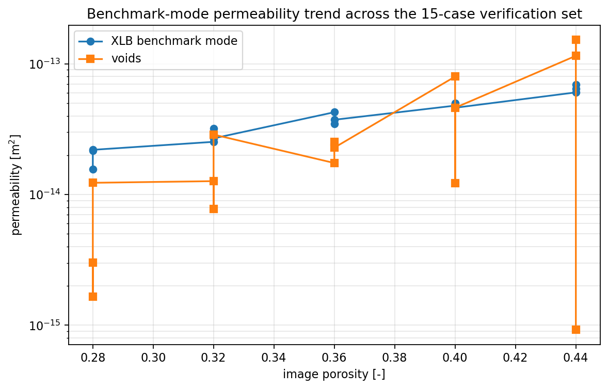
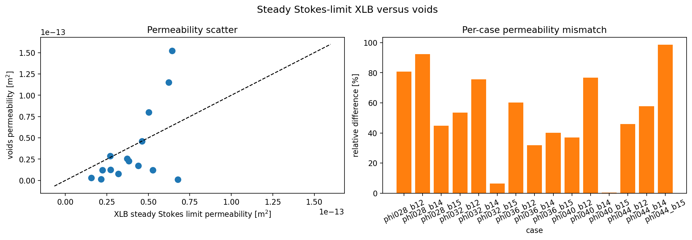
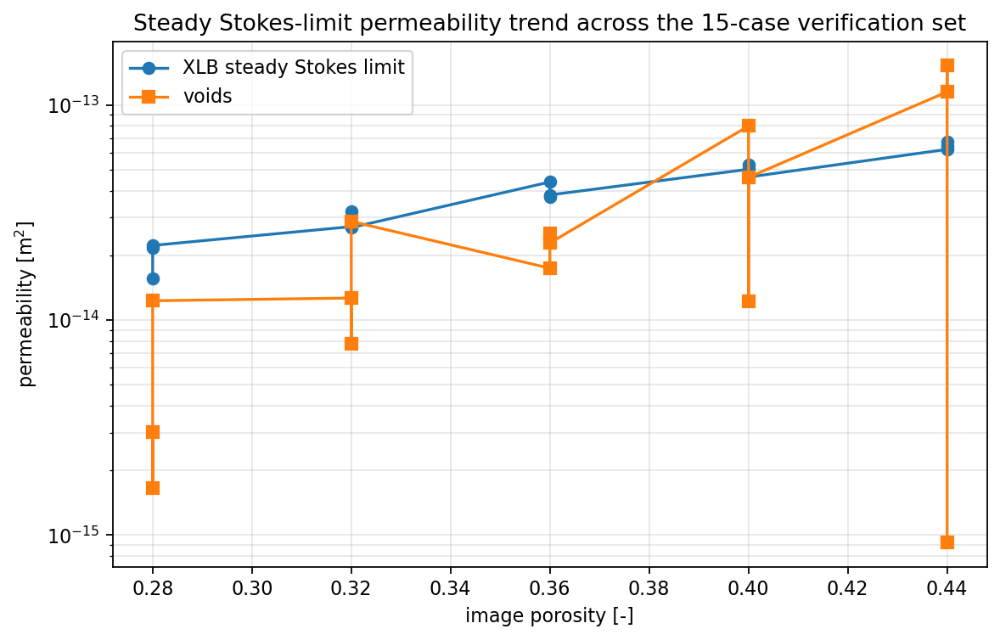
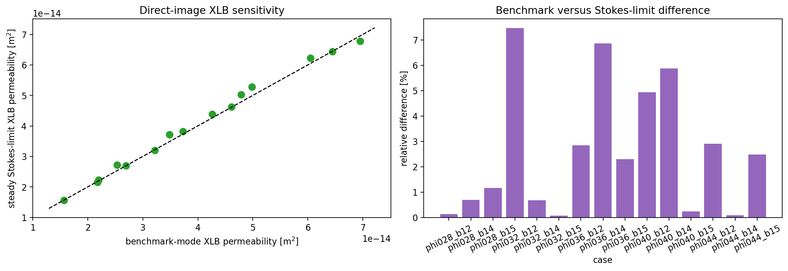

# XLB Direct-Image Permeability Benchmark

This report documents a controlled verification study of `voids` against a
voxel-scale lattice-Boltzmann reference solved with XLB. The purpose is not to
replace pore-network modeling with LBM, but to quantify how closely the current
extracted-network workflow tracks a higher-fidelity direct-image calculation on
the same segmented geometry.

The reproducible artifact for this report is notebook
`notebooks/13_mwe_synthetic_volume_xlb_benchmark.ipynb`.

---

## Goal

The benchmark answers the following question:

Given the same binary segmented volume, how different is the absolute
permeability predicted by:

1. direct-image LBM on the voxel geometry, and
2. `voids` after `snow2` extraction and pore-network flow solution?

That is the scientifically relevant comparison for `voids`, because the main
approximation is not only the linear solver, but the reduction from voxel
geometry to an extracted pore-throat network.

---

## Governing Formulations

### `voids` PNM Workflow

For each binary image:

1. `snow2` extracts a pore network from the segmented volume.
2. The network is pruned to the axis-spanning subnetwork.
3. `voids` solves steady incompressible single-phase flow on that graph.

The `voids` pressure solve is the graph-Laplacian system

$$
\mathbf{A}\,\mathbf{p} = \mathbf{b},
$$

with throat fluxes

$$
q_t = g_t (p_i - p_j),
$$

where $g_t$ is the hydraulic conductance of throat $t$.

After solving the pore pressures, `voids` converts the inlet flow rate to
apparent permeability using Darcy's law:

$$
K = \frac{|Q|\,\mu\,L}{A\,|\Delta p|}.
$$

For this benchmark, the `voids` side uses:

- `conductance_model = "valvatne_blunt"`
- `solver = "direct"`
- $\mu = 1.0 \times 10^{-3}$ Pa s

The `valvatne_blunt` model is the complete single-phase conduit closure
implemented in `voids`.
It prefers available shape-factor and conduit-length information when present,
but it is not a full reproduction of Valvatne-Blunt multiphase physics.

### XLB Direct-Image LBM Workflow

The reference solve is run directly on the segmented binary image, without
network extraction.

The current `voids` adapter uses XLB's incompressible Navier-Stokes
lattice-Boltzmann stepper. On each lattice direction $i$, the distribution
function update is

$$
f_i(\mathbf{x} + \mathbf{c}_i \Delta t, t + \Delta t)
=
f_i(\mathbf{x}, t)
- \omega \left[f_i(\mathbf{x}, t) - f_i^{\mathrm{eq}}(\rho, \mathbf{u})\right].
$$

The macroscopic fields are recovered from the moments

$$
\rho = \sum_i f_i,
\qquad
\rho \mathbf{u} = \sum_i \mathbf{c}_i f_i,
$$

and the standard quadratic equilibrium is

$$
f_i^{\mathrm{eq}}
=
w_i \rho
\left[
1
+ \frac{\mathbf{c}_i \cdot \mathbf{u}}{c_s^2}
+ \frac{(\mathbf{c}_i \cdot \mathbf{u})^2}{2 c_s^4}
- \frac{\mathbf{u} \cdot \mathbf{u}}{2 c_s^2}
\right].
$$

In lattice units,

$$
\nu_{\mathrm{lu}} = c_s^2 \left(\tau - \frac{1}{2}\right),
\qquad
\omega = \tau^{-1},
\qquad
p_{\mathrm{lu}} = c_s^2 \rho.
$$

This last relation is the key point behind the current boundary-condition
implementation. In this isothermal LBM formulation, prescribing density at the
inlet and outlet is the standard way to prescribe pressure. The public `voids`
adapter now therefore accepts pressure BCs or a pressure drop and converts them
internally to the equivalent densities expected by the XLB boundary operator.

To couple the same physical pressure drop to both PNM and XLB, the benchmark
uses the standard unit conversion

$$
\nu_{\mathrm{phys}} = \frac{\mu_{\mathrm{phys}}}{\rho_{\mathrm{phys}}},
\qquad
\Delta t_{\mathrm{phys}}
=
\frac{
  \nu_{\mathrm{lu}}\,\Delta x_{\mathrm{phys}}^2
}{
  \nu_{\mathrm{phys}}
},
$$

followed by

$$
\Delta p_{\mathrm{lu}}
=
\Delta p_{\mathrm{phys}}
\frac{
  \Delta t_{\mathrm{phys}}^2
}{
  \rho_{\mathrm{phys}}\,\Delta x_{\mathrm{phys}}^2
}.
$$

That is the consistency condition used in the current benchmark wrapper: for
each comparison mode, `voids` and XLB use the same imposed physical
$\Delta p$, while XLB still applies it through the equivalent densities.

For the current benchmark formulation, the absolute pressure offset is only a
gauge choice. The public high-level benchmark wrappers therefore now accept a
preferred physical input `delta_p`, with optional `pin` and `pout` retained
only for cases where an absolute pressure reference should also be recorded. In
practice, `delta_p = 1 Pa`, `pin = 1 Pa` / `pout = 0 Pa`, and `delta_p = 1 Pa`
with `pin = 101326 Pa` / `pout = 101325 Pa` are all the same current
permeability-driving condition.

For the current benchmark implementation, this means:

- D3Q19 lattice for 3-D cases
- single-relaxation-time BGK collision
- `pull` streaming
- lattice viscosity $\nu_{\mathrm{lu}} = 0.10$
- pressure boundary conditions, converted internally to equivalent densities
- half-way bounce-back on solid voxels
- sealed side walls orthogonal to the flow axis
- six fluid buffer cells before and after the sample so pressure BCs act on
  clean planar reservoir faces rather than directly on a perforated porous face

The benchmark uses the sample-averaged superficial axial velocity from the
original sample domain, not from the padded reservoir region.

Permeability is then recovered from lattice units as

$$
K_{\mathrm{phys}} =
\frac{
  \nu_{\mathrm{lu}}\,U_{\mathrm{lu}}\,L_{\mathrm{lu}}\,\Delta x_{\mathrm{phys}}^2
}{
  \Delta p_{\mathrm{lu}}
},
$$

with

$$
\Delta p_{\mathrm{lu}} = p_{\mathrm{in,lu}} - p_{\mathrm{out,lu}}.
$$

This means the XLB side is used here as a permeability reference. It is not
being interpreted as a fully pressure-calibrated physical transient model.

### Steady Stokes-Limit Mode

The continuum target for creeping flow in the pore space is the steady Stokes
system

$$
-\nabla p + \mu \nabla^2 \mathbf{u} = \mathbf{0},
\qquad
\nabla \cdot \mathbf{u} = 0
\quad \text{in the void space},
$$

with no-slip walls on the solid boundary.

The installed XLB package used here does not expose a separate Stokes-only
operator. For that reason, `voids` now provides
`XLBOptions.steady_stokes_defaults()`, which still uses the same
incompressible-Navier-Stokes LBM stepper but applies:

- a smaller shared pressure drop
- tighter steady-state controls
- explicit low-inertia diagnostics:
  - `xlb_mach_max`
  - `xlb_re_voxel_max`

Scientifically, the correct statement is therefore:

`steady_stokes_limit` is an LBM approximation to the steady creeping-flow
limit, not a distinct upstream Stokes discretization inside XLB.

---

## Why The Two Methods Differ

Even when both workflows are implemented correctly, they solve different
representations of the same sample.

| Aspect | `voids` | XLB |
|---|---|---|
| Geometry | Extracted pore-throat network | Original voxel image |
| Unknowns | One pressure unknown per pore | Distribution functions and velocity field per voxel |
| Transport law | Network conductance closure | Mesoscopic lattice Boltzmann dynamics |
| Solid treatment | Encoded indirectly through extracted geometry | Explicit bounce-back on solid voxels |
| Main approximation | Image-to-network reduction and conductance closure | Voxel staircasing, finite lattice resolution, BC discretization |

Therefore, mismatch between `voids` and XLB is not automatically a `voids` bug.
It can come from:

- loss of geometric information during extraction
- limitations of the selected pore-network conductance model
- voxel-resolution effects in the LBM reference
- boundary-condition sensitivity on small samples

---

## Synthetic Benchmark Setup

All cases in this report use:

- binary spanning volumes generated with `generate_spanning_blobs_matrix`
- shape `(24, 24, 24)`
- flow axis `x`
- voxel size `2.0e-6 m`
- fluid viscosity `1.0e-3 Pa s`
- fluid density `1.0e3 kg m^-3`
- preferred benchmark input `delta_p = 25/3 Pa ≈ 8.333 Pa`
- preferred steady Stokes-limit input `delta_p = 5/3 Pa ≈ 1.667 Pa`
- the report uses the default benchmark gauge choice `pout = 0 Pa`,
  `pin = delta_p`; any common pressure offset would be equivalent for this
  current incompressible benchmark
- XLB benchmark options:
  - `formulation = "incompressible_navier_stokes"`
  - `max_steps = 3000`
  - `min_steps = 400`
  - `check_interval = 50`
  - `steady_rtol = 1.0e-3`
  - `Δp_lu = 3.333e-4`
  - `inlet_outlet_buffer_cells = 6`
- XLB steady Stokes-limit options used for the artifacts in this report:
  - `formulation = "steady_stokes_limit"`
  - `max_steps = 3000`
  - `min_steps = 800`
  - `check_interval = 50`
  - `steady_rtol = 5.0e-4`
  - `Δp_lu = 6.667e-5`
  - `inlet_outlet_buffer_cells = 6`

!!! note "Current package default"
    The current package-level `XLBOptions.steady_stokes_defaults()` preset is
    stricter for direct-image validation runs: 12 inlet/outlet buffer cells,
    `max_steps=8000`, `min_steps=1200`, and `steady_rtol=1e-4`. The values above
    are preserved because they describe the already-generated synthetic
    verification artifacts on this page.

The 15-case verification set spans five porosity levels and three blobiness
levels per porosity:

| Case | Target porosity | Blobiness | Seed used |
|---|---:|---:|---:|
| `phi028_b12` | 0.28 | 1.2 | 101 |
| `phi028_b14` | 0.28 | 1.4 | 135 |
| `phi028_b15` | 0.28 | 1.5 | 155 |
| `phi032_b12` | 0.32 | 1.2 | 271 |
| `phi032_b14` | 0.32 | 1.4 | 305 |
| `phi032_b15` | 0.32 | 1.5 | 322 |
| `phi036_b12` | 0.36 | 1.2 | 441 |
| `phi036_b14` | 0.36 | 1.4 | 475 |
| `phi036_b15` | 0.36 | 1.5 | 492 |
| `phi040_b12` | 0.40 | 1.2 | 611 |
| `phi040_b14` | 0.40 | 1.4 | 645 |
| `phi040_b15` | 0.40 | 1.5 | 662 |
| `phi044_b12` | 0.44 | 1.2 | 781 |
| `phi044_b14` | 0.44 | 1.4 | 815 |
| `phi044_b15` | 0.44 | 1.5 | 832 |

---

## Figures

Left: `voids` permeability against XLB permeability with the one-to-one line.
Right: per-case relative difference.

Porosity-permeability trend for the 15-case set. This is useful for checking
whether `voids` follows the same macroscopic trend as the direct-image XLB
reference even when the pointwise agreement is imperfect.

Permeability scatter and per-case error after rerunning all 15 cases with the
lower-driving steady Stokes-limit configuration.

Porosity-permeability trend in the steady Stokes limit. This checks whether the
direct-image LBM reference changes materially when the forcing is reduced.

Direct comparison between benchmark-mode XLB permeability and steady
Stokes-limit XLB permeability across the full 15-case set.

---

## Results

The full CSV generated by the notebook is available here:
[xlb_15_case_results.csv](../assets/verification/xlb_15_case_results.csv).

The full steady Stokes-limit CSV is available here:
[xlb_stokes_15_case_results.csv](../assets/verification/xlb_stokes_15_case_results.csv).

The representative Stokes-limit rerun is available here:
[xlb_stokes_limit_representative.csv](../assets/verification/xlb_stokes_limit_representative.csv).

| Case | Image porosity | `K_voids` [m^2] | `K_xlb` [m^2] | `K_voids / K_xlb` | Rel. diff. [%] | XLB steps | Converged |
|---|---:|---:|---:|---:|---:|---:|---:|
| `phi028_b12` | 0.280020 | 1.161e-14 | 1.563e-14 | 0.743 | 25.71 | 450 | yes |
| `phi028_b14` | 0.280020 | 1.598e-14 | 2.174e-14 | 0.735 | 26.50 | 400 | yes |
| `phi028_b15` | 0.280020 | 5.235e-14 | 2.198e-14 | 2.381 | 58.01 | 400 | yes |
| `phi032_b12` | 0.320023 | 2.308e-14 | 2.531e-14 | 0.912 | 8.81 | 2750 | yes |
| `phi032_b14` | 0.320023 | 5.138e-14 | 3.216e-14 | 1.598 | 37.41 | 1200 | yes |
| `phi032_b15` | 0.320023 | 6.371e-14 | 2.690e-14 | 2.368 | 57.77 | 1100 | yes |
| `phi036_b12` | 0.360026 | 4.851e-14 | 4.265e-14 | 1.138 | 12.09 | 1050 | yes |
| `phi036_b14` | 0.360026 | 4.214e-14 | 3.482e-14 | 1.210 | 17.37 | 2300 | yes |
| `phi036_b15` | 0.360026 | 3.517e-14 | 3.733e-14 | 0.942 | 5.77 | 450 | yes |
| `phi040_b12` | 0.400029 | 1.561e-13 | 4.789e-14 | 3.259 | 69.31 | 1850 | yes |
| `phi040_b14` | 0.400029 | 3.443e-14 | 4.983e-14 | 0.691 | 30.92 | 2250 | yes |
| `phi040_b15` | 0.400029 | 8.599e-14 | 4.612e-14 | 1.864 | 46.36 | 500 | yes |
| `phi044_b12` | 0.440032 | 1.799e-13 | 6.046e-14 | 2.976 | 66.40 | 2300 | yes |
| `phi044_b14` | 0.440032 | 2.143e-13 | 6.444e-14 | 3.325 | 69.93 | 400 | yes |
| `phi044_b15` | 0.440032 | 9.731e-15 | 6.948e-14 | 0.140 | 85.99 | 400 | yes |

Summary statistics for this 15-case set:

- mean relative difference: `41.22 %`
- median relative difference: `37.41 %`
- mean factor gap: `2.24 x`
- median factor gap: `1.60 x`
- worst factor gap: `7.14 x`

### Full 15-Case Steady Stokes-Limit Results

| Case | Image porosity | `K_voids` [m^2] | `K_xlb,stokes` [m^2] | `K_voids / K_xlb,stokes` | Rel. diff. [%] | XLB steps | Converged |
|---|---:|---:|---:|---:|---:|---:|---:|
| `phi028_b12` | 0.280020 | 1.161e-14 | 1.565e-14 | 0.742 | 25.81 | 800 | yes |
| `phi028_b14` | 0.280020 | 1.598e-14 | 2.159e-14 | 0.740 | 25.99 | 1100 | yes |
| `phi028_b15` | 0.280020 | 5.235e-14 | 2.223e-14 | 2.354 | 57.52 | 1250 | yes |
| `phi032_b12` | 0.320023 | 2.308e-14 | 2.719e-14 | 0.849 | 15.14 | 1800 | yes |
| `phi032_b14` | 0.320023 | 5.138e-14 | 3.194e-14 | 1.609 | 37.84 | 950 | yes |
| `phi032_b15` | 0.320023 | 6.371e-14 | 2.692e-14 | 2.366 | 57.74 | 1200 | yes |
| `phi036_b12` | 0.360026 | 4.851e-14 | 4.386e-14 | 1.106 | 9.59 | 1550 | yes |
| `phi036_b14` | 0.360026 | 4.214e-14 | 3.721e-14 | 1.133 | 11.70 | 850 | yes |
| `phi036_b15` | 0.360026 | 3.517e-14 | 3.818e-14 | 0.921 | 7.89 | 1350 | yes |
| `phi040_b12` | 0.400029 | 1.561e-13 | 5.025e-14 | 3.106 | 67.80 | 800 | yes |
| `phi040_b14` | 0.400029 | 3.443e-14 | 5.276e-14 | 0.653 | 34.75 | 1150 | yes |
| `phi040_b15` | 0.400029 | 8.599e-14 | 4.623e-14 | 1.860 | 46.23 | 850 | yes |
| `phi044_b12` | 0.440032 | 1.799e-13 | 6.221e-14 | 2.892 | 65.43 | 1500 | yes |
| `phi044_b14` | 0.440032 | 2.143e-13 | 6.439e-14 | 3.328 | 69.95 | 800 | yes |
| `phi044_b15` | 0.440032 | 9.731e-15 | 6.775e-14 | 0.144 | 85.64 | 1150 | yes |

Summary statistics for the steady Stokes-limit 15-case set:

- mean relative difference: `41.27 %`
- median relative difference: `37.84 %`
- mean factor gap: `2.21 x`
- median factor gap: `1.62 x`
- worst factor gap: `6.96 x`
- maximum `Mach_max`: `3.83e-5`
- maximum `Re_voxel,max`: `2.21e-4`

### Benchmark-Mode Versus Steady Stokes-Limit Sensitivity

Across the full 15-case set, the direct-image XLB benchmark and the lower-drive
steady Stokes-limit rerun differed by:

- mean relative difference: `2.58 %`
- median relative difference: `2.30 %`
- worst relative difference: `7.46 %`

This is the key result for the “is the benchmark already Stokes-like?” question.
For these synthetic cases, the answer is still broadly yes, but less strongly
than the earlier draft suggested: reducing the imposed pressure drop changed the
direct-image permeability by a few percent on average while still lowering the
velocity-scale diagnostics substantially.

### Representative Steady Stokes-Limit Comparison

The notebook also reruns the representative case `phi036_b14` with
`XLBOptions.steady_stokes_defaults()` and reports:

| Mode | `K_xlb` [m^2] | Steps | Converged | `Δp_phys` [Pa] | `Δp_lu` | `Mach_max` | `Re_voxel,max` | Rel. diff. vs benchmark [%] |
|---|---:|---:|---:|---:|---:|---:|---:|---:|
| Benchmark | 3.482e-14 | 2300 | yes | 8.333 | 3.333e-4 | 1.240e-4 | 7.143e-4 | 0.00 |
| Steady Stokes limit | 3.721e-14 | 850 | yes | 1.667 | 6.667e-5 | 2.804e-5 | 1.619e-4 | 6.86 |

For this representative geometry, reducing the shared physical pressure drop by
a factor of five lowered both `Mach_max` and `Re_voxel,max` by about a factor
of four to five while changing the XLB permeability by `6.86 %`. That still
supports the creeping-flow interpretation, but it is not small enough to treat
benchmark mode and steady-Stokes-limit mode as numerically interchangeable on
every morphology.

---

## Interpretation

These results support the following conclusions:

1. `voids` and XLB can agree quite closely on some cases. In this set,
   `phi036_b15` differs by only `5.77 %`.
2. The mismatch can still be substantial on other morphologies, reaching a
   factor gap of about `7.14 x` for `phi044_b15`.
3. The porosity-permeability trend is broadly similar between the methods, but
   the pointwise spread remains too large to treat the current extracted-network
   workflow as interchangeable with a direct-image LBM reference.
4. The new steady-Stokes-limit mode makes the physical interpretation cleaner,
   but it should not be described as a separate solver backend unless XLB
   exposes an actual Stokes-only operator in a future release.

The practical interpretation is that the current `voids` image-to-network
workflow is plausible, but still morphology-sensitive relative to XLB. That is
exactly the kind of signal a verification benchmark should reveal.

---

## Limits Of This Verification

This report is intentionally narrow. It does **not** establish universal
agreement between `voids` and LBM.

Important limits and assumptions:

- the cases are small synthetic spanning volumes, not real rock images
- side walls are sealed in the XLB benchmark; periodic transverse boundaries are
  not used here
- `voids` is compared against one specific network conductance closure:
  `valvatne_blunt`
- the XLB permeability conversion is a lattice-unit permeability mapping, not a
  full dimensional calibration of the transient flow field
- the steady-Stokes-limit mode is an interpretation of the same LBM operator in
  a low-inertia regime, not a separate Stokes discretization
